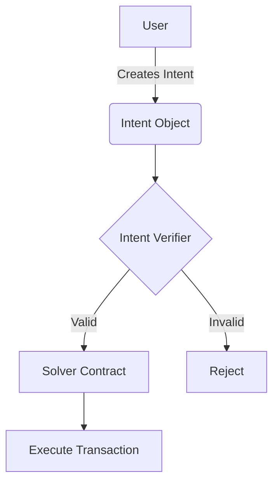

Here are the steps to implement mermaid diagram support in your NEAR workshop application:

## 1. Install Required Packages

```bash
npm install mermaid react-syntax-highlighter rehype-raw
```

## 2. Create a Custom Mermaid Component

Create a new file at `src/components/workshop/MermaidDiagram.jsx`:

```jsx
import React, { useEffect, useRef } from 'react';
import mermaid from 'mermaid';

// Initialize mermaid with default configuration
mermaid.initialize({
  startOnLoad: true,
  theme: 'default',
  securityLevel: 'loose',
  flowchart: { useMaxWidth: false, htmlLabels: true },
});

export default function MermaidDiagram({ chart }) {
  const mermaidRef = useRef(null);
  const svgRef = useRef(null);
  
  useEffect(() => {
    if (!mermaidRef.current) return;
    
    try {
      // Reset the container to prevent rendering issues with multiple diagrams
      mermaidRef.current.innerHTML = chart;
      
      // Uniquely identify this diagram
      const id = `mermaid-${Math.random().toString(36).substring(2, 11)}`;
      mermaidRef.current.id = id;
      
      // Render the diagram
      mermaid.init(undefined, `#${id}`);
    } catch (error) {
      console.error("Failed to render mermaid diagram:", error);
      mermaidRef.current.innerHTML = `
        <div class="p-4 bg-red-100 border border-red-500 text-red-700 rounded">
          <p class="font-bold">Mermaid Diagram Error</p>
          <pre class="mt-2 text-sm">${error.message}</pre>
        </div>
      `;
    }
  }, [chart, mermaidRef]);
  
  return (
    <div className="mermaid-container not-prose my-6 py-3 bg-gray-50 rounded-lg shadow-inner">
      <div ref={mermaidRef} className="mermaid text-center" />
    </div>
  );
}
```

## 3. Update SectionContent Component

Modify `src/components/workshop/SectionContent.jsx`:

```jsx
import React from 'react';
import ReactMarkdown from 'react-markdown';
import { Skeleton } from "@/components/ui/skeleton";
import { Prism as SyntaxHighlighter } from 'react-syntax-highlighter';
import { atomDark } from 'react-syntax-highlighter/dist/esm/styles/prism';
import MermaidDiagram from './MermaidDiagram';
import rehypeRaw from 'rehype-raw';

export default function SectionContent({ content, loading, sectionTitle }) {
  if (loading) {
    return (
      <div className="space-y-4">
        <Skeleton className="h-12 w-3/4" />
        <Skeleton className="h-6 w-1/2" />
        <div className="space-y-2 mt-8">
          <Skeleton className="h-4 w-full" />
          <Skeleton className="h-4 w-full" />
          <Skeleton className="h-4 w-3/4" />
        </div>
      </div>
    );
  }

  const CodeBlock = ({ node, inline, className, children, ...props }) => {
    const match = /language-(\w+)/.exec(className || '');
    
    // Detect mermaid code blocks
    if (!inline && match && match[1] === 'mermaid') {
      return <MermaidDiagram chart={String(children).replace(/\n$/, '')} />;
    }
    
    // Regular code blocks
    return !inline && match ? (
      <SyntaxHighlighter
        style={atomDark}
        language={match[1]}
        PreTag="div"
        {...props}
      >
        {String(children).replace(/\n$/, '')}
      </SyntaxHighlighter>
    ) : (
      <code className={className} {...props}>
        {children}
      </code>
    );
  };

  // Track if we've seen the first h1 that matches the section title
  let foundFirstH1 = false;

  return (
    <div className="prose prose-lg max-w-none">
      <ReactMarkdown
        components={{
          code: CodeBlock,
          a: ({node, ...props}) => {
            // Check if it's a button link (contains class with 'button')
            const isButton = props.className && props.className.includes('button');
            return (
              <a 
                {...props} 
                className={isButton 
                  ? "inline-flex items-center bg-white text-black neo-button px-4 py-2 font-bold" 
                  : "text-blue-600 font-semibold underline flex items-center"
                }
                target="_blank" 
                rel="noopener noreferrer"
              />
            );
          },
          h1: ({node, children, ...props}) => {
            // Convert both to lowercase and trim for case-insensitive matching
            const headingText = children.toString().toLowerCase().trim();
            const title = sectionTitle ? sectionTitle.toLowerCase().trim() : '';
            
            // Check if this is the first h1 that matches the section title
            if (!foundFirstH1 && headingText === title) {
              foundFirstH1 = true;
              // Skip rendering this h1
              return null;
            }
            
            // Render other h1 elements normally
            return <h1 {...props} className="text-4xl font-black mb-6">{children}</h1>;
          },
          h2: ({node, ...props}) => (
            <h2 {...props} className="text-2xl font-bold mt-8 mb-4" />
          ),
          h3: ({node, ...props}) => (
            <h3 {...props} className="text-xl font-bold mt-6 mb-3" />
          )
        }}
        // Add rehype-raw plugin to enable HTML in markdown
        rehypePlugins={[rehypeRaw]}
      >
        {content}
      </ReactMarkdown>
    </div>
  );
}
```

## 4. Test the Implementation

Create a test mermaid diagram in one of your content markdown files:

```markdown
# Testing Mermaid Diagrams

Here's a simple flowchart using mermaid:



The diagram above shows the basic intent verification flow.
```

## 5. Handle Edge Cases

To handle potential browser compatibility issues or cases where mermaid fails to render, add a basic fallback styling in `src/index.css` or your main CSS file:

```css
/* Fallback styling for mermaid diagrams in case JS fails */
.mermaid {
  font-family: 'Courier New', Courier, monospace;
  padding: 1rem;
  white-space: pre;
  overflow-x: auto;
}

/* Style when diagram renders successfully */
.mermaid svg {
  max-width: 100%;
  height: auto;
}
```

## 6. Production Considerations

In your Vite configuration (`vite.config.js`), ensure that the mermaid library is properly bundled:

```js
// Add this to your existing Vite config
build: {
  rollupOptions: {
    output: {
      manualChunks: {
        mermaid: ['mermaid']
      }
    }
  }
}
```

This separates mermaid into its own chunk to improve initial load performance.

## 7. Updating Content Guidelines

Update your content guidelines to inform content creators about proper mermaid syntax and usage. Refer to the Cursor rule you've created for mermaid diagrams.

## 8. Testing and Troubleshooting

Common issues and solutions:

1. **Diagrams not rendering**: Check browser console for errors. Mermaid syntax is strict, so ensure proper indentation and syntax.

2. **Slow rendering**: For pages with multiple complex diagrams, consider lazy-loading or rendering diagrams only when they come into viewport.

3. **Styling issues**: Mermaid generates SVG elements that may conflict with your global styles. Use specific CSS selectors to avoid conflicts.

4. **Mobile responsiveness**: Test diagrams on smaller screens and add responsive styling as needed.
