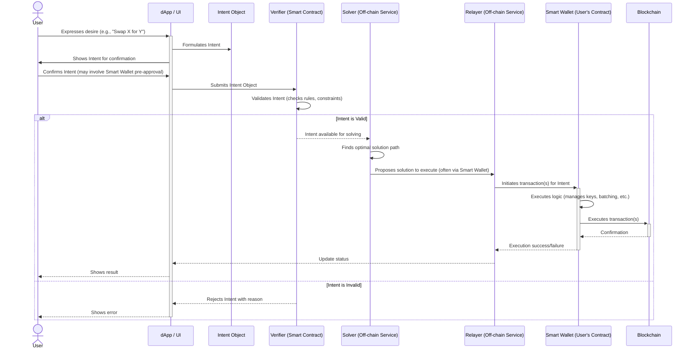

# Understanding the Building Blocks: Intents, Wallets, and Key Actors

In the welcome section, we introduced the idea of making decentralized applications (dApps) as user-friendly as the Web2 applications you're familiar with. Now, let's dive deeper into the core components that make this possible with NEAR's Intent-Centric architecture.

## The Old Way vs. The New Way

**Typically, interacting with a blockchain application (a dApp) has been complex:** Users often need to:

- Manually craft detailed transactions, specifying every technical step. (Think of this like writing low-level assembly code for a simple task, rather than using a high-level programming language.)
- Know specific smart contract addresses (these are like unique API endpoints for different applications on the blockchain).
- Manage "gas fees" (network transaction costs) for every single action and understand their limits.
- Approve each step in a sequence individually, leading to many pop-ups and confirmations.
- Handle the complexities of interacting with multiple blockchains if the dApp supports it.

This often results in a clunky user experience, far from the seamlessness of modern web apps.

**NEAR Intents represent a paradigm shift.** Instead of users dictating the precise, technical _how_, they simply declare their high-level _what_—their desired outcome or "intent." The system then figures out the best way to achieve it.

## Key Actors on the Stage

Before we detail the components, let's understand the "actors" involved in this new paradigm. Understanding their roles is crucial before diving into the codebase.

- **User**: The end-user of the dApp. They want to accomplish a goal (e.g., swap tokens, purchase an NFT) without needing to understand the underlying blockchain complexities.
- **dApp (Decentralized Application)**: The application interface (e.g., a website) that the user interacts with. In our context, the dApp helps the user formulate their intent.
- **Intent (The User's Goal)**: Not an actor, but the central piece of information. It's a declarative statement of what the user wants to achieve (e.g., "Swap 10 USDC for NEAR within the next 5 minutes, with a maximum 0.5% price difference from market rate").
  - It's **outcome-driven**: Focuses on the "what," not the "how."
  - It can be **chain-agnostic**: The user's goal isn't necessarily tied to one specific blockchain; the system can figure out the best chain(s) to use. Think of wanting to book a flight (the outcome) and an intelligent travel agent (the system) finding the best airline and route, possibly involving multiple carriers, without you needing to specify each one.
- **Verifier (The Rule-Checker)**: A smart contract or service that checks if a user's stated intent is valid, secure, and meets predefined constraints. It acts as a crucial security layer, ensuring that any proposed solution genuinely matches the user's stated desires and protects them from malicious or incorrect fulfillment.
- **Solver (The Problem-Solver)**: An off-chain actor or service that finds the optimal way to fulfill a user's validated intent.
  - Solvers **compete** to provide the best execution path (e.g., best price for a swap, fastest execution, cheapest transaction). This is like getting quotes from multiple vendors before making a purchase, ensuring the user gets the best deal.
  - They can operate across multiple chains or protocols if the intent requires it.
- **Relayer (The Facilitator)**: An optional but often vital off-chain service that can submit transactions on behalf of the user.
  - Relayers are key to enabling **gasless transactions** (where the dApp or another service sponsors the network fees, so the user doesn't see them). In Web2, this is like a company paying for postage for a mail-in rebate—the user doesn't directly pay for sending the letter.
  - They can also help manage transaction submissions, retries, or other complexities, further abstracting the blockchain from the user. Think of them as a specialized middleware service that handles the nitty-gritty of blockchain communication.
- **Smart Wallet (The User's Agent)**: This isn't just a place to hold keys; it's an advanced, often contract-based, wallet that acts as the user's intelligent agent on the blockchain. It plays a huge role in improving UX by:
  - **Abstracting Signing**: Instead of users cryptographically approving every single action with potentially confusing technical details, smart wallets can enable more user-friendly approval mechanisms (e.g., approving a "session" for a limited time or for specific types of actions, much like logging into a website).
  - **Batching Transactions**: If a user's intent requires multiple on-chain steps, the smart wallet can bundle these into a single transaction, requiring only one approval from the user. This is like adding multiple items to an online shopping cart and paying once, instead of paying for each item separately.
  - **Managing Multi-Chain Logic**: For cross-chain intents, the smart wallet can handle the complexities of interacting with different networks.
  - **Enabling Gasless Experiences**: Works with Relayers so users don't have to manually pay gas fees.
  - **Session-Based Authentication**: Allows for smoother interactions over a period, contrasting with typical Web3 experiences that often require per-transaction authentication.

## The Intent Workflow

Here's how these actors and components typically interact:



## Example Intent (The "What")

Let's make the "Intent Object" more concrete. Here's what a simplified version might look like in JSON format.
This example translates to: "The user wants to swap 100 units of the token 'USDC' for the token 'NEAR', and they are willing to accept a price that is no more than 0.5% different from the quoted market price (this is 'max slippage')."

```json
{
  "userAddress": "user.near",
  "intent": {
    "action": "swap",
    "input": {
      "token": "USDC.token.near",
      "amount": "100000000" // Assuming 6 decimals for USDC
    },
    "output": {
      "token": "NEAR"
    }
  },
  "constraints": {
    "maxSlippagePercent": "0.5", // e.g., 0.5%
    "deadline": "1678886400" // Unix timestamp for expiry
  },
  "signature": "user_signature_over_intent_hash"
}
```

_Note: The actual structure and fields can vary based on the specific implementation._

## Benefits Revisited

Understanding these components, let's revisit the benefits:

1.  **For Users:**

    - **Simpler Interactions:** No need to understand contract calls or gas.
    - **Better Prices/Execution:** Achieved through competing Solvers.
    - **Improved UX:** Closer to familiar Web2 applications.
    - **Cross-Chain Capability:** Enables interaction with multiple blockchains seamlessly, managed by the system.
    - **Enhanced Security:** Verifiers and Smart Wallet rules protect the user.

2.  **For Developers:**
    - **Focus on User Value:** Abstract away blockchain complexity.
    - **Flexible Implementation:** Freedom to design Verifiers and Solvers.
    - **Enhanced Composability:** Intents can be combined and built upon.
    - **Future-Proof Architecture:** Adaptable to new protocols and chains.

Now that we grasp the key concepts and actors behind NEAR's intent architecture, we're ready to set up our development environment and explore the codebase structure. This will prepare us for the hands-on implementation in the subsequent modules, aligning with our workshop objective to comprehend the fundamentals of Intent-Centric Architecture.
