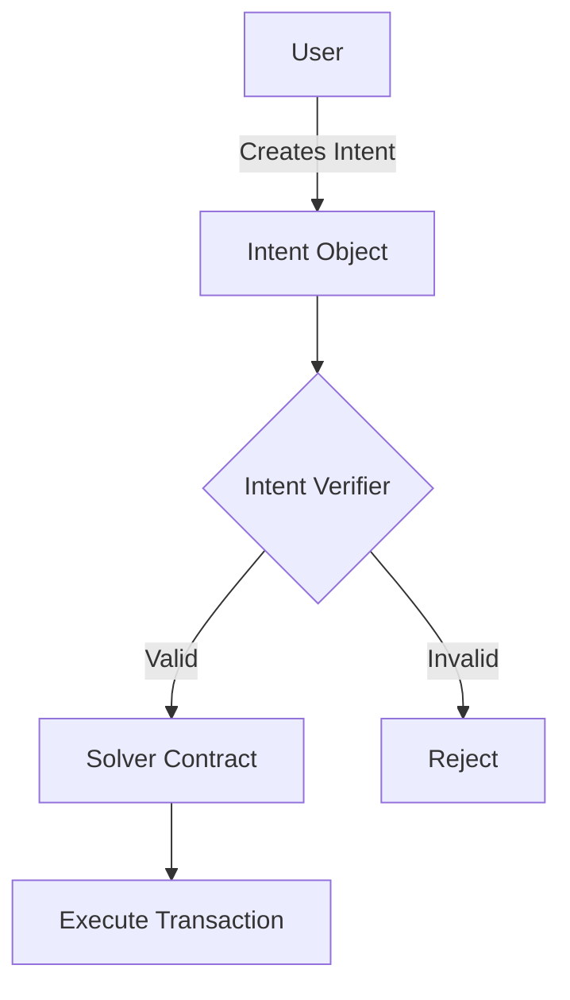
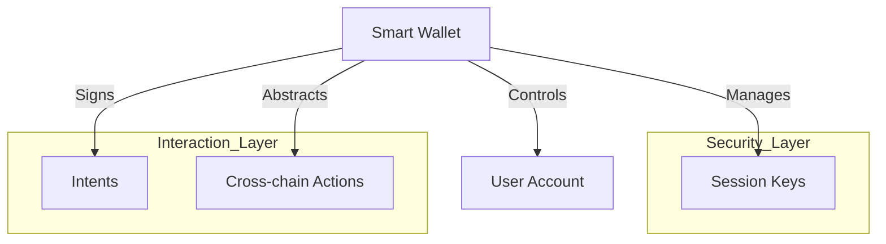
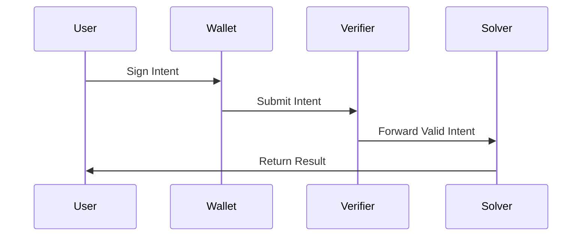
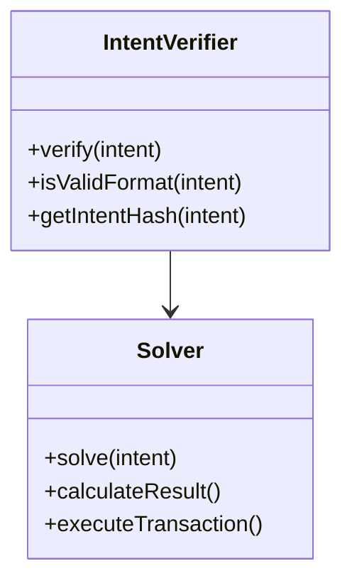
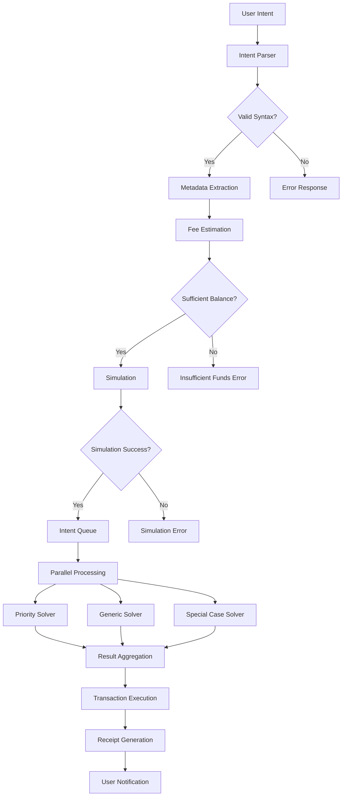
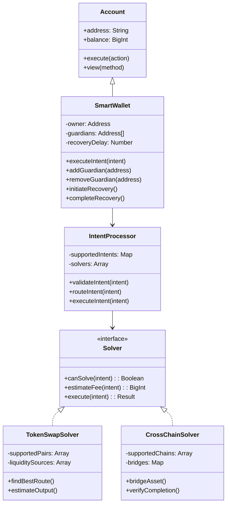
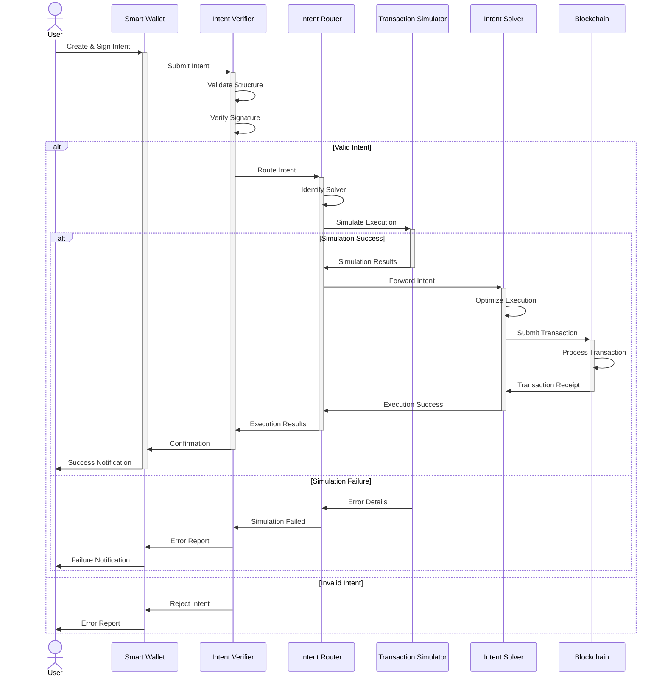
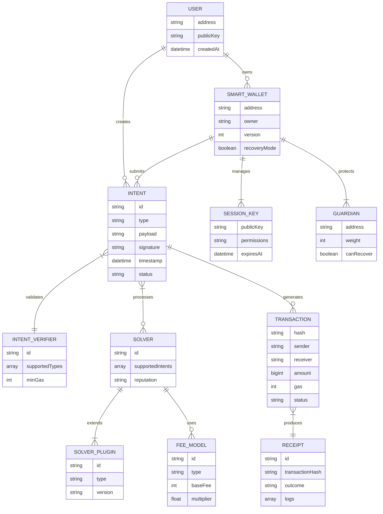

# Testing Mermaid Diagrams

This page demonstrates the ability to create diagrams using mermaid syntax.

## Intent Flow Diagram



---

## Smart Wallet Architecture



---

## Sequence Diagram Example



---

## Class Diagram Example



---

## Advanced Intent Processing Flow



---

## Multi-Chain Intent Timeline

```mermaid
gantt
    title Multi-Chain Intent Execution Timeline
    dateFormat  YYYY-MM-DD
    axisFormat %M:%S
    
    section Intent Creation
    User Signs Intent           :a1, 2023-01-01, 2s
    Intent Validation           :a2, after a1, 3s
    
    section NEAR Chain
    Parse Intent                :n1, after a2, 2s
    Execute on NEAR             :n2, after n1, 5s
    Verify Outcome              :n3, after n2, 2s
    
    section Aurora Chain
    Bridge Intent               :e1, after a2, 3s
    Execute on Aurora           :e2, after e1, 6s
    Verify Aurora Outcome       :e3, after e2, 2s
    
    section Result
    Aggregate Results           :r1, after n3, after e3, 3s
    Return to User              :r2, after r1, 1s
```

---

## Smart Contract Relationship Diagram



---

## Detailed Intent Processing Sequence



---

## Intent System Entity Relationship



---

## Summary

The diagrams above demonstrate how we can visualize various aspects of NEAR's intent-centric architecture using mermaid diagrams directly in our markdown content.
