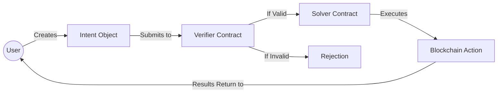

# Intents - The "What," Not the "How"

**Estimated Time:** 25 minutes
**Prerequisites:** Completed Section 1: Introduction
**Learning Objectives:**

- Understand the fundamental concept of intents and how they differ from traditional transactions
- Recognize the benefits of declarative approaches over imperative ones
- Identify the key components in an intent's lifecycle

In the introduction, we briefly touched upon how intents can revolutionize user experience in dApps. Now, let's dive deeper into what makes this approach so powerful for blockchain development.

## Web2 to Web3 Bridge: The API Analogy

Before we dive into blockchain-specific details, let's draw a parallel to something familiar in Web2 development:

**Web2 API Evolution:**

1. **Early APIs (Imperative)**: Required developers to make multiple specific function calls in the correct order with precise parameters
2. **Modern APIs (Declarative)**: Allow developers to simply specify the desired outcome, with the API figuring out the implementation details

Think about the difference between these two approaches for a flight booking service:

```javascript
// Imperative approach (old style)
const flights = searchFlights("Paris", "2023-12-10", "2023-12-17");
const cheapestFlight = flights.sort((a, b) => a.price - b.price)[0];
const reservation = createReservation(cheapestFlight.id, userId);
processPayment(reservation.id, paymentDetails);
emailConfirmation(reservation.id, userEmail);

// Declarative approach (modern)
bookTrip({
  destination: "Paris",
  departDate: "2023-12-10",
  returnDate: "2023-12-17",
  preference: "cheapest",
  userId: userId,
  paymentDetails: paymentDetails,
});
```

Intent-centric architecture brings this same evolution to blockchain, moving from users needing to understand and execute complex transaction sequences to simply expressing what they want to achieve.

## Definition and Key Characteristics

An **Intent** is a cryptographically signed, declarative statement that expresses _what_ a user wants to achieve, without dictating the precise, technical steps of _how_ it should be executed.

Think of it as telling a smart assistant: "Book me the cheapest flight to Paris next Tuesday," rather than manually searching multiple airline websites, comparing prices, and filling out each booking form yourself.

### Key Characteristics:

- **Declarative & Outcome-Driven**: It describes the desired end state or outcome (e.g., "I want 100 XYZ tokens in exchange for my 5 ABC tokens"), not the specific operations or sequence of calls to achieve it.
- **Chain-Agnostic (Potentially)**: While an intent might target a specific blockchain, its structure can be designed to be resolvable across multiple chains. For instance, a "swap X for Y" intent could potentially be fulfilled by finding the best liquidity pool for that pair across several connected blockchains, or even by routing through multiple chains, all without the user needing to specify these details.
- **Composable**: Intents can be embedded within applications, UI widgets, or even automated bots. This means developers can easily build complex financial or operational workflows by combining existing, standardized intents, much like assembling a data processing pipeline from pre-built software components or using Lego™ bricks to build a larger structure.

## The Power of Declarative over Imperative

To truly appreciate intents, let's compare them to traditional blockchain transactions, which are **imperative**.

**Traditional Imperative Transactions:**

- Users (or their wallets) must specify the exact smart contract function to call.
- All parameters (like amounts, addresses, and data payloads) are fixed at the moment of submission.
- The execution flow is rigid and predetermined by the transaction's details.
- **Conceptual Example (Imperative Token Swap):** To swap Token A for Token B, a user (or their dApp) might have to:
  1.  Manually check and approve that DEX contract X can spend their Token A.
  2.  Call the specific `swap` function on DEX contract X with exact input/output amounts and a slippage tolerance.
  3.  If this transaction fails (e.g., due to price changes or insufficient liquidity), the user might have to repeat steps 1 & 2 for DEX contract Y, potentially paying gas fees for the failed attempt.

**Intents are Declarative:**

- Users express their desired outcome (e.g., "I want to swap my 100 USDC for the best possible amount of NEAR, with a maximum slippage of 0.5%").
- The underlying system (composed of Verifiers, Solvers, and Smart Wallets) determines the optimal execution path. This might involve choosing the best decentralized exchange (DEX), finding the most efficient route, or even waiting for better market conditions if specified in the intent's constraints.
- This significantly reduces complexity for end-users and opens the door for more efficient execution.
- **Web2 Analogy**: This is similar to writing a SQL query (declarative: `SELECT name FROM users WHERE country = 'France'`) where you state _what_ data you want, and the database engine figures out _how_ to retrieve it efficiently. This contrasts with procedural code (imperative) where you'd manually loop through records, check conditions, and collect results.

## Intent Flow Visualization

The following diagram illustrates how an intent flows through our system:



As shown above, the intent journey starts with the user expressing their goal, then moves through verification and solving stages before execution and returning results.

## Examples of Intents (Illustrative JSON)

Below are simplified JSON representations of what these intents might look like. The exact structure can vary.

### Simple Transfer Intent

```json
{
  "intent": {
    "action": "transfer",
    "asset": {
      "type": "native", // or "fungible_token"
      "id": "NEAR" // or "usdc.token.near"
    },
    "amount": "1000000000000000000000000", // 1 NEAR (in yoctoNEAR)
    "recipient": "alice.near"
  },
  "constraints": {
    "expiresAt": "2024-12-31T23:59:59Z"
  }
}
```

### Token Swap Intent

```json
{
  "intent": {
    "action": "swap",
    "fromAsset": {
      "type": "fungible_token",
      "id": "usdc.token.near",
      "amount": "100000000" // 100 USDC (assuming 6 decimals)
    },
    "toAsset": {
      "type": "fungible_token",
      "id": "wnear.token.near" // wNEAR is Wrapped NEAR, a tokenized version often used in DeFi.
    }
  },
  "constraints": {
    "minReceiveAmount": "85000000000000000000000000", // Desired minimum wNEAR (in yocto)
    "maxSlippagePercent": "0.5",
    "deadline": "180s" // Expires in 3 minutes from submission
  }
}
```

### Cross-Chain Bridge Intent (Conceptual)

```json
{
  "intent": {
    "action": "bridge_and_swap",
    "fromAsset": {
      "type": "fungible_token",
      "id": "0xA0b86991c6218b36c1d19D4a2e9Eb0cE3606eB48", // USDC on Ethereum
      "amount": "500000000", // 500 USDC
      "sourceChain": "ethereum"
    },
    "toAsset": {
      "type": "fungible_token",
      "id": "aurora.token.near", // Hypothetical bridged asset on NEAR
      "destinationChain": "near"
    }
  },
  "preferences": {
    "routePriority": ["fastest", "cheapest"]
  }
}
```

## Benefits of Intent Architecture

Adopting an intent-centric approach offers several advantages:

1.  **Better User Experience (UX)**:
    - Users focus on their goals, not on the complex steps or technical jargon.
    - Reduced cognitive load and fewer chances for user error.
2.  **Market Efficiency & Optimal Execution**:
    - A competitive marketplace of **Solvers** (entities that find ways to fulfill intents) can emerge.
    - Solvers compete, often by bidding or proposing the most efficient execution paths, to fulfill the intent, which can lead to better prices, lower fees, or faster execution for the user.
3.  **Innovation & Flexibility**:
    - Opens the door for sophisticated Solver strategies that users don't need to be aware of.
    - Facilitates easier development of cross-chain functionalities and complex, composable actions.
4.  **Risk Reduction**:
    - **Intent Verification**: Before execution, intents are checked against predefined rules and user-specified constraints by a **Verifier**.
    - **Failed Transaction Protection**: Intents can be designed so that if a Solver cannot guarantee successful execution within the user's constraints (e.g., maximum slippage or a specific deadline), the transaction might not proceed at all. This can save the user from paying gas fees for failed transactions, a common frustration in imperative systems.

## The Basic Intent Lifecycle

A typical intent goes through several stages:

1.  **Creation**: The user expresses their goal through a dApp's UI. The frontend helps format this into a structured intent object. Basic client-side validation (e.g., checking if input formats are correct or if an amount is positive) might occur here.
2.  **Verification**: The signed intent is submitted, often to a Verifier smart contract. The Verifier meticulously checks the intent against its ruleset, user constraints (like deadlines or slippage), and potentially other on-chain conditions (like account permissions or token allowances).
3.  **Solver Discovery & Proposal**: If valid, the intent becomes available for Solvers. Solvers analyze the intent and propose solutions. The "best" proposal is selected based on criteria that can be defined by the application or even influenced by user preferences (e.g., prioritizing the cheapest rate, fastest execution, or highest reliability).
4.  **Execution**: The chosen Solver (or the user's Smart Wallet acting on a Solver's proposed solution) executes the necessary transactions to fulfill the intent.
5.  **Settlement & Outcome Verification**: The outcome of the execution is checked (e.g., by the Verifier, the Smart Wallet, or through on-chain events) to ensure it aligns with the original intent before the process is considered complete and the user is notified.

## Next Steps: Anatomy of an Intent

Now that we understand the core concept of what an intent is and why it's powerful, let's prepare to dissect its structure. In the next section, [2.2 Intent Anatomy](mdc:./02-intent-anatomy.md), we'll examine the typical components and data fields that make up an intent object in more detail, paving the way to understand how they are processed and validated.
