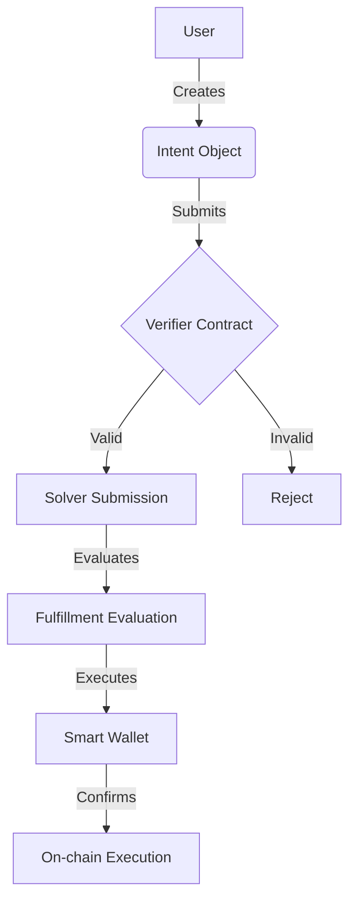
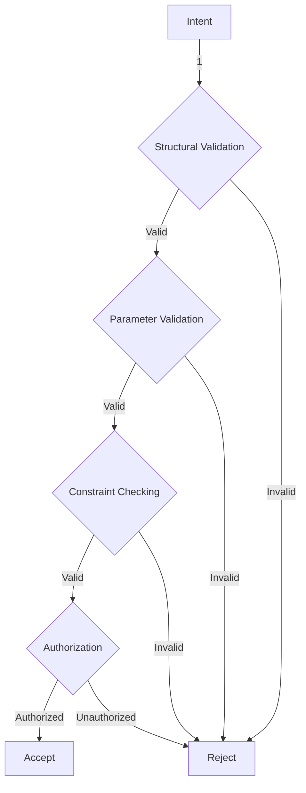
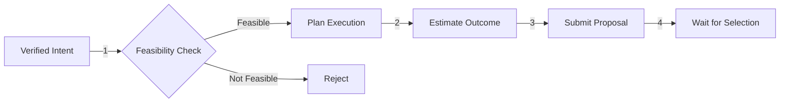
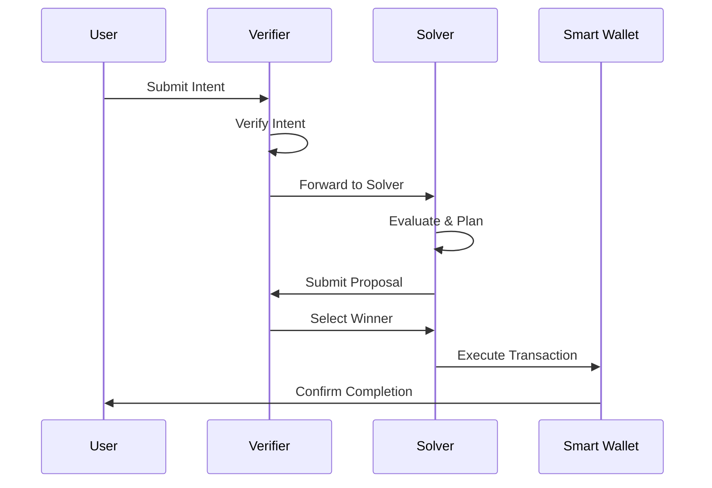

# Anatomy of a NEAR Intent

## Intent Flow Architecture

The flow of a NEAR intent transaction follows this path:



## Intent Object Structure

A NEAR intent is structured as a JSON object with several key components:

```javascript
{
  "intent": {
    "action": "swap",          // The primary action the user wants to perform
    "input": {                 // Input parameters for the action
      "token": "USDC",
      "amount": "100"
    },
    "output": {                // Expected output from the action
      "token": "wNEAR"
    }
  },
  "constraints": {           // Conditions that must be satisfied
    "maxSlippage": "0.5",
    "deadline": "1h"
  },
  "metadata": {              // Additional information for verifiers/solvers
    "source": "myDApp",
    "userPreferences": {}
  }
}
```

## Key Components Explained

### Action

The action field defines what the user wants to achieve. Common actions include:
- `transfer` - Send tokens to another account
- `swap` - Exchange one token for another
- `bridge` - Move tokens across chains
- `stake` - Stake tokens for yields
- `compound` - Perform multiple actions in sequence

### Input and Output

These fields define what the user is providing and what they expect to receive:

- **Input**: Resources the user is contributing (tokens, NFTs, etc.)
- **Output**: What the user expects to receive in return

### Constraints

Constraints define the conditions under which the intent is valid:

- **maxSlippage**: Maximum acceptable price difference
- **deadline**: Time after which the intent expires
- **minOutput**: Minimum acceptable return amount
- **preferredDex**: Optional preferred execution venue

### Metadata

Additional information that might be useful for verifiers and solvers:
- Source application
- User preferences
- Context information

## Intent Verification Process

When an intent reaches the verifier contract, it undergoes these checks:



## Solver Interaction

Solvers analyze verified intents through this process:



## Transaction Execution

The final execution follows this sequence:



## Example: Complete Swap Intent Lifecycle

```javascript
// 1. User creates intent
const userIntent = {
  "intent": {
    "action": "swap",
    "input": {
      "token": "USDC",
      "amount": "100"
    },
    "output": {
      "token": "wNEAR"
    }
  },
  "constraints": {
    "maxSlippage": "0.5"
  }
};

// 2. Intent is verified by contract
// verifier.near.verify_intent(userIntent)

// 3. Solvers submit proposals
// solver1.near.propose_solution(intentId, { expectedReturn: "25.2" })
// solver2.near.propose_solution(intentId, { expectedReturn: "25.5" })

// 4. Best solution is selected
// verifier.near.select_solution(intentId, solver2.near)

// 5. Intent is executed
// solver2.near.execute_solution(intentId)
```

## Advanced Intent Patterns

### Multi-step Intents

```javascript
const multiStepIntent = {
  "intent": {
    "action": "compound",
    "steps": [
      {
        "action": "swap",
        "input": { "token": "USDC", "amount": "100" },
        "output": { "token": "wNEAR" }
      },
      {
        "action": "stake",
        "input": { "token": "wNEAR" },
        "output": { "token": "stNEAR" }
      }
    ],
    "constraints": {
      "atomic": true,
      "maxSlippage": "0.5",
      "deadline": "1h"
    }
  }
};
```

### Conditional Intents

```javascript
const conditionalIntent = {
  "intent": {
    "action": "swap",
    "input": { "token": "USDC", "amount": "100" },
    "output": { "token": "wNEAR" },
    "conditions": {
      "if": {
        "price": { "token": "wNEAR", "operator": ">", "value": "5" }
      },
      "then": {
        "action": "swap",
        "output": { "token": "ETH" }
      },
      "else": {
        "action": "stake",
        "output": { "token": "stNEAR" }
      }
    }
  }
};
```

## Security Considerations

### Intent Validation

```javascript
class IntentValidator {
  async validateIntent(intent) {
    // 1. Structure validation
    if (!this.isValidStructure(intent)) {
      throw new Error('Invalid intent structure');
    }

    // 2. Parameter validation
    await this.validateParameters(intent);

    // 3. Constraint validation
    await this.validateConstraints(intent);

    // 4. Authorization check
    await this.checkAuthorization(intent);

    return true;
  }

  async validateParameters(intent) {
    const { input, output } = intent;
    
    // Validate token addresses
    await this.validateTokenAddress(input.token);
    await this.validateTokenAddress(output.token);
    
    // Validate amounts
    this.validateAmount(input.amount);
    
    // Validate slippage
    this.validateSlippage(intent.constraints.maxSlippage);
  }
}
```

### Error Handling

```javascript
class IntentProcessor {
  async processIntent(intent) {
    try {
      // 1. Validate intent
      await this.validator.validateIntent(intent);
      
      // 2. Find solver
      const solver = await this.findSolver(intent);
      
      // 3. Execute intent
      const result = await this.executeIntent(intent, solver);
      
      // 4. Verify result
      await this.verifyExecution(result);
      
      return result;
    } catch (error) {
      // Handle specific error types
      switch (error.type) {
        case 'VALIDATION_ERROR':
          return this.handleValidationError(error);
        case 'SOLVER_ERROR':
          return this.handleSolverError(error);
        case 'EXECUTION_ERROR':
          return this.handleExecutionError(error);
        default:
          return this.handleGenericError(error);
      }
    }
  }
}
```

## Testing Approaches

### Unit Testing

```javascript
describe('IntentValidator', () => {
  it('should validate a valid swap intent', async () => {
    const validator = new IntentValidator();
    const intent = createTestSwapIntent();
    
    const result = await validator.validateIntent(intent);
    expect(result).toBe(true);
  });
  
  it('should reject invalid token addresses', async () => {
    const validator = new IntentValidator();
    const intent = createTestSwapIntent({
      input: { token: 'INVALID_TOKEN' }
    });
    
    await expect(validator.validateIntent(intent))
      .rejects
      .toThrow('Invalid token address');
  });
});
```

### Integration Testing

```javascript
describe('Intent Lifecycle', () => {
  it('should complete full intent execution', async () => {
    // 1. Create intent
    const intent = createTestSwapIntent();
    
    // 2. Submit to verifier
    const verification = await verifier.verifyIntent(intent);
    expect(verification.status).toBe('verified');
    
    // 3. Get solver proposals
    const proposals = await solver.getProposals(intent);
    expect(proposals.length).toBeGreaterThan(0);
    
    // 4. Execute intent
    const result = await executor.executeIntent(intent, proposals[0]);
    expect(result.status).toBe('completed');
  });
});
```

## Best Practices

1. **Intent Design**
   - Keep intents atomic and focused
   - Include clear constraints
   - Provide fallback options
   - Consider gas costs

2. **Security**
   - Validate all inputs
   - Check authorization
   - Implement timeouts
   - Handle errors gracefully

3. **Testing**
   - Test all intent types
   - Verify constraints
   - Check error cases
   - Test integration points

4. **Monitoring**
   - Track intent success rates
   - Monitor gas usage
   - Log errors
   - Track solver performance

By following these patterns and best practices, developers can create robust and secure intent-based applications on NEAR.