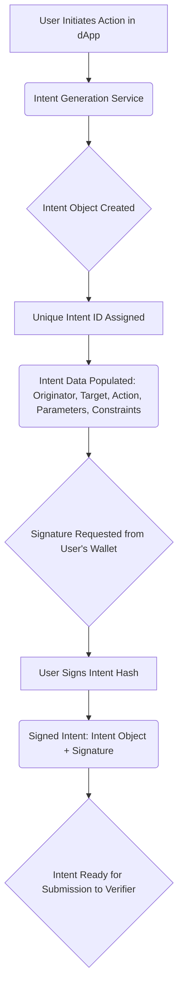

# Anatomy of an Intent - Peeling Back the Layers

**Estimated Time:** 30 minutes
**Prerequisites:** Understanding of intent concepts from section 2.1
**Learning Objectives:**

- Understand the structure and components of an intent object
- Identify how constraints and preferences work in intent-based systems
- Recognize the roles of verifiers and solvers in processing intents

In the [previous section (2.1)](mdc:./01-intents-concept.md), we established that an intent is a user's declarative statement of _what_ they want to achieve. Now, let's dissect the typical structure of an intent object to understand _how_ it formally captures those desires and constraints. This anatomy is crucial for Verifiers to validate intents and for Solvers to find ways to fulfill them.

## Core Intent Object Structure

> 💡 **Web2 Analogy**: You can think of an intent as a structured API request in Web2 development. Just as a REST API might expect a specific JSON structure with certain required fields, an intent requires specific properties like action type, parameters, and authentication details. The difference is that an intent focuses on the desired outcome rather than the specific API endpoints to call.

A NEAR intent is generally represented as a JSON object. While specific implementations can vary, a common structure includes the following key parts. The comments explain each field's purpose.

```json
{
  "schemaVersion": "1.0.0", // Optional: Version of the intent structure itself
  "intentId": "user-generated-unique-id-or-hash", // Optional: A unique identifier for this specific intent instance
  "originator": {
    "accountId": "user-alice.near",
    "actingAs": "dapp-super-swapper.near"
  },
  "target": {
    "type": "SERVICE_OR_CONTRACT_FUNCTION",
    "identifier": "swap-aggregator.near/findBestSwap",
    "specificMethod": "execute_swap_via_route"
  },
  "action": {
    "type": "SWAP_TOKENS",
    "description": "Swap 100 USDC for NEAR with max 0.5% slippage before timestamp 1704067200"
  },
  "parameters": {
    "tokenIn": { "id": "usdc.token.near", "amount": "100000000" },
    "tokenOut": {
      "id": "wrap.near",
      "minAmountOut": "248000000000000000000000"
    }
  },
  "constraints": {
    "deadline": "1704067200",
    "maxGasFee": "100000000000000000000000",
    "slippageTolerance": "0.005",
    "allowedSolvers": ["solver-alpha.near", "solver-beta.near"]
  },
  "signature": {
    "signerAccountId": "user-alice.near",
    "signatureValue": "base64_encoded_signature_value_here",
    "signatureScheme": "ED25519",
    "messageHash": "hash_of_intent_payload_that_was_signed"
  },
  "metadata": {
    "createdAt": "1704066000",
    "dAppSource": "SuperSwapper Frontend v1.2",
    "clientInfo": "Chrome/98.0.4758.102 OS/MacOS",
    "tags": { "priority": "high", "context": "daily_portfolio_rebalance" }
  }
}
```

### Dissecting the Key Sections:

- **`schemaVersion`, `intentId`, `originator`**: Basic envelope information. The `originator` is key for Verifiers to check ownership and permissions.
- **`target`**: Specifies the service or contract function that will ultimately handle the action.
- **`action`**:
  - `type`: A high-level category (e.g., `swap`, `transfer`, `stake`, `liquid_stake`, `vote`, `execute_contract_call`). This helps Verifiers and Solvers route the intent to appropriate logic.
  - `description`: A human-readable summary of the action.
- **`parameters`**: Contains the necessary inputs for the action, like token IDs, amounts, and minimum expected output (`minAmountOut`).
- **`constraints`**:
  - These are **hard rules**. If a Solver cannot meet these, the intent should not be executed. Verifiers check these rigorously.
  - `deadline`: Prevents execution of outdated intents.
  - `maxGasFee`: The user is willing to pay (in yoctoNEAR).
  - `slippageTolerance`: Protects users from unfavorable price changes during a swap.
  - `allowedSolvers`: Restricts execution to a specific list of solvers.
- **`signature`**: Crucial for security. The Verifier will use this to confirm that the intent was indeed created and authorized by the `originator` and hasn't been tampered with.
- **`metadata`**:
  - Useful for dApps, analytics, or providing extra context to Solvers or users later. Generally not used for core validation logic.

> **Note on Real-World Implementations**: The JSON examples throughout this section use illustrative string literals for token IDs (e.g., `"usdc.token.near"`), contract addresses (e.g., `"swap-aggregator.near"`), and user-generated IDs. In production systems, such values are typically managed as named constants, configuration variables, or derived programmatically, rather than being repeatedly hardcoded. This note applies to all subsequent JSON examples in this section.

### 1. Intent ID (`intentId`)

The `intentId` is a unique identifier for this specific intent.

### 2. Originator (`originator`)

The `originator` field specifies who initiated the intent; `actingAs` can indicate if a dApp or another entity is creating the intent on the user's behalf.

### 3. Target (`target`)

The `target` specifies the service or contract function that will ultimately handle the action.

### 4. Action (`action`)

The `action` provides a type and human-readable description.

### 5. Parameters (`parameters`)

`parameters` contains the necessary inputs for the action, like token IDs, amounts, and minimum expected output (`minAmountOut`).

### 6. Constraints (`constraints`)

`constraints` define conditions like a `deadline` (Unix timestamp), `maxGasFee` the user is willing to pay (in yoctoNEAR), `slippageTolerance` for swaps, and potentially a list of `allowedSolvers`.

### 7. Signature (`signature`)

The `signature` object contains the cryptographic signature from the `signerAccountId` (who could be the originator or a delegate), the `signatureValue` itself, the `signatureScheme` used (e.g., ED25519), and the `messageHash` that was signed.

### 8. Metadata (`metadata`)

Finally, `metadata` can include useful information like when the intent was `createdAt`, the `dAppSource`, `clientInfo` for debugging, and arbitrary `tags` for categorization.

## How System Components Interact with Intent Anatomy

> **CORE CONCEPT: Verifier Contracts**
>
> A verifier contract acts as the gatekeeper for intent execution. It validates that:
>
> - The intent format is correct and follows the expected schema
> - The intent is properly signed by the originator
> - The requested action is permitted for this user
> - All constraints (time limits, slippage, etc.) are satisfied
> - The intent hasn't already been executed or expired
>
> Only after passing verification is an intent forwarded to a solver contract for execution.

> **CORE CONCEPT: Solver Contracts**
>
> Solver contracts implement the business logic to fulfill validated intents. A solver:
>
> - Receives verified intents from the verifier
> - Determines the optimal way to execute the requested action
> - Performs the necessary blockchain operations to fulfill the intent
> - Ensures constraints are respected during execution
> - Reports results back to the verifier and ultimately to the user
>
> Multiple solvers might compete to provide the best execution for a given intent.

- **User & dApp**: The dApp helps the user construct this JSON object, often abstracting the complexity via a user-friendly interface.
- **Verifier (Smart Contract)**: Receives the signed intent. Its primary job is to:
  1.  Check the `signature` against the `originator`.
  2.  Validate the overall `action.type` and `action.details` for structural correctness and known parameters.
  3.  Rigorously check all conditions in `constraints`. For a swap, it would verify `maxSlippagePercent`, `deadlineTimestamp`, and potentially simulate if `minOutputAmount` is achievable with current (oracle) prices before marking the intent as "verified" or "invalid."
- **Solver (Often Off-Chain Service)**: Looks for verified intents. A Solver specializing in swaps would:
  1.  Analyze the `action.details` (tokens, amounts).
  2.  Consider the `constraints` (slippage, deadline) as hard limits.
  3.  Optionally consider `preferences` to tailor its solution.
  4.  Propose a fulfillment plan, including the expected outcome and potentially its fee.

## Visualizing the Flows (Refined)

Let's revisit and clarify the flows with this anatomical understanding.

### Simplified Intent Lifecycle Flow

This shows the journey from user idea to on-chain execution.



Figure 1: High-Level Flow of Intent Creation and Signing.

Let's break down each of these conceptual components:

- **User Initiates Action in dApp**: The user expresses their goal through a user interface provided by the dApp.
- **Intent Generation Service**: The dApp constructs the intent object based on the user's input.
- **Intent Object Created**: The intent object is generated and assigned a unique ID.
- **Intent Data Populated**: The intent object is populated with data such as the originator, target, action, parameters, and constraints.
- **Signature Requested from User's Wallet**: The user's wallet is requested to sign the intent hash.
- **User Signs Intent Hash**: The user signs the intent hash using their private key.
- **Signed Intent**: The intent object along with the signed hash is generated.
- **Intent Ready for Submission to Verifier**: The signed intent is ready to be submitted to the Verifier for validation.

### Core Interaction Sequence

This sequence diagram highlights the messages between key actors.

```mermaid
sequenceDiagram
    actor User
    participant DApp
    participant VerifierContract as Verifier
    participant SolverService as Solver
    participant SmartWalletContract as Smart Wallet
    participant Blockchain

    User->>+DApp: Define desired outcome
    DApp->>DApp: Construct & Sign Intent Object (with User's key via Wallet)
    DApp->>VerifierContract: Submit Signed Intent
    VerifierContract->>VerifierContract: Validate Signature, Structure, Constraints
    alt Intent Valid
        VerifierContract-->>SolverService: Notify/Make available: Verified Intent
        SolverService->>SolverService: Analyze Intent, find solution path(s)
        SolverService->>VerifierContract: Submit Fulfillment Proposal (details, outcome, fee)
        VerifierContract->>VerifierContract: Evaluate Proposals, Select Best Solver
        VerifierContract-->>SolverService: Notify Winning Solver
        SolverService->>+SmartWalletContract: Initiate execution of chosen solution
        SmartWalletContract->>+Blockchain: Perform on-chain actions
        Blockchain-->>-SmartWalletContract: Confirmations
        SmartWalletContract-->>-SolverService: Execution Result
        SolverService-->>DApp: Report Outcome
        DApp-->>-User: Display Result
    else Intent Invalid
        VerifierContract-->>DApp: Report Rejection
        DApp-->>-User: Display Error
    end
```

Figure 2: Conceptual Class Diagram of an Intent Object and its Components.

Now, let's explore each part in more detail.

## Advanced Intent Patterns & Implementation Considerations

While the core structure above covers many use cases, the intent framework is flexible. As you go deeper, you might encounter or design more complex patterns.

> **Note for Learners**: The following subsections introduce more advanced concepts and show illustrative code. Grasping the core anatomy first is key. These sections can be revisited as you progress into actual implementation.

### Multi-Step Intents (Compound Actions)

Sometimes a user's ultimate goal requires a sequence of actions. For example: "Swap USDC for wNEAR, then stake that wNEAR."

```json
{
  // ... (originator, signature, etc.)
  "action": {
    "type": "compound",
    "steps": [
      {
        "id": "step1_swap",
        "action": {
          "type": "swap",
          "details": {
            "fromToken": "USDC",
            "fromAmount": "100",
            "toToken": "wNEAR"
          }
        },
        "constraints": { "maxSlippagePercent": "0.5" }
      },
      {
        "id": "step2_stake",
        "action": {
          "type": "stake",
          // Input for staking often implicitly comes from the output of a previous step
          "details": {
            "tokenToStake": "output_of_step1_swap.toToken",
            "validator": "validatorX.pool.near"
          }
        },
        "constraints": { "minStakeDuration": "24h" }
      }
    ]
  },
  "constraints": {
    // Overall constraints for the compound action
    "atomicExecution": true, // CRITICAL: Ensures that if any step fails, the entire sequence is rolled back.
    // This prevents being left in an inconsistent state (e.g., swapped but failed to stake).
    "deadlineTimestamp": "1678890000"
  }
}
```

- **Atomicity (`atomicExecution: true`)**: This is a powerful feature. In Web2, this is akin to database transactions where a series of operations must all complete successfully; otherwise, no changes are committed.

### Conditional Intents

These allow intents to be executed only if certain on-chain (or off-chain, if a trusted oracle is used) conditions are met.

```json
{
  // ... (originator, signature, etc.)
  "action": {
    "type": "conditional_execute",
    "condition": {
      "source": "oracle_price",
      "asset": "NEAR_USD",
      "operator": ">=", // (greater than or equal to)
      "value": "10.00" // (e.g., price is $10 or more)
    },
    "trueBranch_intent": {
      // Intent to execute if condition is true
      "action": {
        "type": "sell_limit_order",
        "details": {
          "sellToken": "NEAR",
          "sellAmount": "50",
          "targetPrice": "10.00"
        }
      }
      // ... further constraints for this sub-intent
    },
    "falseBranch_intent": null // Optional: intent to execute if condition is false
  },
  "constraints": {
    "checkFrequency": "1h", // How often to check the condition
    "maxChecks": "24" // Stop checking after 24 attempts
  }
}
```

- **Web2 Analogy**: Conditional intents are like event-driven actions or business rule engines in Web2 systems, where different processes are triggered based on real-time data feeds or predefined criteria.

### Security & Validation: Illustrative Code Snippet

While the actual Verifier contract will be in Rust (or AssemblyScript), here's a conceptual JavaScript snippet showing some validation logic a Verifier might perform.

```javascript
// Conceptual Validator Logic (Illustrative)
class IntentVerifier {
  async isValid(signedIntent) {
    // 1. Recover the signer from the signature
    // This is a conceptual representation. Actual recovery involves cryptographic operations.
    const originator = await recoverSigner(
      signedIntent.intentPayload,
      signedIntent.signature
    );
    if (originator !== signedIntent.intentPayload.originator.accountId) {
      throw new Error("Signature invalid or signer does not match originator.");
    }

    // 2. Basic structural validation (e.g., using a JSON schema)
    if (!isValidIntentStructure(signedIntent.intentPayload)) {
      throw new Error("Intent structure is invalid.");
    }

    // 3. Validate constraints (deadline, etc.)
    const { constraints } = signedIntent.intentPayload;
    if (
      constraints.deadlineTimestamp &&
      Date.now() / 1000 > constraints.deadlineTimestamp
    ) {
      throw new Error("Intent has expired (deadline passed).");
    }

    // 4. Validate token addresses, amounts, permissions (conceptual)
    // These would involve on-chain checks or calls to trusted oracles/registries.
    await this.validateTokenAddress(
      signedIntent.intentPayload.action.details.fromToken
    );
    await this.validateTokenAddress(
      signedIntent.intentPayload.action.details.toToken
    );
    await this.checkAccountPermissions(originator, signedIntent.intentPayload);

    // 5. Check against any global policies or blacklists
    if (
      isBlocked(originator) ||
      isBlocked(signedIntent.intentPayload.action.details.toToken)
    ) {
      throw new Error("Interaction involves a blocked account or asset.");
    }

    // If all checks pass:
    return true;
  }

  async validateTokenAddress(tokenId) {
    /* ... conceptual on-chain check ... */
  }
  async checkAccountPermissions(accountId, intentPayload) {
    /* ... conceptual permission check ... */
  }
}
```

This conceptual validator performs several key checks:

1.  **Signature Verification**: It verifies the signature to ensure the intent was signed by the originator.
2.  **Structural Validation**: It checks the overall structure of the intent to ensure it follows the expected format.
3.  **Constraint Validation**: It checks the constraints to ensure they are met.
4.  **Token Address Validation**: It validates the token addresses to ensure they are valid and not blocked.
5.  **Permission Validation**: It checks if the originator has the necessary permissions to perform the action.

### Testing Approaches

Thorough testing is vital.

- **Unit Testing**: Test individual validation functions, constraint checkers, and parsing logic.
- **Integration Testing**: Test the end-to-end flow: intent submission -> verification -> solver proposal -> execution -> outcome verification.

## Best Practices for Intent Design & Handling

1.  **Intent Design**:
    - **Atomicity & Focus**: Keep individual intents focused on a single logical outcome. Use `compound` actions for sequences, ensuring atomicity where needed.
    - **Clear Constraints**: Be explicit and realistic with constraints to protect users while allowing Solvers flexibility.
    - **Fallback Options**: Consider what happens if an intent cannot be fulfilled as preferred. For `preferences`, if `routePriority: ["direct_pool_A", "aggregator_B"]` is given, and Pool A fails or gives a bad quote, the system should ideally allow Solvers to try Aggregator B if it still meets hard constraints.
    - **Gas Cost Awareness**: While users might not pay gas directly, complex intents or Verifier logic can incur costs. Design with efficiency in mind.
2.  **Security**:
    - **Rigorous Validation**: Verifiers are the primary defense. Validate all inputs, check authorizations, and ensure constraints are met.
    - **Timeouts & Deadlines**: Crucial for preventing stale executions.
    - **Error Handling**: Graceful error handling and clear feedback to users.
3.  **Testing**: Comprehensive unit, integration, and potentially end-to-end (e2e) tests for all intent types, constraints, and error conditions.
4.  **Monitoring**:
    - Track intent success/failure rates, execution times, and Verifier/Solver performance.
    - **Solver Performance Tracking**: This can be complex. Systems might involve off-chain leaderboards based on successful fulfillments, speed, price efficiency, or even an on-chain reputation system where Solvers stake tokens and can be penalized for malicious behavior or rewarded for good service.

Understanding the anatomy of an intent and the considerations around its lifecycle is fundamental to building robust, user-friendly, and secure intent-centric applications on NEAR. In the following sections, we'll explore the Smart Wallet and Cross-Chain aspects that build upon this foundation.
