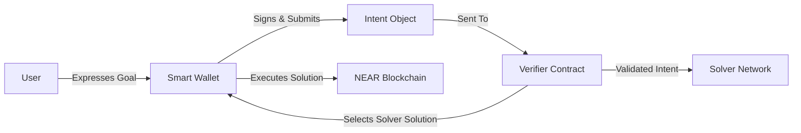

# 3.1: From Concepts to Code - Building Your First NEAR Smart Contract

**Estimated Time:** 35 minutes  
**Prerequisites:** Completion of Module 2, basic Rust familiarity helpful but not required
**Learning Objectives:**

- Set up a local environment for NEAR smart contract development
- Understand key Rust concepts for blockchain development
- Create a basic intent verification contract

## Bridging from Concepts to Implementation

In Module 2, we explored the conceptual components of an intent-centric architecture: Intents, Verifier, Solver, and Smart Wallet. Now, we'll begin implementing these components as actual smart contracts on the NEAR blockchain, starting with the **Verifier contract**.

Let's recall where the Verifier fits in our overall architecture:



**The Verifier contract** is the on-chain rule-checker that validates user intents, ensuring they are well-formed, authorized, and follow the system's constraints. Once deployed on NEAR, this contract will be callable by users (or their Smart Wallets) and will interact with Solver contracts.

## Understanding Smart Contract Storage

> 💡 **Web2 Analogy**: Smart contract storage is conceptually similar to a database in traditional applications, but with important differences. While a Web2 database might have tables with rows and columns managed by a central server, contract storage uses key-value pairs distributed across the blockchain. The crucial differences are: 1) storage on a blockchain costs gas fees, making it much more expensive than traditional databases, 2) all data is public and transparent, and 3) once written, data is immutable unless specific code is written to update it.

In NEAR smart contracts, state is stored in a persistent key-value store. This is similar to databases in Web2, but with blockchain-specific constraints and characteristics:

- Storage costs gas and is paid by users
- Data is transparently visible to everyone
- Reading data is free, but writing has a cost
- Contract storage is limited and should be optimized

As we build our contracts, we'll use various NEAR SDK storage primitives like `LookupMap` and `Vector` to efficiently manage data.

## Rust for Web2 Developers: A Quick Primer

NEAR smart contracts are primarily written in **Rust**, which may be significantly different from the JavaScript/TypeScript you're used to. Here's a quick orientation:

### Key Differences from JavaScript/TypeScript

1. **Compiled vs. Interpreted**: Rust is compiled to WebAssembly (WASM), while JS is typically interpreted. This means we'll have a build step.

2. **Strong Static Typing**: Unlike JS's dynamic typing, Rust requires explicit types for variables, parameters, and return values. This catches many errors at compile-time rather than runtime.

   ```rust
   // JavaScript
   let count = 5;  // Type inferred, but can change
   count = "five"; // Valid in JS, will throw error in TypeScript

   // Rust
   let count: i32 = 5;  // Type specified explicitly
   // count = "five";   // Compile error! Can't change types
   ```

3. **Ownership & Memory Management**: Rust's most unique feature is its ownership system that ensures memory safety without garbage collection. We won't dive deep here, but be aware of borrowing (`&`) and mutation (`&mut`).
4. **Error Handling**: Rust uses `Result<T, E>` types for operations that might fail, rather than throwing exceptions.

5. **Syntax Differences**:
   - Functions: `fn add(a: i32, b: i32) -> i32 { a + b }`
   - Structs (like classes): `struct User { name: String, age: u32 }`
   - Method implementation: `impl User { fn greet(&self) { println!("Hi, {}", self.name); } }`
   - Namespaces/modules: Access items via `::` (e.g., `std::collections::HashMap`)

Don't worry if this seems overwhelming - we'll introduce Rust concepts gradually as needed. If you want to dive deeper, the [official Rust Book](https://doc.rust-lang.org/book/) is an excellent resource.

## Setting Up Your NEAR Smart Contract Environment

Assuming you've already installed Rust and Cargo from the setup in Module 1, let's create a new Rust project for our Verifier contract:

```bash
cd contracts  # Navigate to the contracts directory in your project
cargo new --lib verifier --vcs none  # Create a new library called 'verifier', without version control
cd verifier  # Navigate into the new project
```

These commands create a basic Rust library project structure that we'll modify for NEAR smart contract development.

## Configuring Your Smart Contract with Cargo.toml

First, update the `Cargo.toml` file (similar to `package.json` in Node.js) with the necessary dependencies:

```toml
[package]
name = "verifier"
version = "0.1.0"
edition = "2021"

[lib]
crate-type = ["cdylib"]

[dependencies]
near-sdk = "4.0.0"
serde = { version = "1.0", features = ["derive"] }
serde_json = "1.0"
```

Let's understand what each part does:

- `[package]`: Basic metadata about your project (similar to the top level of a `package.json`).
- `[lib]` section with `crate-type = ["cdylib"]`: This tells Rust to compile our library into a dynamic library format (`.wasm`) suitable for NEAR smart contracts, rather than a standard Rust library.
- `[dependencies]`:
  - `near-sdk = "4.0.0"`: The official NEAR SDK for Rust. It provides essential macros, types, and functions for interacting with the NEAR blockchain (storage, cross-contract calls, logging, etc.).
  - `serde` and `serde_json`: Libraries for serializing/deserializing Rust data structures to/from JSON. Smart contracts need this to handle incoming JSON data (like our Intent objects) and for storage serialization.

## Writing Your First NEAR Smart Contract

Now, let's create a basic intent verification contract in `src/lib.rs`:

```rust
// Import necessary components from the NEAR SDK
use near_sdk::{env, near_bindgen, serde::{Deserialize, Serialize}};

// This macro marks our struct as a NEAR contract
// It generates the boilerplate code to make our struct compatible with the NEAR runtime
#[near_bindgen]
// This macro implements the Default trait, allowing the contract to be initialized with default values
#[derive(Default)]
pub struct Verifier {
    // Contract state would go here
    // (empty for now, we'll add state in the next sections)
}

// Define what an Intent looks like in our system
// These derive macros enable conversion to/from JSON for the Intent struct
#[derive(Serialize, Deserialize)]
// This tells the serialization framework to use the version of serde from the NEAR SDK
#[serde(crate = "near_sdk::serde")]
pub struct Intent {
    pub action: String,         // What the user wants to do (e.g., "swap", "transfer")
    pub input_token: String,    // Token the user is providing
    pub input_amount: u128,     // Amount of the input token
                               // u128 is good for token amounts - it can handle very large numbers
                               // without risk of overflow, and tokens shouldn't be negative
    pub output_token: String,   // Token the user wants to receive
    pub max_slippage: f64,      // Maximum acceptable price difference (as a percentage)
                               // Note: f64 is fine for this example, but in production
                               // fixed-point arithmetic might be preferred for financial calculations
}

// This marks the implementation block for our contract methods
#[near_bindgen]
impl Verifier {
    // Public method that can be called by users or other contracts
    // &self indicates this is a "view" method - it doesn't modify contract state
    // The intent parameter will be automatically deserialized from JSON by the NEAR runtime
    pub fn verify_intent(&self, intent: Intent) -> bool {
        // For now, we'll just log the action and return true
        // env::log_str is similar to console.log in JavaScript
        env::log_str(&format!("Verifying intent: {}", intent.action));

        // In a real implementation, we would check various conditions
        // We'll implement actual verification logic in the next sections
        true
    }
}

// Automatically generated tests module (created by cargo)
// This is where unit tests would go - we'll cover testing later
#[cfg(test)]
mod tests {
    use super::*;

    #[test]
    fn it_works() {
        // A simple test that our verify_intent function exists and returns true
        let verifier = Verifier::default();
        let intent = Intent {
            action: "swap".to_string(),
            input_token: "NEAR".to_string(),
            input_amount: 1000000000000000000000000, // 1 NEAR (in yoctoNEAR)
            output_token: "USDC".to_string(),
            max_slippage: 0.5,
        };
        assert_eq!(verifier.verify_intent(intent), true);
    }
}
```

## Building Your Smart Contract

Now, let's compile our contract to WebAssembly:

```bash
cargo build --target wasm32-unknown-unknown --release
```

Breaking down this command:

- `cargo build`: Initiates the build process (similar to `npm run build`).
- `--target wasm32-unknown-unknown`: Specifies that we want to compile to WebAssembly. This target was added during Rust setup in Module 1.
- `--release`: Creates an optimized build (smaller file size, faster execution) suitable for deployment.

This command produces a `.wasm` file in the `target/wasm32-unknown-unknown/release/` directory. This WebAssembly binary is your actual smart contract that will be deployed to the NEAR blockchain.

## Next Steps

You've just created a basic NEAR smart contract for intent verification! While our current implementation is simple, in the next sections, we'll:

1. Add robust intent verification logic with constraints validation.
2. Implement state management to track verified intents.
3. Create interaction patterns between the Verifier and Solver contracts.

In the next section, [3.2 Intent Verifier](mdc:./02-intent-verifier.md), we'll develop a more sophisticated Verifier contract with comprehensive validation logic, showing how our conceptual understanding of intents from Module 2 translates to actual smart contract code.
