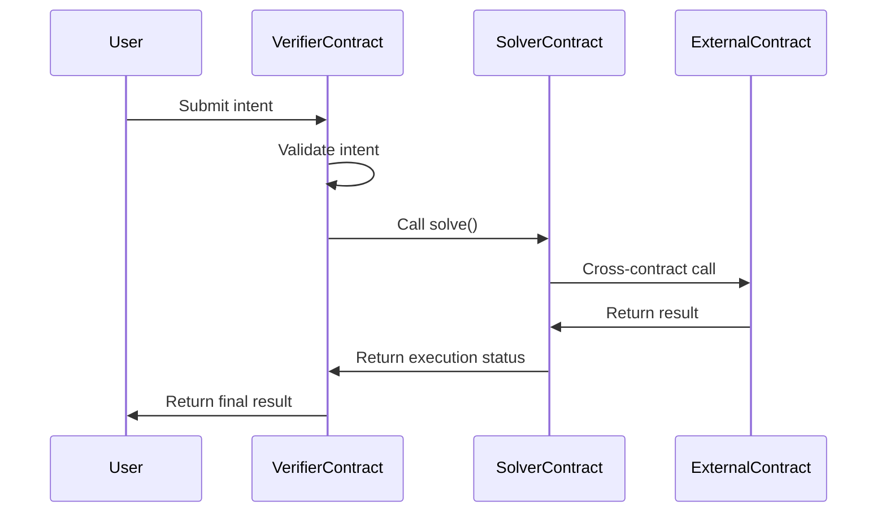
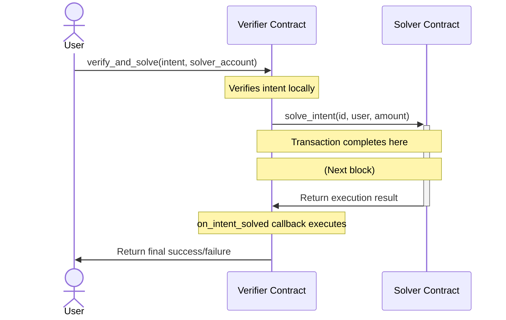

# Advanced Contract Interactions - Mastering Cross-Contract Calls

**Estimated Time:** 30 minutes
**Prerequisites:** Completed Verifier and Solver contract implementation from sections 3.2-3.3
**Learning Objectives:**

- Understand asynchronous cross-contract calls in NEAR
- Implement proper callback handling for contract communication
- Master gas allocation across contract interactions

In the [previous sections](mdc:./03-solver-contract.md), we implemented both the Verifier and Solver contracts. Now, we'll dive deeper into how these contracts communicate with each other through **cross-contract calls** and how to properly handle their asynchronous nature.

## Understanding Cross-Contract Calls in NEAR

### The Asynchronous Nature of Blockchain Interactions

In Web2 development, when one service calls another (e.g., a microservice making an HTTP request), you typically:

1. Make the request
2. Wait for the response
3. Process the result immediately within the same execution context

Blockchain is fundamentally different. Cross-contract calls in NEAR are necessarily **asynchronous** due to:

- **Consensus Requirements**: Each transaction (including cross-contract calls) must be validated across the network
- **Block Boundaries**: The called contract's execution often happens in a subsequent block
- **Resource Management**: Executing everything synchronously would lead to extremely long transactions and unpredictable gas usage
- **Transaction Model**: NEAR's shard-based architecture means contracts might live on different shards

As a result, cross-contract calls return `Promise` objects rather than immediate results. This is similar to `async/await` or `Promise` in JavaScript, but at the blockchain transaction level.

## Cross-Contract Call Flow Visualization

This diagram illustrates the complete cross-contract communication flow between a user, the Verifier, and the Solver contracts:



Notice how the flow spans multiple interactions, with each arrow potentially representing a separate blockchain transaction. This asynchronous pattern requires careful handling through callbacks and promises.

## Implementing Cross-Contract Communication

Let's enhance our Verifier contract to properly interact with our Solver, including handling the asynchronous results.

### Step 1: Define the External Contract Interface

First, we need to define an interface that describes the Solver contract's methods we want to call:

```rust
use near_sdk::{ext_contract, json_types::U128, AccountId, Promise};

// The ext_contract macro generates code for making cross-contract calls
// It creates an interface to the external contract (Solver in this case)
#[ext_contract(ext_solver)]
trait Solver {
    // Define the methods of the Solver contract that we want to call
    fn solve_intent(&self, intent_id: String, user: AccountId, input_amount: U128) -> Promise;
}

// This defines an interface to our own contract for callbacks
// We'll use this for when the Solver responds
#[ext_contract(ext_self)]
trait VerifierCallbacks {
    fn on_intent_solved(&mut self, intent_id: String) -> bool;
}
```

This creates two interfaces:

1. `ext_solver`: Defines methods we can call on the Solver contract
2. `ext_self`: Defines callback methods on our own contract that will execute after the Solver completes

### Step 2: Implement the Cross-Contract Call with Callback

Now, let's enhance our Verifier implementation to handle the full asynchronous flow:

```rust
#[near_bindgen]
impl Verifier {
    // This method initiates the cross-contract call to the Solver
    pub fn verify_and_solve(&mut self, intent: Intent, solver_account: AccountId) -> Promise {
        // First verify the intent (returning early with assertion if invalid)
        assert!(self.verify_intent(intent.clone()), "Intent verification failed");

        // Log that we're proceeding to solve the intent
        env::log_str(&format!("Verified intent {}, calling solver at {}", intent.id, solver_account));

        // Prepare user account for the solver (with error handling)
        let user_account = match intent.user_account.parse::<AccountId>() {
            Ok(account) => account,
            Err(_) => env::panic_str("Invalid user account format in intent"),
        };

        // Make the cross-contract call to the solver
        // This returns a Promise immediately, but the actual execution happens later
        ext_solver::solve_intent(
            intent.id.clone(),        // The intent ID
            user_account,             // The user account (now properly parsed)
            U128(intent.input_amount), // Input amount (wrapped in U128 for proper JSON serialization)
            solver_account,           // The solver contract's account ID
            0,                        // No attached deposit
            10_000_000_000_000        // Gas allocation for the solver (10 TGas)
        )
        // Chain a callback to handle the result
        // This executes after the solver completes (whether successful or not)
        .then(ext_self::on_intent_solved(
            intent.id,                // Pass the intent ID to the callback
            env::current_account_id(), // Our own account ID
            0,                        // No attached deposit
            5_000_000_000_000         // Gas allocation for the callback (5 TGas)
        ))
    }

    // Callback method that executes after the solver attempt
    // #[private] ensures only the contract itself can call this method
    #[private]
    pub fn on_intent_solved(&mut self, intent_id: String) -> bool {
        // Check if the cross-contract call succeeded
        // env::promise_result() gives us the result of the previous Promise
        let solver_succeeded = match env::promise_result(0) {
            PromiseResult::Successful(_) => {
                // The solver successfully executed the intent
                env::log_str(&format!("Intent {} was successfully solved", intent_id));
                true
            },
            PromiseResult::Failed => {
                // The solver failed to execute the intent
                env::log_str(&format!("Intent {} execution failed at solver", intent_id));
                false
            },
            PromiseResult::NotReady => {
                // This should never happen in a callback
                env::panic_str("Promise result not ready")
            }
        };

        // This return value can be used by other contract logic or returned to the caller
        solver_succeeded
    }
}
```

This implementation introduces several important concepts:

1. **Error Handling**: We properly handle parsing errors for the user account
2. **Promise Chaining**: We use `.then()` to schedule a callback after the Solver executes
3. **Callback Function**: `on_intent_solved` processes the result of the Solver's execution
4. **Promise Results**: `env::promise_result(0)` retrieves the result of the previous Promise in the chain
5. **Private Methods**: `#[private]` ensures only the contract itself can call the callback

### Step 3: Visualizing the Execution Flow

Here's how the execution flows across contracts:



This diagram illustrates the asynchronous nature of the interaction:

1. The initial transaction ends after the Verifier initiates the call to the Solver
2. The Solver executes in a separate transaction
3. The callback executes in yet another transaction

## Gas Allocation Considerations

When making cross-contract calls, you need to carefully allocate gas for each step:

1. **Gas for the Called Contract**: You must attach enough gas for the Solver to execute the intent. If you don't, the execution will fail when it runs out of gas.

2. **Gas for Callbacks**: Each callback in the Promise chain needs its own gas allocation.

3. **Total Gas Limits**: NEAR has a limit of 300 TGas per transaction. If your entire cross-contract chain would exceed this, you need to break it into multiple independent transactions.

In our example:

- We allocate 10 TGas to the Solver execution
- We allocate 5 TGas to our callback
- The total (including the Verifier's own execution) must stay under NEAR's gas limits

### Web2 Analogy: Resource Allocation

This is similar to how you might allocate compute resources, memory limits, or execution timeouts for various microservices in a Web2 architecture. The key difference is that in blockchain, these resources are paid for with gas fees and their allocation is much more explicit.

## Building and Deploying the Enhanced Verifier

After adding the callback functionality, rebuild and redeploy your verifier:

```bash
cd contracts/verifier
cargo build --target wasm32-unknown-unknown --release
near deploy --accountId verifier.yourname.testnet \
  --wasmFile ./target/wasm32-unknown-unknown/release/verifier.wasm
```

## Testing the End-to-End Flow

Now, let's test our integrated system:

```bash
# Verifier calls Solver's solve_intent_for_account
# Replace <YOUR_ACCOUNT_ID> with your actual NEAR testnet account ID
# Ensure verifier.<YOUR_ACCOUNT_ID>.testnet and solver.<YOUR_ACCOUNT_ID>.testnet are deployed

# Step 1: Prepare intent arguments in a file (e.g., xc_intent_args.json)
# Create a file named xc_intent_args.json with the following content:
# {
#   "intent": {
#     "intent_id": "xc-intent-001",
#     "user_account": "alice.<YOUR_ACCOUNT_ID>.testnet",
#     "input_token": "usdc.near",
#     "input_amount": "100000000",
#     "output_token": "wnear.near",
#     "min_output_amount": "90",
#     "max_slippage": 0.05,
#     "deadline": 0,
#     "verifier_id": "verifier.<YOUR_ACCOUNT_ID>.testnet"
#   }
# }

# Step 2: Call the verify_intent function using the arguments file
near call verifier.<YOUR_ACCOUNT_ID>.testnet verify_intent --argsFile xc_intent_args.json --accountId alice.<YOUR_ACCOUNT_ID>.testnet --gas 300000000000000

# Check logs for verifier.<YOUR_ACCOUNT_ID>.testnet and solver.<YOUR_ACCOUNT_ID>.testnet to see the flow and callback results.
# You might use near-cli or a NEAR explorer.
```

### Debugging Cross-Contract Calls

When working with cross-contract calls, debugging can be challenging since execution spans multiple transactions. Here are some tips:

1. **Use NEAR Explorer**: Look up the transaction hash to see logs from all contracts involved

2. **Emit Detailed Logs**: Use `env::log_str()` liberally in both contracts and callbacks to trace execution flow

3. **Use Distinct IDs**: Include unique identifiers (like the intent ID) in all logs to correlate events across transactions

4. **Check Receipts**: In NEAR Explorer, examine the receipt details to see how gas was consumed and what contract methods were called

## Advanced Cross-Contract Patterns

As you build more complex intent systems, you might use these advanced patterns:

### 1. Multi-Step Promise Chains

You can chain multiple cross-contract calls:

```rust
// Example: Call solver, then a token contract, then back to self
ext_solver::solve_intent(...)
  .then(ext_token::transfer(...))
  .then(ext_self::on_transfer_complete(...))
```

### 2. Parallel Promises

You can execute multiple Promises in parallel and then join their results:

```rust
// Execute two Promises in parallel and then handle their combined results
Promise::join(
    ext_contract_a::method_a(...),
    ext_contract_b::method_b(...)
).then(ext_self::on_both_complete(...))
```

### 3. Conditional Promise Chains

You can conditionally execute further Promises based on callback results:

```rust
#[private]
pub fn on_first_step(&mut self) -> Promise {
    if env::promise_result(0).is_success() {
        // Execute next step if first was successful
        ext_contract::next_step(...)
    } else {
        // Handle failure case
        Self::end_execution(...)
    }
}
```

## Best Practices for Cross-Contract Calls

When implementing cross-contract interactions, follow these guidelines:

1. **Use Proper Error Handling**: Always handle potential failures in parsing and Promise execution.

2. **Ensure Data Consistency**: Make sure data structures (like `Intent`) are consistent between contracts. Any mismatch in fields or types can cause serialization failures.

3. **Monitor Gas Usage**: Carefully allocate gas for each step in the Promise chain. Consider the computational complexity of each operation.

4. **Implement Idempotent Operations**: Design your contract methods to be safely retryable in case of failures.

5. **Guard Against Reentrancy**: Be aware that callbacks can potentially be called in unexpected orders. Implement proper checks to prevent reentrancy attacks.

6. **Use #[private] for Callbacks**: Always mark callback methods as private to prevent them from being called directly by users.

## Next Steps

You now have a complete intent-processing backend with the Verifier and Solver contracts properly connected through asynchronous cross-contract calls. In the [next section](mdc:./05-testing.md), we'll explore how to thoroughly test our smart contracts to ensure they're robust and secure before deploying to production.

// Assuming Intent is defined and imported (e.g., from verifier or a shared module)
// If not, we define a local version for this example #[derive(Serialize, Deserialize, BorshDeserialize, BorshSerialize, Debug, Clone)] #[serde(crate = "near_sdk::serde")] #[serde(rename_all = "camelCase")]
pub struct Intent {
pub intent_id: String,
pub user_account: AccountId,
pub input_token: String,
pub input_amount: u128,
pub output_token: String,
pub min_output_amount: u128,
pub max_slippage: f64, // Simplified for example
pub deadline: Timestamp,
pub verifier_id: AccountId,
}

// Structure for verify_intent arguments (when calling Verifier) #[derive(Serialize, Deserialize, BorshDeserialize, BorshSerialize, Debug)] #[serde(crate = "near_sdk::serde")] #[serde(rename_all = "camelCase")]
pub struct IntentParams {
pub intent: Intent,
}

// Structure for solve_intent_for_account arguments (when Verifier calls Solver) #[derive(Serialize, Deserialize, BorshDeserialize, BorshSerialize, Debug, Clone)] #[serde(crate = "near_sdk::serde")] #[serde(rename_all = "camelCase")]
pub struct IntentForSolver {
pub intent_payload: Intent,
pub originator_account_id: AccountId,
}
