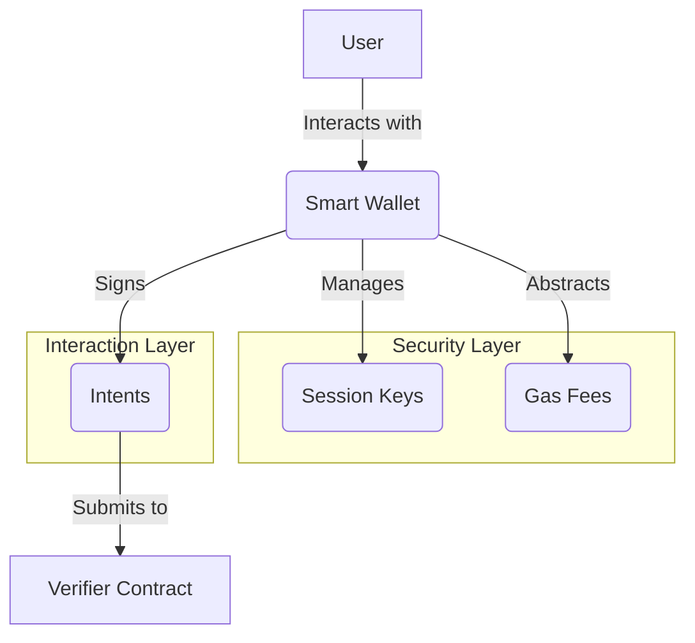

# Understanding Gas & Fees in Intent Systems

**Estimated Time:** 20 minutes
**Prerequisites:** Completed previous sections on contract implementation
**Learning Objectives:**

- Understand how gas fees work in blockchain compared to Web2 infrastructure costs
- Identify strategies for optimizing gas usage in intent systems
- Recognize the economic models for a sustainable intent architecture

## Blockchain Economics for Web2 Developers

Intent-based systems have a multi-layered economic model that's important to understand before going to production. If you're coming from Web2, think of this as understanding:

1. **Infrastructure costs** (like AWS/Azure charges)
2. **Service fees** (what you charge users)
3. **Third-party API costs** (external services your app uses)

In blockchain, these concepts map to:

| Web2 Concept  | Web3 Equivalent   | Who Pays                                | Who Receives          |
| ------------- | ----------------- | --------------------------------------- | --------------------- |
| Server costs  | Gas fees          | Transaction initiator (user or relayer) | Network validators    |
| Service fees  | Solver fees       | User (from input or output tokens)      | Solver operators      |
| Platform fees | Protocol fees     | User (built into the system)            | Protocol treasury/DAO |
| API charges   | DEX/Protocol fees | Solver (factored into their fees)       | Underlying protocols  |

## Understanding Gas: Blockchain's Computing Resource

> **CORE CONCEPT: Gas Fees**
>
> Gas fees are the costs paid for computation and storage on a blockchain network. They work as follows:
>
> - Every operation in a smart contract costs a specific amount of gas
> - Users pay for gas in the blockchain's native token (e.g., NEAR)
> - Gas prices fluctuate based on network demand and congestion
> - Failed transactions still consume gas for the computation attempted
> - Gas limits protect the network from infinite loops or excessive resource usage
>
> **Web2 Parallel**: In Web2 systems, server resources are typically paid for by the service provider and included in their business costs. Users don't directly pay for each database query or API call. In contrast, blockchain operations require users to pay for computation directly through gas fees. Think of gas as the metered computing power needed to execute your code—similar to how you might pay for serverless function execution in AWS, but made explicit with each transaction.

In traditional Web2 systems, computing resources are:

- Billed in aggregate (monthly server costs)
- Usually invisible to end users
- Paid by the service provider

In Web3, gas works differently:

- **Pay-per-operation**: Every computation step costs gas
- **User-visible**: End users explicitly pay for their transactions
- **Variable pricing**: Gas prices fluctuate with network demand

Gas in NEAR is measured in "gas units" with a conversion to NEAR tokens that varies based on network conditions.

### Optimizing Gas Usage

Since gas directly impacts user costs, optimizing for gas efficiency is similar to optimizing server costs in Web2, but with a direct impact on user experience:

```rust
// Gas-inefficient approach (similar to loading a full database table)
pub struct Verifier {
    // Store every intent as a complete object in a Vector
    pub verified_intents: Vec<Intent>,
}

// Gas-efficient approach (similar to using indexed lookups)
pub struct Verifier {
    // Store only intent IDs and minimal metadata in a LookupMap
    pub verified_intents: LookupMap<String, IntentStatus>,
}
```

`LookupMap` provides O(1) access time for reads and writes, whereas with a `Vec`, you might need to iterate through all elements to find a specific intent, resulting in O(n) complexity and higher gas usage as your data grows.

### Efficient Data Serialization with borsch

```rust
// Using borsch for efficient serialization
#[derive(borschDeserialize, borschSerialize)]
pub struct IntentStatus {
    pub verified: bool,
    pub timestamp: u64,
    pub user: AccountId,
}
```

**Web2 Parallel**: borsch is NEAR's binary serialization format, optimized for minimal size and fast processing. Think of it as using Protocol Buffers or a highly optimized binary format instead of JSON in your APIs for better performance.

### Batch Operations for Gas Savings

```rust
// Process multiple operations in a single transaction
pub fn verify_multiple_intents(&mut self, intents: Vec<Intent>) -> Vec<bool> {
    let mut results = Vec::with_capacity(intents.len());

    for intent in intents {
        results.push(self.verify_intent(intent));
    }

    results
}
```

**Web2 Parallel**: Similar to batching API calls or using bulk inserts in a database to reduce overhead.

## Designing Fee Models for Solvers

A well-designed fee structure is essential for a sustainable intent ecosystem. Solvers can implement various fee models:

```rust
pub enum FeeModel {
    Fixed(Balance),               // E.g., 1 NEAR per execution
    Percentage(u32),              // In basis points (1/100 of a percent)
                                  // E.g., 20 = 0.2%
    Tiered(Vec<(Balance, u32)>),  // (threshold, fee_bps) pairs
                                  // E.g., [(1000, 50), (10000, 30), (100000, 20)]
                                  // 0.5% for <1000, 0.3% for <10000, 0.2% for <100000
}

impl Solver {
    pub fn calculate_fee(&self, amount: Balance) -> Balance {
        match &self.fee_model {
            FeeModel::Fixed(fee) => *fee,
            FeeModel::Percentage(bps) => (amount * (*bps as u128)) / 10_000,
            FeeModel::Tiered(tiers) => {
                for (threshold, fee_bps) in tiers.iter().rev() {
                    if amount >= *threshold {
                        return (amount * (*fee_bps as u128)) / 10_000;
                    }
                }
                0 // No fee for amounts below the lowest tier
            }
        }
    }
}
```

**Web2 Parallel**: This is directly comparable to SaaS pricing tiers, payment processing fees, or marketplace commission structures in Web2 applications.

## Creating a Healthy Intent Marketplace

For a sustainable intent ecosystem, focus on:

1. **Solver Competition**: Enable multiple solvers to compete for intent execution, creating price pressure that benefits users. This is similar to how ride-sharing platforms have multiple drivers competing for rides.

2. **Fee Transparency**: Users should clearly see all fees before submission, just as they would expect transparent pricing in any Web2 service.

3. **Performance Incentives**: Reward solvers for better execution prices. This is comparable to performance-based ranking in marketplaces like Amazon or Etsy.

4. **Reputation Systems**: Track solver reliability and execution quality over time. Similar to seller ratings on e-commerce platforms or driver ratings in ride-sharing apps.

## Understanding and Preventing MEV

MEV (Maximal Extractable Value) is a concept that may be unfamiliar to Web2 developers.

**Web2 Parallel**: Think of MEV as similar to high-frequency trading advantages in traditional finance or like a marketplace where a platform operator could use insider information about pending orders to their advantage.

Here's what it means and how to protect against it:

1. **What is MEV?**

   - The ability for blockchain validators or other participants to extract additional profit by reordering, inserting, or censoring transactions
   - For users, MEV often manifests as getting worse prices than expected (front-running)

2. **Protection Strategies**:

   - **Private Intents**: Keep intents encrypted or in a private mempool until execution, similar to how sensitive Web2 APIs might use end-to-end encryption

   - **Batch Execution**: Group intents together to reduce MEV opportunities, comparable to how batch order processing can prevent information leakage in traditional trading systems

   - **Slippage Protection**: Set strict limits on acceptable execution prices, similar to limit orders in trading

   - **Time Locks**: Add mechanisms to prevent last-minute changes, similar to escrow periods in high-value transactions

## Comparing Implementation Approaches: Cost vs. UX

When designing your intent system, consider these tradeoffs:

| Approach                                     | Gas Costs | UX Quality | Implementation Complexity |
| -------------------------------------------- | --------- | ---------- | ------------------------- |
| Direct Smart Contract Calls                  | Low       | Poor       | Simple                    |
| Basic Intent System                          | Medium    | Better     | Medium                    |
| Advanced Intent System w/ Solver Competition | High      | Best       | Complex                   |

**Web2 Parallel**: This is comparable to choosing between:

- A bare-bones API with minimal features (simple but limited)
- A managed service with some convenience features (balanced)
- A fully-featured platform with AI-powered optimization (powerful but complex)

## Advanced User Cost Optimization Techniques

For production intent systems, consider these advanced techniques:

1. **Batching**: Combine multiple user intents into a single transaction

   ```rust
   pub fn batch_process(&mut self, intents: Vec<Intent>, solver: AccountId) {
       // Process multiple intents with a single transaction overhead
   }
   ```

2. **onchain Verification**: Perform preliminary intent verification off-chain before submitting to the blockchain

   ```rust
   // Client-side code validates format, signatures, basic constraints
   // Only valid intents are submitted on-chain, saving users gas on obviously invalid intents
   ```

3. **Gasless Transactions**: Implement meta-transactions where a relayer pays gas on behalf of users

   ```rust
   pub fn relay_intent(&mut self, intent: Intent, user_signature: Signature) {
       // Relayer calls this function and pays gas
       // Contract verifies user's signature to authenticate the intent
   }
   ```

4. **Session Keys**: Enable users to authorize multiple intent submissions with a single signature
   ```rust
   pub fn register_session_key(&mut self, session_key: PublicKey, expiry: u64) {
       // User authorizes a temporary key for submitting multiple intents
   }
   ```

**Web2 Parallel**: These optimizations are similar to using connection pooling, caching, CDNs, or OAuth tokens in Web2 applications to reduce overhead and improve user experience.

## Summary

Understanding the economic model of your intent system is crucial for creating a sustainable and user-friendly application. By optimizing gas usage, designing fair fee structures, and implementing protective mechanisms, you can build an intent system that balances costs with superior UX.

## The User Experience Challenge

As you've seen throughout this module, direct interaction with smart contracts involves complexities like gas fees, function calls, and state management. These technical aspects create significant friction for end users who are used to seamless Web2 experiences.

Consider the challenges a typical user would face when using our intent system directly:

1. They would need to understand concepts like gas fees and attached deposits
2. They would have to sign individual transactions for each operation
3. They would be exposed to technical details like contract addresses and function names
4. They might experience failed transactions and have to retry with different parameters

This is where **Smart Wallet Abstractions** come in - they provide a layer that simplifies blockchain interactions without sacrificing the benefits of intent-based architecture.

## Smart Wallet Architecture

The following diagram illustrates how smart wallet abstractions fit into our overall system:



## Next Steps: Building the Smart Wallet Experience

In the next module, **[Module 4: Smart Wallet Experience](mdc:../04-smart-wallet-experience/01-session-wallet.md)**, we'll explore how to implement these smart wallet abstractions to provide users with a more familiar experience while maintaining the benefits of blockchain technology. We'll start with session-based authentication, which allows users to authenticate once rather than sign every transaction.

Key topics we'll cover include:

- Session key management using NEAR's Function Call Access Keys
- Secure authentication patterns for Web3 applications
- Action abstraction for simplified user interactions
- Testing your smart wallet implementation

These smart wallet abstractions will build directly on the contracts we've developed in this module, creating a complete intent-based system that's both powerful and user-friendly.
