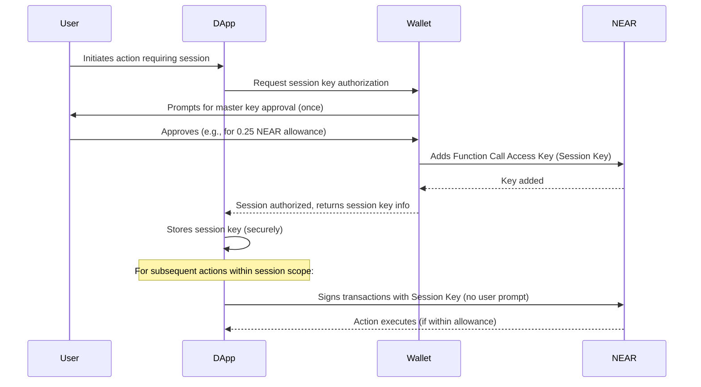

# Session-based Smart Wallets - Bridging Intent Architecture to User Experience

**Time**: 15 minutes  
**Pre-requisite**: Understanding of intent architecture from Module 3

## Connecting Intent Architecture with User Experience

In the previous module, we built the on-chain infrastructure of our intent system with Verifier and Solver contracts. Now, we'll implement the final piece that bridges users to this infrastructure: **the smart wallet layer**.



Figure 1: Session Key Authorization and Usage Flow.

This flow allows the dApp to perform specific actions on the user's behalf without requiring repeated manual approvals, significantly improving the user experience for applications that need frequent on-chain interactions.

## Understanding Session-based Smart Wallets

A traditional Web3 wallet requires the user to approve and sign every single transaction, creating significant UX friction. A session-based smart wallet solves this problem by allowing users to authorize a temporary session key with limited permissions that can perform actions on their behalf without requiring additional signatures.

> 💡 **Web2 Parallel**: This is similar to how OAuth tokens work in Web2 applications. When you authorize a third-party app to access your Google account, you grant it specific permissions (scopes) without sharing your main password.

## NEAR's Function Call Access Keys

NEAR provides a powerful mechanism called **Function Call Access Keys** that enables session-based wallet functionality. These are limited-permission keys that:

- Can only call specific methods on specific contracts
- Have a capped allowance of NEAR tokens for gas fees
- Can optionally be time-limited
- Cannot transfer funds directly or modify the account in other ways

## The Complete Session Key Lifecycle

Understanding the full lifecycle of a session key is crucial:

1. **Generation**: A new key pair is generated by the dApp
2. **Authorization**: The user approves adding this as a Function Call Access Key to their account
3. **Storage**: The dApp securely stores the private key
4. **Usage**: The dApp uses the key to sign and send transactions
5. **Expiration/Revocation**: The key is eventually depleted, expires, or is revoked

Let's implement each step:

### 1. Generating a Session Key

```javascript
import { KeyPair } from "near-api-js";

// Generate a brand new key pair (typically done by the dApp)
function generateSessionKeyPair() {
  // Create a new ED25519 key pair
  const keyPair = KeyPair.fromRandom("ed25519");

  // Get the public key in a format ready for on-chain authorization
  const publicKey = keyPair.getPublicKey().toString();

  // The private key should be securely stored by the dApp
  const privateKey = keyPair.toString();

  return { publicKey, privateKey, keyPair };
}
```

### 2. Requesting User Authorization

```javascript
import { transactions, utils } from "near-api-js";

// Request the user to authorize this session key via their main wallet
async function authorizeSessionKey(
  userAccountId,
  sessionKeyPublicKey,
  contractId,
  methods
) {
  // Access the user's main wallet (e.g., NEAR Wallet, MyNearWallet)
  const walletConnection = await connectToWallet();

  // Create a transaction to add the session key as a Function Call Access Key
  const actions = [
    transactions.functionCallAccessKey(
      contractId, // The contract this key can call (e.g., your Verifier contract)
      methods, // Array of method names this key can call (e.g., ['verify_intent'])
      utils.format.parseNearAmount("0.25") // Allowance (max 0.25 NEAR for gas fees)
    ),
  ];

  // Redirect user to their wallet to approve this key addition
  await walletConnection.requestAddKey(
    sessionKeyPublicKey, // The public key to add
    actions // The permissions for this key
  );

  // After approval, the wallet will redirect back to your dApp
}
```

### 3. Securely Storing the Session Key

```javascript
// Store the session key (typically after receiving redirect from wallet)
function storeSessionKey(accountId, privateKey) {
  // For development ONLY - in production consider more secure options
  // or keeping the key in memory only for the current browser session
  const sessionData = {
    accountId,
    privateKey,
    createdAt: new Date().toISOString(),
  };

  // WARNING: localStorage is vulnerable to XSS attacks
  // This is a simplified example for demonstration purposes
  localStorage.setItem("nearSessionKey", JSON.stringify(sessionData));
}
```

> ⚠️ **Security Warning**: Storing private keys in localStorage is convenient but vulnerable to cross-site scripting (XSS) attacks. For production applications, consider:
>
> - Storing keys in memory only for the current session
> - Using secure browser storage APIs if available
> - Encrypting keys with a user password before storage
> - Using a more secure key management solution

### 4. Using the Session Key for Transactions

```javascript
import { connect, keyStores, KeyPair } from "near-api-js";

// Setup a NEAR connection that uses the session key
async function createSessionConnection(accountId, privateKey) {
  // Create an in-memory keystore for the session key
  const keyStore = new keyStores.InMemoryKeyStore();

  // Load the private key into a KeyPair object
  const keyPair = KeyPair.fromString(privateKey);

  // Add the key to the keystore for the specified account
  await keyStore.setKey("testnet", accountId, keyPair);

  // Connect to NEAR with this keystore
  const near = await connect({
    networkId: "testnet",
    keyStore,
    nodeUrl: "https://rpc.testnet.near.org",
    walletUrl: "https://wallet.testnet.near.org",
  });

  // Get the account object that will use the session key
  const account = await near.account(accountId);
  return account;
}

// Use the session to call a contract without user approval
async function callContractWithSession(
  sessionAccount,
  contractId,
  method,
  args
) {
  try {
    const result = await sessionAccount.functionCall({
      contractId,
      methodName: method,
      args,
      gas: "30000000000000", // 30 TGas
      attachedDeposit: "0", // No attached deposit
    });

    console.log("Transaction succeeded:", result.transaction.hash);
    return result;
  } catch (error) {
    console.error("Transaction failed:", error);

    // Handle errors like insufficient allowance or unauthorized method
    if (error.message.includes("Exceeded the allowance")) {
      // Session key has run out of its NEAR allowance
      // Prompt user to authorize a new session key
    }

    throw error;
  }
}
```

### 5. Managing Key Expiration and Revocation

For a complete implementation, you should also consider:

- **Tracking key usage**: Monitor the remaining allowance
- **Renewal**: Prompt the user to authorize a new key before the old one expires
- **Revocation UI**: Let users view and revoke active session keys
- **Auto-expiry**: Set time-based expiration for unused keys

## Putting It All Together

Here's how a typical session key flow works in a dApp:

```javascript
// On app initialization, check if we have a valid session key
async function initializeWallet() {
  const savedSession = localStorage.getItem("nearSessionKey");

  if (savedSession) {
    // We have a saved session key, try to use it
    const { accountId, privateKey } = JSON.parse(savedSession);
    return createSessionConnection(accountId, privateKey);
  } else {
    // No session key, we'll need to create one
    const { publicKey, privateKey } = generateSessionKeyPair();

    // Request user to authorize this key (will redirect to wallet)
    await authorizeSessionKey(
      "user.testnet", // User's account ID
      publicKey, // Our new public key
      "verifier.testnet", // The contract this key can call
      ["verify_intent", "verify_and_solve"] // Methods this key can call
    );

    // After redirect back from wallet:
    storeSessionKey("user.testnet", privateKey);
    return createSessionConnection("user.testnet", privateKey);
  }
}
```

## Linking to Our Intent Architecture

With our session-based smart wallet, we can now build a seamless user experience for our intent system:

1. User connects to our dApp and authorizes a session key (one-time approval)
2. Our dApp uses this session key to submit intents to the Verifier contract
3. The Verifier validates these intents and forwards them to Solvers
4. Users get all the benefits of the intent architecture without repetitive signing

In the next section, we'll explore how to implement secure key management and storage for our smart wallet.

// Configuration - In a real app, load from a config file or environment variables
const NEAR_NETWORK_ID = "testnet";
const VERIFIER_CONTRACT_ID = "<YOUR_VERIFIER_CONTRACT_ID>"; // e.g., verifier.your-account.testnet
const USER_ACCOUNT_ID = "<YOUR_USER_ACCOUNT_ID>"; // e.g., user-alice.testnet
const SESSION_KEY_ALLOWANCE_NEAR = "0.25"; // Allowance for the session key in NEAR
const DEFAULT_FUNCTION_CALL_GAS = nearAPI.utils.format.parseNearAmount("0.00000000003"); // 30 TGas, example

// Connect to NEAR
async function connectNEAR() {
// ... existing code ...
}

// This function simulates requesting the wallet to add a new Function Call Access Key (session key).
// In a real application using `near-api-js` directly, this would involve constructing actions for `Account.addKey`.
// Libraries like `@near-wallet-selector` provide higher-level abstractions for this.
async function authorizeNewSessionKey(walletConnection, accountId, contractId, methodNames = ["execute_intent"]) {
const allowance = nearAPI.utils.format.parseNearAmount(SESSION_KEY_ALLOWANCE_NEAR);
const actualContractId = contractId || VERIFIER_CONTRACT_ID;
const keyPair = nearAPI.utils.KeyPair.fromRandom("ed25519");
const publicKey = keyPair.publicKey.toString();

console.log(`Requesting to add session key: ${publicKey} for contract: ${actualContractId}, methods: ${methodNames.join(", ")}`);

// The actual call to add the key. The `walletConnection` object (from `new WalletConnection(near)`)
// would typically handle the redirect to the wallet for approval.
// The arguments (publicKey, contractId, methodNames, allowance) map to what `Account.addKey` expects.
// Some wallet interfaces might have a more direct `requestAddKey` method.
try {
// This is a simplified representation. `WalletConnection.requestSignIn` is for full access keys.
// Adding a function call access key usually happens after sign-in, via the `Account` object.
// Example using a connected `Account` object:
// const account = walletConnection.account();
// await account.addKey(publicKey, actualContractId, methodNames, allowance);
// For a wallet-brokered request (like Wallet Selector might offer):
await walletConnection.requestSignTransactions({
transactions: [
nearAPI.transactions.createTransaction(
accountId, // signerId
publicKey, // publicKey for the new key, but this is wrong here, should be signer's key
actualContractId, // receiverId, but for addKey it's the accountId itself
0, // nonce
[nearAPI.transactions.addKey(nearAPI.utils.PublicKey.fromString(publicKey), nearAPI.transactions.functionCallAccessKey(actualContractId, methodNames, allowance))],
nearAPI.utils.serialize.base_decode("1".repeat(32)) // blockHash, placeholder
)
]
});

    // Persist the private key securely (as discussed, localStorage is for demo only)
    localStorage.setItem(`session_key_${accountId}_${actualContractId}`, keyPair.secretKey);
    alert("Session key authorized and stored (for demo). You can now use dApp features without further prompts for this session.");
    return keyPair;

} catch (error) {
console.error("Failed to add session key:", error);
alert("Failed to authorize session key. Please try again.");
throw error;
}
}
