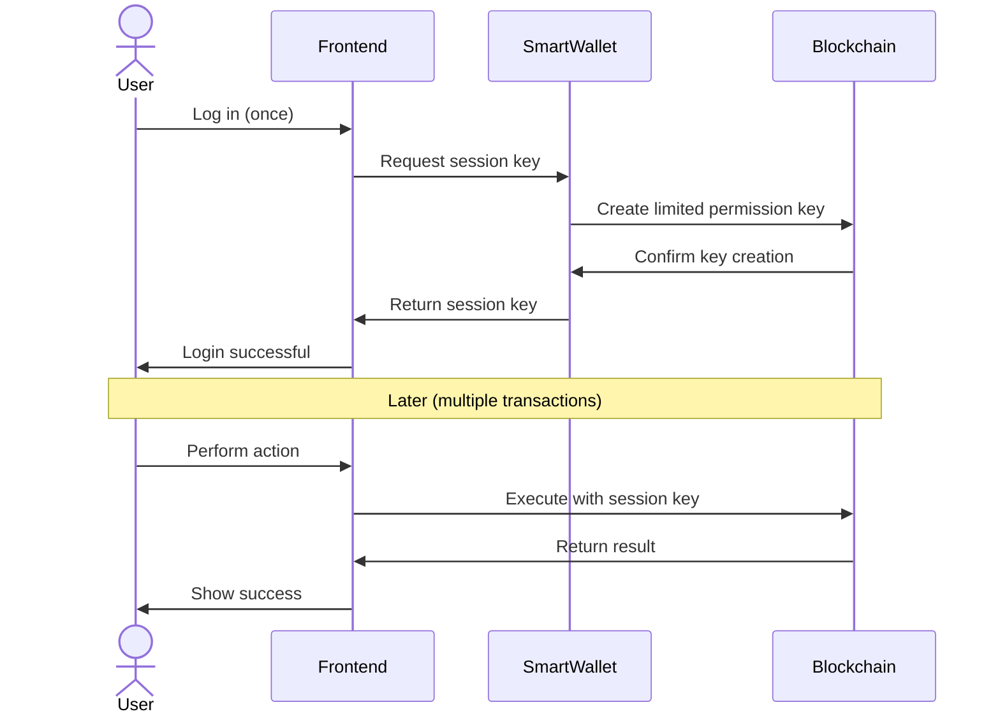

# Secure Key Management for Smart Wallets

**Estimated Time:** 25 minutes
**Prerequisites:** Understanding of session-based smart wallets from section 4.1
**Learning Objectives:**

- Understand the differences between Web2 and Web3 authentication models
- Implement secure key storage patterns for session-based smart wallets
- Create a complete key lifecycle management system

## Keys in Web3 vs Authentication in Web2

In most Web2 applications, authentication is handled by:

- Centralized identity providers (Google, Facebook, Auth0)
- Password-based systems with recovery options
- Backend servers that manage sessions and tokens

In Web3, including our intent-centric architecture, users own and control their cryptographic keys directly. This requires careful key management to balance security and usability.

> 💡 **Web2 Parallel**: If Web2 authentication is like using a hotel key card (managed by the hotel), Web3 authentication is like owning the deed to your house (fully controlled by you, higher responsibility).

## Session Key Authentication Flow

The following diagram illustrates the complete flow of session key authentication in our smart wallet system:



As shown above, the key benefit is that the user only needs to authenticate once at the beginning. After that, the session key handles all subsequent transactions without requiring additional approvals.

## Understanding Key Types in NEAR

> **CORE CONCEPT: Session Keys**
>
> Session keys are temporary, limited-permission cryptographic keys that enable a more user-friendly blockchain experience:
>
> - They allow applications to perform actions on a user's behalf without requiring approval for each transaction
> - They have restricted permissions (can only call specific contract methods)
> - They often have time or usage limits before expiring
> - They cannot transfer funds directly or modify account settings
> - They provide a security advantage by not exposing a user's main private key
>
> **Web2 Parallel**: Session keys are similar to the authentication tokens used in Web2 applications. When you log in to a website, it often creates a session token that keeps you authenticated for a period of time so you don't have to re-enter your password for every action. Similarly, blockchain session keys allow users to perform multiple actions without having to sign each transaction separately.

NEAR has two primary types of keys that exist on the blockchain:

1. **Full Access Keys**: These are like administrator credentials with unrestricted permissions.

   - Can transfer tokens, deploy contracts, modify account
   - Usually stored in hardware wallets or secure main wallets (MyNEARWallet, NEAR Wallet)
   - Should never be exposed to or handled by dApps

2. **Function Call Access Keys**: These are like limited-permission API keys.
   - Can only call specific smart contract methods
   - Have restricted allowance for gas fees
   - Cannot transfer funds or modify account settings
   - This is what our Session Keys use as their on-chain representation

> ⚠️ **Security Note**: Never request a user's full access key in your dApp. Session-based smart wallets use function call access keys to provide limited access without exposing the user's main keys.

## The On-Chain vs Off-Chain Key Model

To understand our smart wallet implementation, it's important to distinguish between:

1. **On-Chain Keys**: These are public keys registered on the NEAR blockchain.

   - When we add a Function Call Access Key to an account, the **public key** is stored on-chain.
   - These define what actions are permitted with a given key.

2. **Off-Chain Keys**: These are private keys managed by applications or users.
   - When we generate a key pair, the **private key** must be securely stored off-chain.
   - These are used to sign transactions that the blockchain verifies against the public key.

Our session-based wallet implementation involves:

- Generating key pairs (off-chain step)
- Registering the public key on-chain as a Function Call Access Key (on-chain step)
- Securely storing the private key in the dApp (off-chain step)
- Using the private key to sign transactions (off-chain step)
- Blockchain verifying signatures against the registered public key (on-chain step)

## Implementing Secure Key Storage

Let's create a more robust `SessionKeyManager` class that handles key generation, secure storage, and proper integration with NEAR:

```javascript
import { KeyPair, utils, transactions } from "near-api-js";
import * as CryptoJS from "crypto-js";

export class SessionKeyManager {
  constructor(networkId = "testnet") {
    this.keyPrefix = "near_session_key_";
    this.networkId = networkId;
  }

  /**
   * Generate a new session key pair
   * @param {string} accountId - The NEAR account ID this key will be for
   * @param {string} contractId - The contract this key will be able to call
   * @param {Array<string>} methodNames - Methods this key can call
   * @param {string} allowance - Max NEAR tokens for gas (e.g., "0.25")
   * @returns {Object} Session key information
   */
  generateSessionKey(
    accountId,
    contractId,
    methodNames = [],
    allowance = "0.25"
  ) {
    // Create a new ED25519 key pair for this session
    const keyPair = KeyPair.fromRandom("ed25519");

    // Return all the information needed to use this key
    const sessionKey = {
      accountId,
      contractId,
      methodNames,
      allowance: utils.format.parseNearAmount(allowance),
      privateKey: keyPair.toString(), // Full string representation
      publicKey: keyPair.getPublicKey().toString(),
      created: Date.now(),
      expires: Date.now() + 24 * 60 * 60 * 1000, // 24 hours from now
      id: `sess_${accountId}_${Date.now()}_${Math.random()
        .toString(36)
        .substr(2, 9)}`, // Generate a unique ID
    };
    console.log(
      "Generated new session key for",
      accountId,
      "ID:",
      sessionKey.id
    );
    return sessionKey;
  }

  /**
   * Create the actions needed to add this key to a NEAR account
   * @param {Object} sessionKey - Session key information
   * @returns {Array} Actions for adding the key
   */
  createAddKeyActions(sessionKey) {
    return [
      transactions.functionCallAccessKey(
        sessionKey.contractId,
        sessionKey.methodNames,
        sessionKey.allowance
      ),
    ];
  }

  /**
   * Store a session key securely
   * @param {Object} sessionKey - Session key information
   * @param {string} password - User password for encryption
   * @returns {boolean} Success status
   */
  storeSessionKey(sessionKey, password) {
    try {
      // Encrypt the entire session key object with the password
      const encryptedKey = CryptoJS.AES.encrypt(
        JSON.stringify(sessionKey),
        password
      ).toString();

      // Store in localStorage with a prefix + account ID as the key
      localStorage.setItem(this.keyPrefix + sessionKey.accountId, encryptedKey);

      return true;
    } catch (error) {
      console.error("Failed to store session key:", error);
      return false;
    }
  }

  /**
   * Get a stored session key
   * @param {string} accountId - NEAR account ID
   * @param {string} password - Password for decryption
   * @returns {Object|null} Session key or null if not found/expired
   */
  getSessionKey(accountId, password) {
    try {
      // Retrieve the encrypted key from localStorage
      const encryptedKey = localStorage.getItem(this.keyPrefix + accountId);
      if (!encryptedKey) return null;

      // Decrypt the key with the password
      const decrypted = CryptoJS.AES.decrypt(encryptedKey, password).toString(
        CryptoJS.enc.Utf8
      );

      // Parse the decrypted JSON
      const sessionKey = JSON.parse(decrypted);

      // Check if the key has expired
      if (sessionKey.expires < Date.now()) {
        this.removeSessionKey(accountId);
        return null;
      }

      return sessionKey;
    } catch (error) {
      console.error("Failed to retrieve session key:", error);
      return null;
    }
  }

  /**
   * Remove a session key from storage
   * @param {string} accountId - NEAR account ID
   */
  removeSessionKey(accountId) {
    localStorage.removeItem(this.keyPrefix + accountId);
  }

  /**
   * Create a KeyPair object from a stored session key
   * @param {Object} sessionKey - Session key information
   * @returns {KeyPair} NEAR KeyPair object for signing
   */
  createKeyPairFromSession(sessionKey) {
    return KeyPair.fromString(sessionKey.privateKey);
  }
}
```

## Security Concerns with Browser Storage

While we use `localStorage` in our example for simplicity, it comes with significant security risks:

> ⚠️ **Security Warning**: `localStorage` is vulnerable to cross-site scripting (XSS) attacks. If an attacker can inject JavaScript into your application, they could steal keys stored in `localStorage`, even if encrypted.

For production applications, consider these alternatives:

1. **In-memory storage only**: Store keys in JavaScript variables during the session.

   ```javascript
   // Keys are lost when page refreshes, but more secure
   class InMemoryKeyStorage {
     constructor() {
       this.keys = new Map();
     }
     storeKey(id, key) {
       this.keys.set(id, key);
     }
     getKey(id) {
       return this.keys.get(id);
     }
     removeKey(id) {
       this.keys.delete(id);
     }
   }
   ```

2. **Web Crypto API**: For more secure encryption in the browser.

   ```javascript
   // More secure encryption using browser's Web Crypto API
   async function encryptWithWebCrypto(data, password) {
     // Generate key from password
     const encoder = new TextEncoder();
     const passwordData = encoder.encode(password);
     const keyMaterial = await window.crypto.subtle.importKey(
       "raw",
       passwordData,
       { name: "PBKDF2" },
       false,
       ["deriveBits", "deriveKey"]
     );

     // Use key with AES-GCM algorithm
     // Implementation details omitted for brevity
   }
   ```

3. **IndexedDB with encryption**: More secure than localStorage but still in-browser.

4. **OAuth-like flows**: Where the dApp never sees the keys at all.

## Session Key Lifecycle Management

Proper lifecycle management of session keys is critical:

### 1. Authorization and Adding Keys On-Chain

Using near-api-js to add a Function Call Access Key to a user's account:

```javascript
import { connect, WalletConnection } from "near-api-js";

// This would run when the user connects to your dApp
async function authorizeNewSessionKey(accountId, contractId, methods) {
  // Setup NEAR connection
  const near = await connect(config);
  const wallet = new WalletConnection(near);

  // Generate a new session key
  const keyManager = new SessionKeyManager();
  const sessionKey = keyManager.generateSessionKey(
    accountId,
    contractId,
    methods,
    "0.25"
  );

  // Request wallet to add the key with specified permissions
  // This will redirect to the wallet for user approval
  await wallet.requestAddKey(
    sessionKey.publicKey,
    keyManager.createAddKeyActions(sessionKey)
  );

  // Store key locally (after redirect back)
  if (userApprovedKey) {
    keyManager.storeSessionKey(sessionKey, userPassword);
  }
}
```

### 2. Key Rotation and Removal

Rotating keys is important for security. Here's how to properly rotate a session key:

```javascript
async function rotateSessionKey(wallet, oldSessionKey, keyManager) {
  // Generate a new session key with the same permissions
  const newSessionKey = keyManager.generateSessionKey(
    oldSessionKey.accountId,
    oldSessionKey.contractId,
    oldSessionKey.methodNames,
    utils.format.formatNearAmount(oldSessionKey.allowance)
  );

  // First add the new key (requires the user's main wallet authorization)
  await wallet.requestAddKey(
    newSessionKey.publicKey,
    keyManager.createAddKeyActions(newSessionKey)
  );

  // Store the new key securely
  keyManager.storeSessionKey(newSessionKey, userPassword);

  // Then delete the old key from the account
  // This also requires the user's main wallet authorization
  await wallet.requestDeleteKey(oldSessionKey.publicKey);

  // Remove the old key from local storage
  keyManager.removeSessionKey(oldSessionKey.accountId);

  return newSessionKey;
}
```

### 3. Key Monitoring and Management UI

For a complete session key management solution, your dApp should include:

- A user interface showing active sessions and their permissions
- The ability to revoke/rotate keys
- Automatic tracking of allowance usage
- Clear indicators of when a key is authorized or needs reauthorization

## Connecting Key Management to Intent Architecture

In our intent architecture, session keys play a specific role:

1. They provide streamlined authentication to submit intents to the Verifier contract
2. They have permissions limited to calling specific methods like `verify_intent` or `verify_and_solve`
3. They abstract away the need for users to approve every individual intent

When a user wants to use your intent-based dApp:

```javascript
// User connects to your dApp
async function connectAndInitialize() {
  // First try to load an existing session key
  const sessionKey = keyManager.getSessionKey(accountId, userPassword);

  if (sessionKey && !isExpired(sessionKey)) {
    // Create a connection using this session key
    return createSessionConnection(accountId, sessionKey.privateKey);
  } else {
    // Need to create and authorize a new session key
    const newSessionKey = await authorizeNewSessionKey(
      accountId,
      "verifier.testnet", // Your Verifier contract
      ["verify_intent", "verify_and_solve"] // Intent methods
    );

    // Create connection with new session key
    return createSessionConnection(accountId, newSessionKey.privateKey);
  }
}

// Use the connection to submit intents
async function submitIntent(sessionConnection, intent) {
  // User doesn't need to approve this transaction - the session key handles it
  return sessionConnection.functionCall({
    contractId: "verifier.testnet",
    methodName: "verify_intent",
    args: { intent: intent },
    gas: "30000000000000",
  });
}
```

In the next section, we'll explore how to create user-friendly abstractions that hide the complexity of intents and blockchain interactions behind simple action interfaces.

```mermaid
flowchart TD
    A[User Action: e.g., Login / Initiate Session] --> B{KeyManager.getSessionKey(password)};
    B -- Key Exists & Password Valid --> C[Key Decrypted from localStorage];
    B -- No Key / Invalid Password --> D{KeyManager.generateSessionKey()};
    D --> E[New KeyPair Generated];
    E --> F{KeyManager.storeSessionKey(keyPair, password)};
    F --> G[Key Encrypted & Stored in localStorage];
    C --> H[Session KeyPair Ready for Use];
    G --> H;
    H --> I[dApp Uses Session Key to Sign Transactions for Verifier];
    I --> J{NEAR Blockchain};
```

Figure 1: Session Key Generation, Storage, and Retrieval Flow.

This flow illustrates how session keys can be managed with password-based encryption, providing a balance between security and user convenience for persistent sessions.
