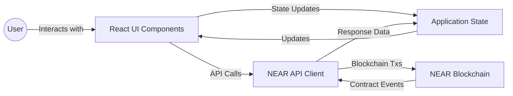
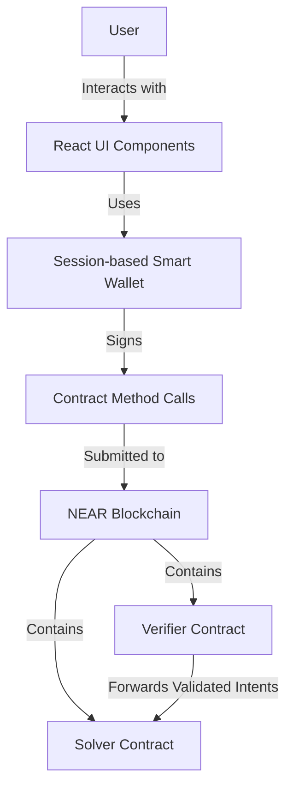

# Setting Up Your Frontend Environment

**Estimated Time:** 20 minutes  
**Prerequisites:** Completed backend contracts from Module 3, smart wallet implementation from Module 4
**Learning Objectives:**

- Set up a React-based frontend for your NEAR intent application
- Configure essential frontend libraries for blockchain interaction
- Understand how the frontend connects to smart contracts

## Bridging the Gap Between Backend Contracts and User Experience

Now that we've built our backend contracts (Verifier and Solver) and implemented our Smart Wallet abstractions, it's time to create the user-facing application that ties everything together.

> 💡 **Web2 Analogy**: Integrating blockchain functionality into a frontend is similar to integrating any third-party API in Web2 development. The main difference is that instead of making HTTP requests to a centralized server, you're making RPC calls to a distributed network through wallet software that handles authentication. Just as you might use Axios or Fetch to call a REST API and then process the response in your UI, in Web3 you'll use libraries like near-api-js to send transactions to the blockchain and then update your UI based on the results.

Our frontend will be a React application that allows users to:

1. Connect their NEAR wallet
2. Create and submit intents
3. Select solvers and view execution results

The frontend architecture follows this pattern:



As you can see, the frontend provides a crucial bridge between user interactions and blockchain operations.

## Architecture Overview: Direct Contract Interaction

For our frontend, we'll use a straightforward architecture based on **direct contract calls**:



> 💡 **Web2 Parallel**: In Web2, frontend applications typically call backend APIs. In our Web3 approach, our frontend directly calls smart contract methods, which act like a decentralized API that anyone can access.

This architecture provides several advantages:

- **Eliminates the need for a centralized backend**
- **Reduces complexity** in the development stack
- **Improves security** by minimizing trusted components
- **Creates a truly decentralized application**

## Project Structure

Let's set up our React project with a clear, organized structure:

```
src/
├── components/             # Reusable UI components
│   ├── WalletConnection/   # Wallet connection components
│   ├── IntentForm/         # Intent creation form
│   ├── SolverList/         # Solver discovery and selection
│   └── ExecutionManager/   # Intent execution and monitoring
├── context/                # React context providers
│   ├── WalletContext.js    # Wallet connection state management
│   └── IntentContext.js    # Intent creation and management
├── utils/                  # Utility functions
│   ├── near.js             # NEAR blockchain connection helpers
│   ├── contracts.js        # Contract interface definitions
│   └── formatting.js       # Data formatting utilities
├── services/               # Core business logic
│   ├── SessionKeyManager.js  # From Module 4 - managing session keys
│   ├── IntentBuilder.js    # From Module 4 - creating intent objects
│   └── IntentService.js    # From Module 4 - submitting intents to chain
└── pages/                  # Application pages
    ├── Dashboard.js        # Main dashboard for the application
    └── IntentDetails.js    # Intent execution and status page
```

## Essential Dependencies

Create a new React project using Create React App (or Next.js) and add these key dependencies:

```bash
npm init vite@latest near-intent-app -- --template react
cd near-intent-app
npm install near-api-js @near-wallet-selector/core @near-wallet-selector/modal-ui @near-wallet-selector/near-wallet
```

Let's create a `package.json` with the necessary dependencies:

```json
{
  "name": "near-intent-app",
  "version": "0.1.0",
  "private": true,
  "dependencies": {
    "react": "^18.2.0",
    "react-dom": "^18.2.0",
    "near-api-js": "^1.1.0",
    "@near-wallet-selector/core": "^8.1.1",
    "@near-wallet-selector/modal-ui": "^8.1.1",
    "@near-wallet-selector/near-wallet": "^8.1.1",
    "@near-wallet-selector/my-near-wallet": "^8.1.1",
    "crypto-js": "^4.1.1",
    "react-router-dom": "^6.10.0",
    "styled-components": "^5.3.9"
  },
  "devDependencies": {
    "vite": "^4.3.9",
    "@vitejs/plugin-react": "^4.0.0"
  },
  "scripts": {
    "dev": "vite",
    "build": "vite build",
    "preview": "vite preview"
  }
}
```

## NEAR Blockchain Configuration

Let's set up our blockchain connection configuration:

```javascript
// src/utils/near.js
import { connect } from "near-api-js";

// Network configuration
export const NETWORK_CONFIG = {
  testnet: {
    networkId: "testnet",
    nodeUrl: "https://rpc.testnet.near.org",
    walletUrl: "https://wallet.testnet.near.org",
    helperUrl: "https://helper.testnet.near.org",
    explorerUrl: "https://explorer.testnet.near.org",
  },
  mainnet: {
    networkId: "mainnet",
    nodeUrl: "https://rpc.mainnet.near.org",
    walletUrl: "https://wallet.near.org",
    helperUrl: "https://helper.mainnet.near.org",
    explorerUrl: "https://explorer.mainnet.near.org",
  },
};

// Contract addresses - will be updated during testnet deployment
export const CONTRACT_ADDRESSES = {
  testnet: {
    verifierContract: "verifier.testnet",
    solverContract: "solver.testnet",
  },
  mainnet: {
    verifierContract: "",
    solverContract: "",
  },
};

// Get active network configuration
export function getConfig(network = "testnet") {
  return NETWORK_CONFIG[network];
}

// Connect to NEAR blockchain
export async function connectToNear(network = "testnet") {
  const nearConfig = getConfig(network);
  return await connect(nearConfig);
}
```

## Contract Interface Definitions

Let's define our contract interfaces to ensure consistent method calls throughout our application:

```javascript
// src/utils/contracts.js
import { Contract } from "near-api-js";

// Define interface for the Verifier contract
export function getVerifierContract(account, contractId) {
  return new Contract(account, contractId, {
    viewMethods: ["get_solvers", "get_intent_status", "is_intent_verified"],
    changeMethods: ["verify_intent", "register_solver"],
  });
}

// Define interface for the Solver contract
export function getSolverContract(account, contractId) {
  return new Contract(account, contractId, {
    viewMethods: [
      "get_solver_info",
      "get_supported_actions",
      "get_solver_fees",
    ],
    changeMethods: ["solve_intent", "cancel_intent"],
  });
}

// Standard intent structure that matches our Rust contracts
export const INTENT_STRUCTURE = {
  id: "", // Unique identifier
  user_account: "", // User's NEAR account
  action: "", // Type of action (e.g., "swap")
  input_token: "", // Token the user is providing
  input_amount: "0", // Amount of input token
  output_token: "", // Token the user wants
  min_output_amount: null, // Minimum acceptable output
  max_slippage: 0.5, // Maximum acceptable slippage
  deadline: null, // Optional expiration time
};
```

## Integrating the Session Wallet from Module 4

We'll reuse the Session Wallet logic from Module 4:

```javascript
// src/services/SessionKeyManager.js
// Importing the SessionKeyManager we built in Module 4.2
import { KeyPair, utils } from "near-api-js";
import * as CryptoJS from "crypto-js";

// This is a simplified version of the class we developed in Module 4.2
export class SessionKeyManager {
  constructor(networkId = "testnet") {
    this.keyPrefix = "near_session_key_";
    this.networkId = networkId;
  }

  // Generate a new session key pair
  generateSessionKey(
    accountId,
    contractId,
    methodNames = [],
    allowance = "0.25"
  ) {
    const keyPair = KeyPair.fromRandom("ed25519");

    return {
      accountId,
      contractId,
      methodNames,
      allowance: utils.format.parseNearAmount(allowance),
      privateKey: keyPair.toString(),
      publicKey: keyPair.getPublicKey().toString(),
      created: Date.now(),
      expires: Date.now() + 24 * 60 * 60 * 1000, // 24 hours from now
    };
  }

  // Store and retrieve session keys (simplified)
  storeSessionKey(sessionKey, password) {
    try {
      const encryptedKey = CryptoJS.AES.encrypt(
        JSON.stringify(sessionKey),
        password
      ).toString();

      localStorage.setItem(this.keyPrefix + sessionKey.accountId, encryptedKey);
      return true;
    } catch (error) {
      console.error("Failed to store session key:", error);
      return false;
    }
  }

  getSessionKey(accountId, password) {
    try {
      const encryptedKey = localStorage.getItem(this.keyPrefix + accountId);
      if (!encryptedKey) return null;

      const decrypted = CryptoJS.AES.decrypt(encryptedKey, password).toString(
        CryptoJS.enc.Utf8
      );

      const sessionKey = JSON.parse(decrypted);

      if (sessionKey.expires < Date.now()) {
        this.removeSessionKey(accountId);
        return null;
      }

      return sessionKey;
    } catch (error) {
      console.error("Failed to retrieve session key:", error);
      return null;
    }
  }

  removeSessionKey(accountId) {
    localStorage.removeItem(this.keyPrefix + accountId);
  }
}
```

## Creating Application Root

Finally, let's set up our application entry point:

```jsx
// src/App.jsx
import React from "react";
import { BrowserRouter as Router, Routes, Route } from "react-router-dom";
import { WalletProvider } from "./context/WalletContext";
import { IntentProvider } from "./context/IntentContext";
import Dashboard from "./pages/Dashboard";
import IntentDetails from "./pages/IntentDetails";

function App() {
  return (
    <Router>
      <WalletProvider>
        <IntentProvider>
          <Routes>
            <Route path="/" element={<Dashboard />} />
            <Route path="/intent/:intentId" element={<IntentDetails />} />
          </Routes>
        </IntentProvider>
      </WalletProvider>
    </Router>
  );
}

export default App;
```

## Next Steps

Our frontend architecture is now ready! In the next section, we'll implement the wallet connection and session key management to provide a seamless user experience for interacting with our intent architecture.

Through this setup, we've created a foundation that:

1. Directly builds on our Smart Wallet implementation from Module 4
2. Uses a consistent, direct contract call architecture
3. Provides a clear project structure
4. Standardizes our intent structure and contract interfaces

This approach will allow us to create a user-friendly dApp that showcases the power of intent-centric architecture with minimal UX friction.
