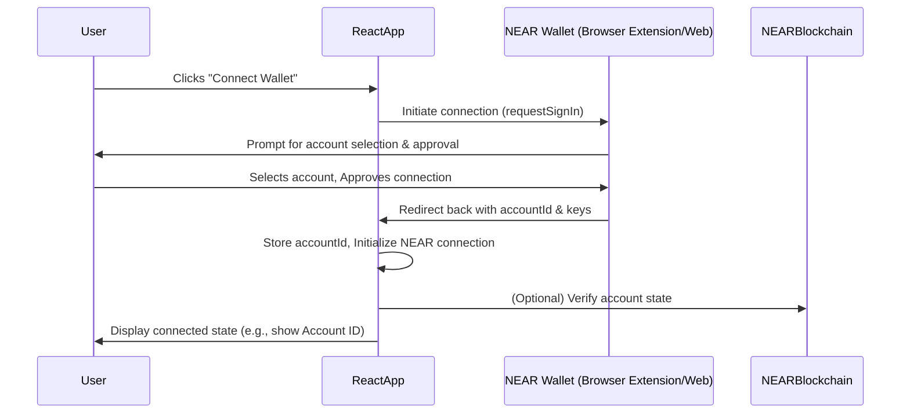

# Connect Wallet

## Implementing Wallet Connection in Your dApp

A seamless wallet connection experience is crucial for user onboarding in Web3 applications. This section covers how to implement wallet connection with support for intent-centric architecture.

## Wallet Selection Component

```jsx
// src/components/wallet/ConnectButton.jsx
import React, { useState } from "react";
import { useWallet } from "../../hooks/useWallet";
import { Button } from "../ui/button";
import { Dialog } from "../ui/dialog";

export function ConnectButton() {
  const { connected, accountId, connect, disconnect } = useWallet();
  const [showModal, setShowModal] = useState(false);

  if (connected) {
    return (
      <div className="flex items-center gap-2">
        <span className="text-sm">{accountId}</span>
        <Button variant="outline" size="sm" onClick={disconnect}>
          Disconnect
        </Button>
      </div>
    );
  }

  return (
    <>
      <Button onClick={() => setShowModal(true)}>Connect Wallet</Button>

      <Dialog open={showModal} onOpenChange={setShowModal}>
        <Dialog.Content className="sm:max-w-md">
          <Dialog.Header>
            <Dialog.Title>Connect your wallet</Dialog.Title>
            <Dialog.Description>
              Choose a wallet to connect to this application
            </Dialog.Description>
          </Dialog.Header>

          <div className="grid gap-4 py-4">
            <Button onClick={() => connect("near-wallet")} className="w-full">
              NEAR Wallet
            </Button>
            <Button
              onClick={() => connect("my-near-wallet")}
              className="w-full"
            >
              MyNEAR Wallet
            </Button>
            <Button onClick={() => connect("sender")} className="w-full">
              Sender
            </Button>
          </div>
        </Dialog.Content>
      </Dialog>
    </>
  );
}
```

## Wallet Provider Context

```jsx
// src/components/wallet/WalletProvider.jsx
import React, { createContext, useContext, useState, useEffect } from "react";
import { setupWalletSelector } from "@near-wallet-selector/core";
import { setupModal } from "@near-wallet-selector/modal-ui";
import { setupNearWallet } from "@near-wallet-selector/near-wallet";
import { setupMyNearWallet } from "@near-wallet-selector/my-near-wallet";
import { setupSender } from "@near-wallet-selector/sender";
import "@near-wallet-selector/modal-ui/styles.css";

const WalletContext = createContext(null);

export function WalletProvider({ children }) {
  const [selector, setSelector] = useState(null);
  const [modal, setModal] = useState(null);
  const [accounts, setAccounts] = useState([]);
  const [error, setError] = useState(null);
  const [status, setStatus] = useState("Initializing...");

  useEffect(() => {
    const init = async () => {
      try {
        setStatus("Connecting...");
        const selector = await setupWalletSelector({
          network: "testnet",
          modules: [setupNearWallet(), setupMyNearWallet(), setupSender()],
        });

        const modal = setupModal(selector, {
          contractId: process.env.CONTRACT_ID || "example.testnet",
        });

        const state = selector.store.getState();
        setAccounts(state.accounts);

        // Listen for account changes
        const subscription = selector.store.observable.subscribe((state) => {
          setAccounts(state.accounts);
        });

        setSelector(selector);
        setModal(modal);

        if (state.accounts.length > 0) {
          setAccounts(state.accounts);
        }
      } catch (err) {
        console.error("NEAR initialization failed:", err);
        setError(
          `Failed to initialize NEAR connection: ${
            err.message || "Check console for details"
          }.`
        );
      } finally {
        setStatus("Initialized");
      }
    };

    init();
  }, []);

  const connected = accounts.length > 0;
  const accountId = connected ? accounts[0].accountId : null;

  const connect = async (walletId) => {
    if (!selector) return;

    if (walletId) {
      await selector.wallet(walletId).signIn();
    } else {
      modal.show();
    }
  };

  const disconnect = async () => {
    if (!selector) return;

    const wallet = await selector.wallet();
    await wallet.signOut();
  };

  const signIntent = async (intent) => {
    if (!selector || !connected) throw new Error("Wallet not connected");

    const wallet = await selector.wallet();
    const signedIntent = await wallet.signMessage({
      message: JSON.stringify(intent),
      recipient: process.env.VERIFIER_ID || "verifier.testnet",
    });

    return {
      ...intent,
      signature: signedIntent.signature,
    };
  };

  const handleConnect = async () => {
    try {
      setError(null);
      setStatus("Connecting...");
      await connect();
      // signIn redirects, so status updates might not show unless handled after redirect
    } catch (err) {
      console.error("Connection failed:", err);
      setStatus("Failed");
      setError(
        `Connection failed: ${
          err.message || "Unknown error"
        }. Please try again.`
      );
    }
  };

  const handleDisconnect = async () => {
    try {
      setStatus("Signing out...");
      await disconnect();
      // signOut clears local storage and resets state
      setStatus("Signed out");
    } catch (err) {
      console.error("Sign out failed:", err);
      setStatus("Failed");
      setError(
        `Sign out failed: ${err.message || "Unknown error"}. Please try again.`
      );
    }
  };

  return (
    <WalletContext.Provider
      value={{
        selector,
        modal,
        accounts,
        accountId,
        connected,
        connect,
        disconnect,
        signIntent,
        handleConnect,
        handleDisconnect,
        error,
        status,
      }}
    >
      {children}
    </WalletContext.Provider>
  );
}

export const useWallet = () => {
  const context = useContext(WalletContext);
  if (!context) {
    throw new Error("useWallet must be used within a WalletProvider");
  }
  return context;
};
```

## Session Key Management

To implement session-based authentication:

```jsx
// src/hooks/useSessionKey.js
import { useState, useEffect, useCallback } from "react";
import { KeyPair } from "near-api-js";
import { useWallet } from "./useWallet";

export function useSessionKey() {
  const { connected, accountId, selector } = useWallet();
  const [sessionKey, setSessionKey] = useState(null);
  const [loading, setLoading] = useState(false);

  // Load existing session key from storage
  useEffect(() => {
    if (connected && accountId) {
      const storedKey = localStorage.getItem(`session_key_${accountId}`);
      if (storedKey) {
        try {
          setSessionKey(KeyPair.fromString(storedKey));
        } catch (err) {
          console.error("Invalid session key in storage");
          localStorage.removeItem(`session_key_${accountId}`);
        }
      }
    } else {
      setSessionKey(null);
    }
  }, [connected, accountId]);

  // Create a new session key
  const createSessionKey = useCallback(async () => {
    if (!connected || !accountId || !selector) return null;

    setLoading(true);
    try {
      // Generate new keypair
      const newKeyPair = KeyPair.fromRandom("ed25519");

      // Add the public key to the account with function call access
      const wallet = await selector.wallet();
      await wallet.signAndSendTransaction({
        actions: [
          {
            type: "AddKey",
            params: {
              publicKey: newKeyPair.getPublicKey().toString(),
              accessKey: {
                permission: {
                  type: "FunctionCall",
                  contractId: process.env.CONTRACT_ID || "example.testnet",
                  methodNames: ["execute_intent"],
                },
              },
            },
          },
        ],
      });

      // Store key securely
      localStorage.setItem(`session_key_${accountId}`, newKeyPair.toString());
      setSessionKey(newKeyPair);
      return newKeyPair;
    } catch (err) {
      console.error("Failed to create session key:", err);
      throw err;
    } finally {
      setLoading(false);
    }
  }, [connected, accountId, selector]);

  return {
    sessionKey,
    hasSessionKey: !!sessionKey,
    createSessionKey,
    loading,
  };
}
```

# Connecting Wallets with Session Key Authorization

**Time**: 20 minutes  
**Pre-requisite**: Frontend setup from 5.1, understanding of Session Keys from Module 4

## From Traditional Wallet Connection to Session Keys

In traditional Web3 dApps, every user action requires a separate wallet confirmation. Our session-based approach, as developed in Module 4, improves this experience dramatically. In this section, we'll implement the wallet connection flow that leverages session keys for a seamless user experience.

> 💡 **Web2 Parallel**: This is similar to how modern Web2 applications use OAuth or refresh tokens. After an initial sign-in, users don't need to re-enter credentials for each action within the authorized scope.

## Setting Up the Wallet Context

First, let's create a context to manage wallet state throughout our application:

```jsx
// src/context/WalletContext.js
import React, { createContext, useContext, useState, useEffect } from "react";
import { connect, keyStores, KeyPair } from "near-api-js";
import { getConfig, CONTRACT_ADDRESSES } from "../utils/near";
import { SessionKeyManager } from "../services/SessionKeyManager";

// Context creation
const WalletContext = createContext(null);

export function useWallet() {
  return useContext(WalletContext);
}

export function WalletProvider({ children }) {
  // State variables
  const [accountId, setAccountId] = useState(null);
  const [isConnected, setIsConnected] = useState(false);
  const [sessionKey, setSessionKey] = useState(null);
  const [sessionAccount, setSessionAccount] = useState(null);
  const [loading, setLoading] = useState(false);
  const [error, setError] = useState(null);

  // Instantiate SessionKeyManager from Module 4
  const [keyManager] = useState(() => new SessionKeyManager());

  // Network configuration
  const [networkId] = useState("testnet");
  const config = getConfig(networkId);

  // Load existing session on component mount
  useEffect(() => {
    const loadExistingSession = async () => {
      // Check if we have a saved account ID from previous session
      const savedAccountId = localStorage.getItem("nearAccountId");

      if (savedAccountId) {
        try {
          // Prompt for password - In a real app, you might use a modal for this
          const password = prompt(
            "Enter your session password to unlock your wallet:"
          );

          if (!password) return;

          // Try to get existing session key
          const existingKey = keyManager.getSessionKey(
            savedAccountId,
            password
          );

          if (existingKey) {
            setAccountId(savedAccountId);
            setSessionKey(existingKey);
            await initializeSessionAccount(
              savedAccountId,
              existingKey.privateKey
            );
            setIsConnected(true);
          }
        } catch (err) {
          console.error("Failed to load existing session:", err);
          localStorage.removeItem("nearAccountId");
        }
      }
    };

    loadExistingSession();
  }, []);

  // Initialize a NEAR account using a session key
  const initializeSessionAccount = async (accountId, privateKey) => {
    try {
      // Create an in-memory keystore for the session key
      const keyStore = new keyStores.InMemoryKeyStore();

      // Load the private key into a KeyPair object
      const keyPair = KeyPair.fromString(privateKey);

      // Add the key to the keystore for the account
      await keyStore.setKey(networkId, accountId, keyPair);

      // Connect to NEAR with this keystore
      const nearConnection = await connect({
        ...config,
        keyStore,
        headers: {},
      });

      // Get the account object that will use the session key
      const account = await nearConnection.account(accountId);
      setSessionAccount(account);

      return account;
    } catch (err) {
      console.error("Failed to initialize session account:", err);
      setError("Failed to initialize session: " + err.message);
      throw err;
    }
  };

  // Connect wallet and authorize session key
  const connectWallet = async () => {
    try {
      setLoading(true);
      setError(null);

      // Create a full access connection for initial authorization
      const nearConnection = await connect({
        ...config,
        keyStore: new keyStores.BrowserLocalStorageKeyStore(),
        headers: {},
      });

      // Create and setup temporary wallet connection
      const walletConnection = new nearConnection.WalletConnection(
        nearConnection
      );

      // If not signed in, redirect to NEAR wallet
      if (!walletConnection.isSignedIn()) {
        walletConnection.requestSignIn();
        return; // The page will redirect and this function will exit
      }

      // Get the connected account ID
      const userAccountId = walletConnection.getAccountId();

      // Generate a new session key for this user
      const verifierContractId = CONTRACT_ADDRESSES[networkId].verifierContract;
      const newSessionKey = keyManager.generateSessionKey(
        userAccountId,
        verifierContractId,
        ["verify_intent"], // Methods this key can call
        "0.25" // 0.25 NEAR allowance for gas fees
      );

      // WARNING: Using prompt() for passwords is HIGHLY INSECURE and bad UX!
      // It's used here ONLY for simplified demonstration.
      // Real applications MUST use a proper password input field within a secure UI modal.
      const password = prompt(
        "Enter a password to encrypt your session key for this browser:"
      );
      if (!password) {
        setLoading(false);
        return;
      }

      // Get publicKey from the session key
      const publicKey = newSessionKey.publicKey;

      // Create access key permissions (function call access key)
      const methodNames = ["verify_intent"];
      const contractId = verifierContractId;

      // Request the wallet to add this session key with function call permissions
      await walletConnection
        .account()
        .addKey(publicKey, contractId, methodNames, newSessionKey.allowance);

      // Store the session key securely
      keyManager.storeSessionKey(newSessionKey, password);

      // Save the account ID
      localStorage.setItem("nearAccountId", userAccountId);

      // Initialize the session account with the new key
      await initializeSessionAccount(userAccountId, newSessionKey.privateKey);

      // Update state
      setAccountId(userAccountId);
      setSessionKey(newSessionKey);
      setIsConnected(true);
    } catch (err) {
      console.error("Wallet connection failed:", err);
      setError("Connection failed: " + err.message);
    } finally {
      setLoading(false);
    }
  };

  // Disconnect wallet and clean up
  const disconnectWallet = () => {
    try {
      // Remove session key if we have one
      if (accountId && sessionKey) {
        keyManager.removeSessionKey(accountId);
      }

      // Clear local storage
      localStorage.removeItem("nearAccountId");

      // Reset state
      setAccountId(null);
      setSessionKey(null);
      setSessionAccount(null);
      setIsConnected(false);
    } catch (err) {
      console.error("Disconnect failed:", err);
      setError("Disconnect failed: " + err.message);
    }
  };

  // Context value
  const value = {
    accountId,
    isConnected,
    sessionKey,
    sessionAccount,
    loading,
    error,
    connectWallet,
    disconnectWallet,
  };

  return (
    <WalletContext.Provider value={value}>{children}</WalletContext.Provider>
  );
}
```

## Creating the Connect Button Component

Now, let's create a button component that triggers the wallet connection:

```jsx
// src/components/WalletConnection/ConnectButton.jsx
import React from "react";
import { useWallet } from "../../context/WalletContext";

function ConnectButton() {
  const {
    accountId,
    isConnected,
    loading,
    error,
    connectWallet,
    disconnectWallet,
  } = useWallet();

  if (loading) {
    return (
      <button className="button loading" disabled>
        Connecting...
      </button>
    );
  }

  if (isConnected) {
    return (
      <div className="wallet-connected">
        <span className="account-id">{accountId}</span>
        <button onClick={disconnectWallet} className="disconnect-button">
          Disconnect
        </button>
      </div>
    );
  }

  return (
    <button onClick={connectWallet} className="connect-button">
      Connect NEAR Wallet
    </button>
  );
}

export default ConnectButton;
```

## The Full Session Key Authorization Flow

Let's visualize the complete session key authorization flow:



Figure 1: Wallet Connection Flow using `near-api-js` WalletConnection.

## Implementing Wallet Connection with near-api-js

This section demonstrates how to connect to a NEAR wallet using the core `near-api-js` library, specifically the `WalletConnection` object. This provides a foundational understanding before we introduce higher-level libraries like Wallet Selector in the next section.

First, let's create a configuration utility (you might have created a similar one in the setup section):

```javascript
// src/config/nearConfig.js
// ... (nearConfig definition as shown previously, including BrowserLocalStorageKeyStore warning)
```

Next, a service to handle the connection logic:

```javascript
// src/services/nearService.js
import { connect, WalletConnection } from "near-api-js";
import { nearConfig } from "../config/nearConfig";

class NearService {
  // ... (constructor, init, signIn, signOut, getAccountId, isSignedIn methods using WalletConnection)
}

// Singleton instance
let nearServiceInstance = null;
export const initNearService = async () => {
  if (!nearServiceInstance) {
    nearServiceInstance = new NearService();
    await nearServiceInstance.init();
  }
  return nearServiceInstance;
};
```

Now, a React Context (`WalletContext`) to manage the wallet state throughout the application:

```jsx
// src/contexts/WalletContext.jsx
// ... (WalletProvider using NearService, managing accountId, isConnected, etc.)
```

Finally, a UI component (`ConnectButton`) to trigger connection/disconnection:

```jsx
// src/components/ConnectButton.jsx
// ... (ConnectButton component using useWallet hook to call connect/disconnect)
```

This setup provides a basic wallet connection using `near-api-js`. While functional, it requires more manual setup compared to Wallet Selector. In the next section, [5.3 Wallet Selector Integration](mdc:./03-wallet-selector.md), we'll see how Wallet Selector simplifies supporting multiple wallets and streamlines the connection process.

## Next Steps

Our wallet connection is now ready! In the next section, we'll explore how to integrate with the NEAR Wallet Selector to provide users with multiple wallet options for authorizing their session keys.

With this wallet connection implementation, we've successfully bridged Module 4's smart wallet concepts to a practical frontend implementation that provides a seamless user experience for Web3 interactions.
