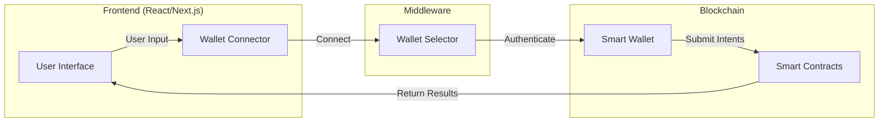
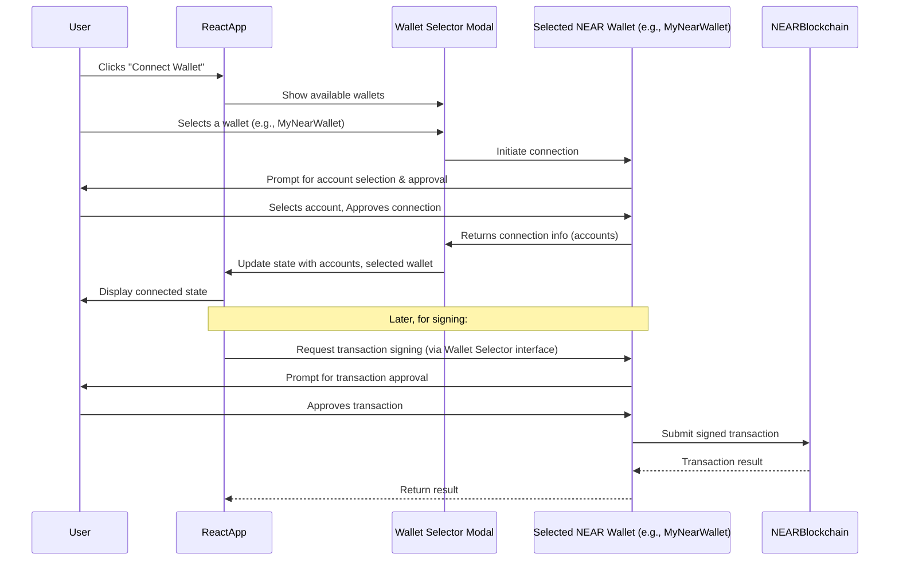

# Integrating with NEAR Wallet Selector for Multiple Wallet Options

**Estimated Time:** 20 minutes  
**Prerequisites:** Wallet connection from section 5.2, understanding of Session Keys from Module 4
**Learning Objectives:**

- Integrate NEAR Wallet Selector to support multiple wallet options
- Connect wallet authentication to the smart wallet abstraction layer
- Implement secure session key management in the frontend

## Enhancing Wallet Options for Users

In the previous section, we implemented basic wallet connectivity using near-api-js. However, in a production dApp, users expect multiple wallet options. The NEAR Wallet Selector provides a consistent interface for integrating with various NEAR-compatible wallets while maintaining our session key approach.

> 💡 **Web2 Parallel**: This is like offering "Sign in with Google/Facebook/Apple" options in a Web2 app while maintaining a consistent session token system regardless of how users authenticate.

## Frontend-Backend Integration Architecture

The following diagram illustrates how our frontend components connect to the blockchain through the wallet and smart contract layers:



This architecture enables a seamless user experience where:

1. The frontend captures user intent through intuitive interfaces
2. The wallet connector and selector handle authentication
3. The smart wallet abstracts blockchain complexity
4. Smart contracts process the actual intents
5. Results flow back to the UI for user feedback

## Understanding NEAR Wallet Selector

NEAR Wallet Selector is a library that simplifies wallet integration by providing:

1. **Multiple wallet support** - Including NEAR Wallet, MyNearWallet, Ledger, and more
2. **Consistent interface** - A unified API regardless of wallet implementation
3. **Modal UI** - A pre-built wallet selection interface

Let's integrate it with our session key management system:

## Installing the Dependencies

First, let's add the necessary packages:

```bash
npm install @near-wallet-selector/core @near-wallet-selector/modal-ui @near-wallet-selector/near-wallet @near-wallet-selector/my-near-wallet @near-wallet-selector/sender @near-wallet-selector/meteor-wallet @near-wallet-selector/ledger
```

## Updating Our Wallet Context

We'll update our WalletContext to use the NEAR Wallet Selector library while maintaining our session key approach:

```jsx
// src/context/WalletContext.js
import React, { createContext, useContext, useState, useEffect } from "react";
import { connect, keyStores, KeyPair, utils } from "near-api-js";
import { setupWalletSelector } from "@near-wallet-selector/core";
import { setupModal } from "@near-wallet-selector/modal-ui";
import { setupNearWallet } from "@near-wallet-selector/near-wallet";
import { setupMyNearWallet } from "@near-wallet-selector/my-near-wallet";
import { setupSender } from "@near-wallet-selector/sender";
import { setupMeteorWallet } from "@near-wallet-selector/meteor-wallet";
import { setupLedger } from "@near-wallet-selector/ledger";
import { getConfig, CONTRACT_ADDRESSES } from "../utils/near";
import { SessionKeyManager } from "../services/SessionKeyManager";

// Import modal UI styles
import "@near-wallet-selector/modal-ui/styles.css";

// Context creation
const WalletContext = createContext(null);

export function useWallet() {
  const [accountId, setAccountId] = useState(null);
  const [isConnected, setIsConnected] = useState(false);
  const [sessionKey, setSessionKey] = useState(null);
  const [sessionAccount, setSessionAccount] = useState(null);
  const [walletSelector, setWalletSelector] = useState(null);
  const [modal, setModal] = useState(null);
  const [loading, setLoading] = useState(false);
  const [error, setError] = useState(null);

  // Instantiate SessionKeyManager from Module 4
  const [keyManager] = useState(() => new SessionKeyManager());

  // Network configuration
  const [networkId] = useState("testnet");
  const config = getConfig(networkId);
  const VERIFIER_CONTRACT_ID =
    process.env.REACT_APP_VERIFIER_ID || "<YOUR_VERIFIER_CONTRACT_ID>";

  // Initialize Wallet Selector
  useEffect(() => {
    const initWalletSelector = async () => {
      try {
        const selector = await setupWalletSelector({
          network: networkId,
          modules: [
            setupNearWallet(),
            setupMyNearWallet(),
            setupSender(),
            setupMeteorWallet(),
            setupLedger(),
          ],
        });

        const newModal = setupModal(selector, {
          contractId: VERIFIER_CONTRACT_ID,
        });

        setWalletSelector(selector);
        setModal(newModal);

        // Check if a wallet is already signed in
        const state = selector.store.getState();
        const accounts = state.accounts;

        if (accounts.length > 0) {
          const accountId = accounts[0].accountId;
          setAccountId(accountId);

          // Check if we have a session key for this account
          try {
            // WARNING: Using prompt() for passwords is HIGHLY INSECURE and bad UX!
            // It's used here ONLY for simplified demonstration.
            // Real applications MUST use a proper password input field within a secure UI modal.
            const password = prompt(
              "Enter password to encrypt session key for this browser:"
            );

            if (password) {
              const existingKey = keyManager.getSessionKey(accountId, password);

              if (existingKey) {
                setSessionKey(existingKey);
                await initializeSessionAccount(
                  accountId,
                  existingKey.privateKey
                );
                setIsConnected(true);
              }
            }
          } catch (err) {
            console.error("Failed to load existing session:", err);
          }
        }

        // Subscribe to accounts changes
        const subscription = selector.store.observable
          .pipe(
            // Add distinctUntilChanged operator if needed to avoid redundant updates
          )
          .subscribe((state) => {
            console.log("WalletSelector State Change:", state);
            const accounts = state.accounts.filter((acc) => acc.active);
            setAccounts(accounts);
            if (accounts.length > 0) {
              setAccountId(accounts[0].accountId);
              // Optionally: automatically try to load/authorize session key here
            } else {
              setAccountId(null);
              setSessionKey(null); // Clear session key on disconnect
            }
          });

        setInitialized(true);
        // Return the unsubscribe function for cleanup
        return () => {
          subscription.unsubscribe();
          selector.off("signedIn", handleSignIn);
          selector.off("signedOut", handleSignOut);
          if(modal) modal.hide();
          console.log("WalletProvider cleaned up.");
        };
      } catch (err) {
        console.error("Failed to initialize wallet selector:", err);
        setError("Wallet initialization failed");
      }
    };

    initWalletSelector();
  }, []);

  // Initialize a NEAR account using a session key
  const initializeSessionAccount = async (accountId, privateKey) => {
    try {
      // Create an in-memory keystore for the session key
      const keyStore = new keyStores.InMemoryKeyStore();

      // Load the private key into a KeyPair object
      const keyPair = KeyPair.fromString(privateKey);

      // Add the key to the keystore for the account
      await keyStore.setKey(networkId, accountId, keyPair);

      // Connect to NEAR with this keystore
      const nearConnection = await connect({
        ...config,
        keyStore,
        headers: {},
      });

      // Get the account object that will use the session key
      const account = await nearConnection.account(accountId);
      setSessionAccount(account);

      return account;
    } catch (err) {
      console.error("Failed to initialize session account:", err);
      setError("Failed to initialize session: " + err.message);
      throw err;
    }
  };

  // Connect wallet and authorize session key using Wallet Selector
  const connectWallet = async () => {
    if (!modal) {
      setError("Wallet selector not initialized");
      return;
    }

    try {
      setLoading(true);
      setError(null);

      // Open the wallet selector modal
      modal.show();

      // The modal handles the wallet selection and connection
      // We'll subscribe to account changes to detect when a user connects
      const subscription = walletSelector.store.observable.subscribe(
        async (state) => {
          if (state.accounts.length > 0) {
            const userAccountId = state.accounts[0].accountId;

            // Check if this is a new connection (not the one we already processed)
            if (userAccountId !== accountId) {
              setAccountId(userAccountId);

              // Generate a new session key for this user
              const newSessionKey = keyManager.generateSessionKey(
                userAccountId,
                VERIFIER_CONTRACT_ID,
                ["verify_intent"], // Methods this key can call
                "0.25" // 0.25 NEAR allowance for gas fees
              );

              // Prompt user for a password to encrypt the session key
              const password = prompt(
                "Create a password to secure your session:"
              );
              if (!password) {
                setLoading(false);
                return;
              }

              try {
                // Get selected wallet
                const wallet = await walletSelector.wallet();

                // Add function call access key using the selected wallet
                await wallet.signAndSendAddKey({
                  contractId: VERIFIER_CONTRACT_ID,
                  methodNames: ["verify_intent"],
                  allowance: utils.format.parseNearAmount("0.25"),
                  publicKey: newSessionKey.publicKey,
                });

                // IMPORTANT SECURITY REMINDER: Storing private keys (even session keys) in
                // Store the session key securely
                keyManager.storeSessionKey(newSessionKey, password);

                // Save the account ID
                localStorage.setItem("nearAccountId", userAccountId);

                // Initialize the session account with the new key
                await initializeSessionAccount(
                  userAccountId,
                  newSessionKey.privateKey
                );

                // Update state
                setSessionKey(newSessionKey);
                setIsConnected(true);

                // Unsubscribe after processing the connection
                subscription.unsubscribe();
              } catch (err) {
                console.error("Failed to authorize session key:", err);
                setError("Failed to authorize session key: " + err.message);
              }
            }
          }
        }
      );
    } catch (err) {
      console.error("Wallet connection failed:", err);
      setError("Connection failed: " + err.message);
    } finally {
      setLoading(false);
    }
  };

  // Disconnect wallet and clean up
  const disconnectWallet = async () => {
    try {
      // Remove session key if we have one
      if (accountId && sessionKey) {
        keyManager.removeSessionKey(accountId);
      }

      // Clear local storage
      localStorage.removeItem("nearAccountId");

      // Sign out from wallet selector
      if (walletSelector) {
        const wallet = await walletSelector.wallet();
        await wallet.signOut();
      }

      // Reset state
      setAccountId(null);
      setSessionKey(null);
      setSessionAccount(null);
      setIsConnected(false);
    } catch (err) {
      console.error("Disconnect failed:", err);
      setError("Disconnect failed: " + err.message);
    }
  };

  // Simplified error handling
  const signIntent = async (intent) => {
    if (!walletSelector || !accountId || !sessionKey) {
      throw new Error("Wallet or session key not initialized");
    }

    try {
      setLoading(true);
      setError(null);

      const wallet = await walletSelector.wallet();
      // Example: Calling a verify_intent method on a contract
      const result = await wallet.signAndSendTransaction({
        signerId: accountId, // The account originating the transaction
        receiverId: VERIFIER_CONTRACT_ID, // Your verifier contract ID
        actions: [
          {
            type: "FunctionCall",
            params: {
              methodName: "verify_intent",
              args: { intent: intent }, // Your intent object
              gas: DEFAULT_FUNCTION_CALL_GAS,
              deposit: "0",
            },
          },
        ],
      });
      return result;
    } catch (error) {
      console.error("Failed to sign and send transaction:", error);
      let userMessage = `Transaction failed: ${error.message || 'Unknown error'}.`;
      // Basic error mapping (expand this based on common errors)
      if (error.message?.includes("User rejected the request")) {
        userMessage = "Transaction cancelled in wallet.";
      } else if (error.message?.includes("Exceeded the allowance")) {
        userMessage = "Transaction failed: The session key allowance might be insufficient for this action. Please try re-authorizing the session.";
      } else if (error.message?.includes("Not enough balance")) {
        userMessage = "Transaction failed due to insufficient balance.";
      }
      // Consider using error codes or more specific error types if available
      throw new Error(userMessage); // Re-throw user-friendly error
    }
  }, [walletSelector, accountId]); // Dependencies for useCallback

  // Context value
  const value = {
    accountId,
    isConnected,
    sessionKey,
    sessionAccount,
    walletSelector,
    modal,
    loading,
    error,
    connectWallet,
    disconnectWallet,
  };

  return (
    <WalletContext.Provider value={value}>{children}</WalletContext.Provider>
  );
}
```

## Creating an Enhanced Connect Button

Let's create an improved wallet connection button that works with the wallet selector:

```jsx
// src/components/WalletConnection/EnhancedConnectButton.jsx
import React from "react";
import { useWallet } from "../../context/WalletContext";

function EnhancedConnectButton() {
  const {
    accountId,
    isConnected,
    sessionKey,
    loading,
    error,
    connectWallet,
    disconnectWallet,
  } = useWallet();

  if (loading) {
    return (
      <button className="button loading" disabled>
        Connecting...
      </button>
    );
  }

  if (isConnected) {
    return (
      <div className="wallet-connected">
        <div className="wallet-info">
          <span className="account-id">{accountId}</span>
          {sessionKey && (
            <span className="session-status">
              Session active until{" "}
              {new Date(sessionKey.expires).toLocaleTimeString()}
            </span>
          )}
        </div>
        <button onClick={disconnectWallet} className="disconnect-button">
          Disconnect
        </button>
      </div>
    );
  }

  return (
    <button onClick={connectWallet} className="connect-button">
      Connect Wallet
    </button>
  );
}

export default EnhancedConnectButton;
```

## Creating a Wallet Options Display

Let's also create a component that displays information about the available wallet options:

```jsx
// src/components/WalletConnection/WalletOptions.jsx
import React, { useEffect, useState } from "react";
import { useWallet } from "../../context/WalletContext";

function WalletOptions() {
  const { walletSelector, connectWallet } = useWallet();
  const [modules, setModules] = useState([]);

  useEffect(() => {
    if (walletSelector) {
      setModules(walletSelector.options.modules);
    }
  }, [walletSelector]);

  if (!walletSelector || modules.length === 0) {
    return null;
  }

  return (
    <div className="wallet-options">
      <h3>Available Wallet Options</h3>
      <div className="wallet-list">
        {modules.map((module, index) => (
          <div key={index} className="wallet-option">
            
            <span>{module.metadata.name}</span>
          </div>
        ))}
      </div>
      <button onClick={connectWallet} className="select-wallet-button">
        Select Wallet
      </button>
      <div className="wallet-description">
        <p>
          Connect with any of these wallets to authorize a session key. After
          connecting once, you can submit intents without needing to approve
          each transaction!
        </p>
      </div>
    </div>
  );
}

export default WalletOptions;
```

## Updating Our Dashboard to Use Wallet Selector

Now, let's update the Dashboard to use our enhanced wallet components:

```jsx
// src/pages/Dashboard.jsx
import React from "react";
import EnhancedConnectButton from "../components/WalletConnection/EnhancedConnectButton";
import WalletOptions from "../components/WalletConnection/WalletOptions";
import SessionKeyManagerUI from "../components/WalletConnection/SessionKeyManager";
import { useWallet } from "../context/WalletContext";

function Dashboard() {
  const { isConnected, accountId, sessionKey } = useWallet();

  return (
    <div className="dashboard">
      <header className="app-header">
        <h1>NEAR Intent Architecture</h1>
        <EnhancedConnectButton />
      </header>

      <main className="main-content">
        {!isConnected ? (
          <div className="welcome-container">
            <div className="welcome-card">
              <h2>Welcome to NEAR Intent Architecture</h2>
              <p>Connect your wallet to get started with intents!</p>
              <WalletOptions />
            </div>
          </div>
        ) : (
          <div className="account-container">
            <div className="account-info-card">
              <h2>Account Connected</h2>
              <p>
                <strong>Account ID:</strong> {accountId}
              </p>
              <p>
                <strong>Session Expires:</strong>{" "}
                {sessionKey
                  ? new Date(sessionKey.expires).toLocaleString()
                  : "Unknown"}
              </p>
              <p className="session-key-info">
                You're using a session key that allows you to submit intents
                without approving each transaction in your wallet!
              </p>
            </div>

            <SessionKeyManagerUI />

            {/* We'll add Intent Form here in the next section */}
          </div>
        )}
      </main>
    </div>
  );
}

export default Dashboard;
```

## How the Wallet Selector Enhances Our Session Key Approach

The NEAR Wallet Selector complements our session key system by:

1. **Providing multiple wallet options** - Users can choose their preferred wallet
2. **Maintaining a consistent experience** - The session key flow remains the same regardless of wallet
3. **Handling wallet-specific logic** - Different wallets may have different APIs for adding keys
4. **Improving UX with a polished interface** - The modal provides a professional wallet selection experience

## Extending Our Smart Wallet Patterns

This integration extends the smart wallet patterns from Module 4 in several ways:

1. **Multi-wallet support** - The same session key management works across wallet providers
2. **Improved user experience** - Professional modal UI for wallet selection
3. **Device-specific options** - Support for hardware wallets like Ledger for the initial authorization
4. **Account subscriptions** - Reactive state management with wallet selector's observable store

## Next Steps

With our wallet connection flow now complete and supporting multiple wallet providers, we're ready to build the intent submission form in the next section. Our enhanced wallet selection system will allow users to:

1. Select from a variety of NEAR wallets
2. Authorize session keys that enable a streamlined user experience
3. Manage their active session securely

In the next section, we'll create the intent submission form that leverages these session keys to enable frictionless transactions.



Figure 1: Wallet Connection and Transaction Signing Flow with Wallet Selector.

## Setting Up Wallet Selector
