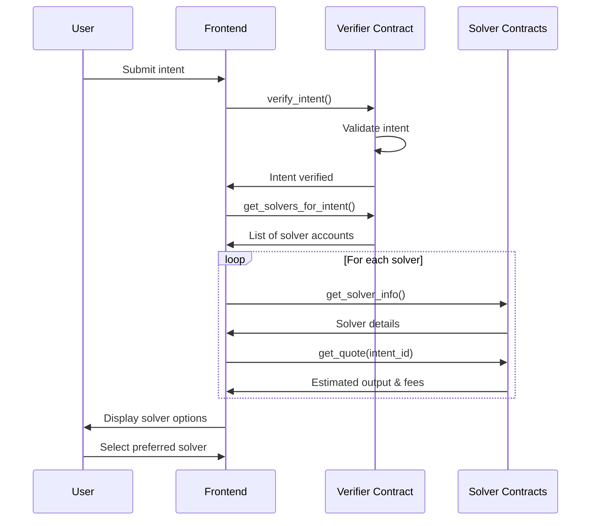

# Solver Options

## Understanding and Implementing Solver Options

Solvers are responsible for executing intents. This section explores different solver options and how to integrate them into your application.

## Types of Solvers

1. **Centralized Solvers**: Operated by a single entity
2. **Decentralized Solvers**: Distributed across multiple nodes
3. **User Solvers**: Run by the users themselves
4. **Specialized Solvers**: Focused on specific intent types

## Solver Implementation Considerations

### Registration & Discovery

Solvers need to be registered and discoverable:

```rust
// Simplified solver registration in Rust
#[near_bindgen]
impl Contract {
    pub fn register_solver(&mut self, solver_id: AccountId, intent_types: Vec<String>) {
        assert!(env::predecessor_account_id() == solver_id, "Only solver can register itself");

        let mut solver = Solver {
            id: solver_id.clone(),
            intent_types,
            total_executed: 0,
            success_rate: 100,
            last_active: env::block_timestamp(),
        };

        self.solvers.insert(&solver_id, &solver);
    }

    pub fn get_solvers_for_intent(&self, intent_type: String) -> Vec<SolverInfo> {
        self.solvers
            .iter()
            .filter(|(_, solver)| solver.intent_types.contains(&intent_type))
            .map(|(id, solver)| SolverInfo {
                id,
                success_rate: solver.success_rate,
                last_active: solver.last_active,
            })
            .collect()
    }
}
```

### Solver Selection UI

```jsx
// src/components/intent/SolverSelector.jsx
import React, { useEffect, useState } from "react";
import { getSolversForIntent } from "../../services/solverService";
import { Button } from "../ui/button";
import { RadioGroup, RadioGroupItem } from "../ui/radio-group";
import { Label } from "../ui/label";
import { Card, CardContent, CardHeader, CardTitle } from "../ui/card";

export function SolverSelector({ intentType, onSelect }) {
  const [solvers, setSolvers] = useState([]);
  const [selectedSolver, setSelectedSolver] = useState(null);
  const [loading, setLoading] = useState(false);

  useEffect(() => {
    const loadSolvers = async () => {
      if (!intentType) return;

      setLoading(true);
      try {
        const availableSolvers = await getSolversForIntent(intentType);
        setSolvers(availableSolvers);

        // Auto-select the first solver if available
        if (availableSolvers.length > 0) {
          setSelectedSolver(availableSolvers[0].id);
          onSelect(availableSolvers[0].id);
        }
      } catch (error) {
        console.error("Failed to load solvers:", error);
      } finally {
        setLoading(false);
      }
    };

    loadSolvers();
  }, [intentType, onSelect]);

  const handleSelect = (solverId) => {
    setSelectedSolver(solverId);
    onSelect(solverId);
  };

  if (loading) {
    return <div className="text-center">Loading solvers...</div>;
  }

  if (solvers.length === 0) {
    return (
      <div className="text-center">
        No solvers available for this intent type
      </div>
    );
  }

  return (
    <Card>
      <CardHeader>
        <CardTitle>Select a Solver</CardTitle>
      </CardHeader>
      <CardContent>
        <RadioGroup value={selectedSolver} onValueChange={handleSelect}>
          {solvers.map((solver) => (
            <div key={solver.id} className="flex items-center space-x-2 mb-3">
              <RadioGroupItem value={solver.id} id={solver.id} />
              <Label htmlFor={solver.id} className="flex-1">
                <div>
                  <div className="font-medium">{solver.id}</div>
                  <div className="text-sm text-gray-500">
                    Success Rate: {solver.success_rate}%
                  </div>
                </div>
              </Label>
            </div>
          ))}
        </RadioGroup>
      </CardContent>
    </Card>
  );
}
```

## Solver Service Interface

```javascript
// src/services/solverService.js
const API_BASE_URL = process.env.API_URL || "https://api.example.com";

export async function getSolversForIntent(intentType) {
  const response = await fetch(
    `${API_BASE_URL}/solvers?intentType=${intentType}`
  );

  if (!response.ok) {
    const error = await response.json();
    throw new Error(error.message || "Failed to fetch solvers");
  }

  return response.json();
}

export async function assignSolverToIntent(intentId, solverId) {
  const response = await fetch(`${API_BASE_URL}/intents/${intentId}/solver`, {
    method: "POST",
    headers: {
      "Content-Type": "application/json",
    },
    body: JSON.stringify({ solverId }),
  });

  if (!response.ok) {
    const error = await response.json();
    throw new Error(error.message || "Failed to assign solver");
  }

  return response.json();
}

export async function getSolverDetails(solverId) {
  const response = await fetch(`${API_BASE_URL}/solvers/${solverId}`);

  if (!response.ok) {
    const error = await response.json();
    throw new Error(error.message || "Failed to fetch solver details");
  }

  return response.json();
}
```

## Building Your Own Solver

A basic solver implementation should:

1. **Monitor for intents** by subscribing to events or polling
2. **Filter intents** based on capabilities and parameters
3. **Simulate execution** to verify feasibility
4. **Execute transactions** to fulfill the intent
5. **Report results** back to the network

```javascript
// src/services/solverNode.js (simplified example)
import { connect, Contract, keyStores, utils } from "near-api-js";

export class SolverNode {
  constructor(accountId, privateKey, networkId = "testnet") {
    this.accountId = accountId;
    this.privateKey = privateKey;
    this.networkId = networkId;
    this.running = false;
    this.supportedIntentTypes = ["transfer", "swap"];
  }

  async initialize() {
    // Configure NEAR connection
    const keyStore = new keyStores.InMemoryKeyStore();
    const keyPair = utils.KeyPair.fromString(this.privateKey);
    await keyStore.setKey(this.networkId, this.accountId, keyPair);

    const config = {
      networkId: this.networkId,
      keyStore,
      nodeUrl: `https://rpc.${this.networkId}.near.org`,
      walletUrl: `https://wallet.${this.networkId}.near.org`,
      helperUrl: `https://helper.${this.networkId}.near.org`,
      explorerUrl: `https://explorer.${this.networkId}.near.org`,
    };

    // Connect to NEAR
    const near = await connect(config);
    this.account = await near.account(this.accountId);

    // Initialize verifier contract
    this.verifierContract = new Contract(this.account, "verifier.testnet", {
      viewMethods: ["get_pending_intents"],
      changeMethods: ["claim_intent", "report_execution"],
    });

    // Register as solver
    await this.registerAsSolver();
  }

  async registerAsSolver() {
    // Call the contract to register this account as a solver
    await this.verifierContract.register_solver({
      intent_types: this.supportedIntentTypes,
    });
  }

  async start() {
    this.running = true;

    while (this.running) {
      try {
        // Fetch pending intents
        const pendingIntents = await this.verifierContract.get_pending_intents({
          limit: 10,
          intent_types: this.supportedIntentTypes,
        });

        // Process each intent
        for (const intent of pendingIntents) {
          await this.processIntent(intent);
        }

        // Wait before next poll
        await new Promise((resolve) => setTimeout(resolve, 2000));
      } catch (error) {
        console.error("Solver error:", error);
        await new Promise((resolve) => setTimeout(resolve, 5000));
      }
    }
  }

  async processIntent(intent) {
    try {
      // Try to claim the intent
      const claimResult = await this.verifierContract.claim_intent({
        intent_id: intent.id,
      });

      if (claimResult.success) {
        // Simulate execution
        const simulationResult = await this.simulateExecution(intent);

        if (simulationResult.success) {
          // Execute the intent
          const executionResult = await this.executeIntent(intent);

          // Report execution result
          await this.verifierContract.report_execution({
            intent_id: intent.id,
            success: executionResult.success,
            result: executionResult.result,
          });
        } else {
          // Report simulation failure
          await this.verifierContract.report_execution({
            intent_id: intent.id,
            success: false,
            result: simulationResult.error,
          });
        }
      }
    } catch (error) {
      console.error(`Error processing intent ${intent.id}:`, error);
    }
  }

  // Implement these methods based on your specific needs
  async simulateExecution(intent) {
    // Simulation logic
  }

  async executeIntent(intent) {
    // Execution logic
  }

  stop() {
    this.running = false;
  }
}
```

# Displaying and Selecting Solver Options

**Time**: 20 minutes  
**Pre-requisite**: Intent submission from 5.4, understanding of Solver contracts from Module 3

## The Solver Marketplace: Enabling Choice and Competition

Once a user has submitted an intent, our system needs to find the best way to execute it. In a decentralized intent architecture, multiple solvers can compete to fulfill the same intent, offering different execution strategies, prices, and guarantees. This creates a marketplace that benefits users through competition.

> 💡 **Web2 Parallel**: This is similar to a travel booking site showing multiple flight options from different airlines for your selected route, allowing you to choose based on price, time, or other preferences.

## Implementing the Solver Discovery and Selection UI

In this section, we'll build components to:

1. **Discover available solvers** for a given intent
2. **Display solver details** including fees, execution strategies, and estimated outcomes
3. **Enable users to select** their preferred solver for execution

## Fetching Solver Information

To present users with solver options, the frontend needs a way to discover available solvers and potentially get quotes or fee information from them for a specific intent. There are a few ways this can work:

1.  **On-Chain Verifier Registry (Recommended for Decentralization)**: The Verifier contract maintains a list of registered/approved solvers. The frontend calls a `view` method on the Verifier (e.g., `get_registered_solvers()`) to get this list.
2.  **Off-Chain Indexer/API (Used in Example Below)**: A separate backend service monitors the blockchain (or a specific Verifier) for verified intents and indexes available solvers and their capabilities. The frontend queries this API.
3.  **Direct Solver Interaction (Less Common)**: The frontend could potentially query known solver contracts directly for their fees or capabilities, though this is less scalable.

Our example below will use a conceptual **Off-Chain API** for simplicity, but an on-chain registry is often preferred for trust and decentralization.

```javascript
// src/services/solverService.js
// This service simulates fetching solver info from an external API or indexer.
// In a real app, replace with actual API calls or on-chain contract views.

const SOLVER_API_BASE_URL = "https://api.example-solver-registry.com"; // Placeholder

export const fetchSolversForIntent = async (intentId) => {
  // ... existing code ...
};
```

## Connecting to the Verifier Contract for Solver Discovery

First, let's enhance our IntentService to discover solvers for a specific intent:

```javascript
// src/services/IntentService.js
// Add these methods to the existing IntentService class

// Get all solvers registered with the verifier
async getRegisteredSolvers() {
  try {
    const account = this.sessionAccount;

    // Call view method on verifier contract
    const solvers = await account.viewFunction({
      contractId: this.verifierContractId,
      methodName: 'get_solvers',
      args: {}
    });

    return { success: true, solvers };
  } catch (error) {
    console.error('Failed to get solvers:', error);
    return { success: false, error: error.message };
  }
}

// Get solvers available for a specific intent
async getSolversForIntent(intentId) {
  try {
    const account = this.sessionAccount;

    // Call view method on verifier contract
    const solvers = await account.viewFunction({
      contractId: this.verifierContractId,
      methodName: 'get_solvers_for_intent',
      args: { intent_id: intentId }
    });

    return { success: true, solvers };
  } catch (error) {
    console.error('Failed to get solvers for intent:', error);
    return { success: false, error: error.message };
  }
}

// Get details about a specific solver
async getSolverDetails(solverAccountId) {
  try {
    const account = this.sessionAccount;

    // Call view method on the solver contract
    const solverInfo = await account.viewFunction({
      contractId: solverAccountId,
      methodName: 'get_solver_info',
      args: {}
    });

    return { success: true, solverInfo };
  } catch (error) {
    console.error('Failed to get solver details:', error);
    return { success: false, error: error.message };
  }
}

// Get a solver's quote for an intent
async getSolverQuote(solverAccountId, intentId) {
  try {
    const account = this.sessionAccount;

    // Call view method on the solver contract
    const quote = await account.viewFunction({
      contractId: solverAccountId,
      methodName: 'get_quote',
      args: { intent_id: intentId }
    });

    return { success: true, quote };
  } catch (error) {
    console.error('Failed to get solver quote:', error);
    return { success: false, error: error.message };
  }
}
```

## Updating the Intent Context

Now let's update our IntentContext to include solver discovery and selection:

```jsx
// src/context/IntentContext.js
// Add these to the existing IntentContext

export function IntentProvider({ children }) {
  // Existing state...
  const [availableSolvers, setAvailableSolvers] = useState({});
  const [selectedSolver, setSelectedSolver] = useState({});
  const [loadingSolvers, setLoadingSolvers] = useState({});

  // Fetch solvers for a specific intent
  const fetchSolversForIntent = async (intentId) => {
    if (!intentService) {
      setError("Intent service not initialized");
      return { success: false, error: "Intent service not initialized" };
    }

    try {
      setLoadingSolvers((prev) => ({ ...prev, [intentId]: true }));

      // Get available solvers
      const result = await intentService.getSolversForIntent(intentId);

      if (result.success) {
        // Get details for each solver
        const solverDetails = await Promise.all(
          result.solvers.map(async (solverAccount) => {
            const details = await intentService.getSolverDetails(solverAccount);
            const quote = await intentService.getSolverQuote(
              solverAccount,
              intentId
            );

            return {
              accountId: solverAccount,
              details: details.success ? details.solverInfo : null,
              quote: quote.success ? quote.quote : null,
              error:
                !details.success || !quote.success
                  ? "Failed to fetch complete solver data"
                  : null,
            };
          })
        );

        // Update state with solver information
        setAvailableSolvers((prev) => ({
          ...prev,
          [intentId]: solverDetails.filter((s) => s.details && s.quote),
        }));

        return { success: true, solvers: solverDetails };
      } else {
        setError(`Failed to fetch solvers: ${result.error}`);
        return result;
      }
    } catch (err) {
      const errorMessage = err.message || "Error fetching solvers";
      setError(errorMessage);
      return { success: false, error: errorMessage };
    } finally {
      setLoadingSolvers((prev) => ({ ...prev, [intentId]: false }));
    }
  };

  // Select a solver for an intent
  const selectSolver = (intentId, solverAccountId) => {
    setSelectedSolver((prev) => ({
      ...prev,
      [intentId]: solverAccountId,
    }));

    return { success: true };
  };

  // Get available solvers for an intent
  const getSolversForIntent = (intentId) => {
    return availableSolvers[intentId] || [];
  };

  // Get selected solver for an intent
  const getSelectedSolver = (intentId) => {
    return selectedSolver[intentId];
  };

  // Check if we're loading solvers for an intent
  const isFetchingSolvers = (intentId) => {
    return loadingSolvers[intentId] || false;
  };

  // Add these to the context value
  const value = {
    // Existing values...
    fetchSolversForIntent,
    selectSolver,
    getSolversForIntent,
    getSelectedSolver,
    isFetchingSolvers,
  };

  // Return the provider
  return (
    <IntentContext.Provider value={value}>{children}</IntentContext.Provider>
  );
}
```

## Creating the Solver List Component

Let's create a component to display available solvers for an intent:

```jsx
// src/components/SolverList/SolverList.jsx
import React, { useEffect } from "react";
import { useIntent } from "../../context/IntentContext";
import SolverCard from "./SolverCard";

function SolverList({ intentId }) {
  const {
    fetchSolversForIntent,
    getSolversForIntent,
    getSelectedSolver,
    selectSolver,
    isFetchingSolvers,
  } = useIntent();

  // Fetch solvers when the component mounts
  useEffect(() => {
    fetchSolversForIntent(intentId);

    // Simple polling - In production, consider WebSockets or more efficient methods
    const interval = setInterval(async () => {
      console.log("Polling for solver proposals...");
      // Fetch proposals again
      // ... (fetch logic)
      // If proposals change or a good one appears, update state and maybe clear interval
    }, 5000); // Poll every 5 seconds

    return () => clearInterval(interval); // Cleanup on unmount
  }, [intentId]);

  const solvers = getSolversForIntent(intentId);
  const selectedSolverId = getSelectedSolver(intentId);
  const loading = isFetchingSolvers(intentId);

  if (loading && solvers.length === 0) {
    return <div className="loading-solvers">Discovering solvers...</div>;
  }

  if (solvers.length === 0) {
    return (
      <div className="no-solvers">
        <p>
          No solvers found for this intent yet. Please check back in a moment.
        </p>
        <button
          onClick={() => fetchSolversForIntent(intentId)}
          className="refresh-button"
        >
          Refresh Solvers
        </button>
      </div>
    );
  }

  // Sort solvers by best price if it's a swap
  const sortedSolvers = [...solvers].sort((a, b) => {
    if (a.quote.output_amount && b.quote.output_amount) {
      return b.quote.output_amount - a.quote.output_amount;
    }
    return 0;
  });

  return (
    <div className="solver-list">
      <h3>Available Solvers</h3>
      <p className="solver-explanation">
        These solvers can fulfill your intent. Select the one you prefer.
      </p>

      <div className="solver-cards">
        {sortedSolvers.map((solver) => (
          <SolverCard
            key={solver.accountId}
            solver={solver}
            isSelected={selectedSolverId === solver.accountId}
            onSelect={() => selectSolver(intentId, solver.accountId)}
          />
        ))}
      </div>

      <button
        onClick={() => fetchSolversForIntent(intentId)}
        className="refresh-button"
      >
        Refresh Solvers
      </button>
    </div>
  );
}

export default SolverList;
```

## Creating the Solver Card Component

Next, let's create a component to display information about each solver:

```jsx
// src/components/SolverList/SolverCard.jsx
import React from "react";
import { utils } from "near-api-js";

function SolverCard({ solver, isSelected, onSelect }) {
  const { accountId, details, quote } = solver;

  // Format output amount to human-readable form
  const formatAmount = (yoctoAmount) => {
    if (!yoctoAmount) return "Unknown";
    return utils.format.formatNearAmount(yoctoAmount, 4);
  };

  // Format fee percentage
  const formatFee = (fee) => {
    if (fee === undefined || fee === null) return "Unknown";
    return `${(fee * 100).toFixed(2)}%`;
  };

  // Calculate time estimate in seconds
  const getTimeEstimate = () => {
    if (!quote.estimated_time_seconds) return "Unknown";
    const seconds = quote.estimated_time_seconds;

    if (seconds < 60) return `${seconds} seconds`;
    return `${Math.floor(seconds / 60)} minutes`;
  };

  return (
    <div className={`solver-card ${isSelected ? "selected" : ""}`}>
      <div className="solver-header">
        <h4>{details.name || accountId}</h4>
        {details.verified && <span className="verified-badge">Verified</span>}
      </div>

      <div className="solver-details">
        <p className="solver-description">
          {details.description || "No description provided"}
        </p>

        <div className="solver-stats">
          <div className="stat">
            <span className="label">Receive:</span>
            <span className="value highlight">
              {formatAmount(quote.output_amount)} {quote.output_token}
            </span>
          </div>

          <div className="stat">
            <span className="label">Fee:</span>
            <span className="value">{formatFee(quote.fee)}</span>
          </div>

          <div className="stat">
            <span className="label">Estimated Time:</span>
            <span className="value">{getTimeEstimate()}</span>
          </div>

          {quote.route && (
            <div className="stat">
              <span className="label">Route:</span>
              <span className="value route">{quote.route}</span>
            </div>
          )}
        </div>
      </div>

      <button
        onClick={onSelect}
        className={`select-solver-button ${isSelected ? "selected" : ""}`}
        disabled={isSelected}
      >
        {isSelected ? "Selected" : "Select Solver"}
      </button>
    </div>
  );
}

export default SolverCard;
```

## Creating the Intent Details Page

Let's create a page to show intent details and solver options:

```jsx
// src/pages/IntentDetails.jsx
import React, { useEffect, useState } from "react";
import { useParams, Link } from "react-router-dom";
import { useIntent } from "../context/IntentContext";
import { useWallet } from "../context/WalletContext";
import SolverList from "../components/SolverList/SolverList";

function IntentDetails() {
  const { intentId } = useParams();
  const { getIntentById, activeIntents } = useIntent();
  const { isConnected } = useWallet();
  const [intent, setIntent] = useState(null);

  // Find the intent when component mounts or activeIntents changes
  useEffect(() => {
    const foundIntent = getIntentById(intentId);
    if (foundIntent) {
      setIntent(foundIntent);
    }
  }, [intentId, activeIntents]);

  if (!isConnected) {
    return (
      <div className="not-connected">
        <h2>Wallet Not Connected</h2>
        <p>Please connect your wallet to view intent details.</p>
        <Link to="/" className="back-link">
          Back to Dashboard
        </Link>
      </div>
    );
  }

  if (!intent) {
    return (
      <div className="intent-not-found">
        <h2>Intent Not Found</h2>
        <p>The intent you're looking for doesn't exist or has expired.</p>
        <Link to="/" className="back-link">
          Back to Dashboard
        </Link>
      </div>
    );
  }

  return (
    <div className="intent-details-page">
      <header className="page-header">
        <Link to="/" className="back-link">
          ← Back to Dashboard
        </Link>
        <h1>Intent Details</h1>
      </header>

      <div className="intent-summary">
        <h2>
          {intent.type.charAt(0).toUpperCase() + intent.type.slice(1)} Intent
        </h2>
        <div className="intent-info">
          <p>
            <strong>ID:</strong> {intent.id}
          </p>
          <p>
            <strong>Status:</strong>{" "}
            <span className={`status ${intent.status}`}>{intent.status}</span>
          </p>
          <p>
            <strong>Submitted:</strong>{" "}
            {new Date(intent.timestamp).toLocaleString()}
          </p>

          {intent.type === "swap" && (
            <div className="swap-details">
              <p>
                <strong>Swap:</strong> {intent.params.inputAmount}{" "}
                {intent.params.inputToken} for {intent.params.outputToken}
              </p>
              <p>
                <strong>Max Slippage:</strong> {intent.params.maxSlippage}%
              </p>
              {intent.params.minOutputAmount && (
                <p>
                  <strong>Minimum Output:</strong>{" "}
                  {intent.params.minOutputAmount} {intent.params.outputToken}
                </p>
              )}
            </div>
          )}

          <p>
            <a
              href={`https://explorer.testnet.near.org/transactions/${intent.transactionHash}`}
              target="_blank"
              rel="noopener noreferrer"
              className="explorer-link"
            >
              View Transaction in Explorer
            </a>
          </p>
        </div>
      </div>

      <SolverList intentId={intent.id} />

      {/* We'll add ExecuteIntent component in the next section */}
    </div>
  );
}

export default IntentDetails;
```

## Understanding the Solver Contract Interface

Our frontend components rely on a consistent interface with our solver contracts. Based on the Rust contracts from Module 3, the solver contract should implement these methods:

```rust
// Solver contract interface (from Module 3)
pub trait SolverInterface {
    // Get information about the solver
    fn get_solver_info(&self) -> SolverInfo;

    // Get quote for a specific intent
    fn get_quote(&self, intent_id: String) -> Option<Quote>;

    // Get all supported actions
    fn get_supported_actions(&self) -> Vec<String>;

    // Solve an intent
    fn solve_intent(&mut self, intent: Intent) -> PromiseOrValue<SolveResult>;
}

// SolverInfo structure
pub struct SolverInfo {
    pub name: String,
    pub description: String,
    pub version: String,
    pub supported_tokens: Vec<String>,
    pub verified: bool,
    pub owner_id: AccountId
}

// Quote structure
pub struct Quote {
    pub output_amount: Option<U128>,
    pub output_token: String,
    pub fee: Option<f64>,
    pub route: Option<String>,
    pub estimated_time_seconds: Option<u32>
}
```

## Connecting the Dots: From Intent to Solver

Let's visualize the flow from intent creation to solver selection:



## Direct Connection to Module 3's Contract Design

Our frontend implementation aligns perfectly with the contract design from Module 3:

1. **Contract Method Consistency** - Our frontend calls the same methods we defined in Module 3's contracts
2. **Data Structure Alignment** - Our UI displays data from the SolverInfo and Quote structures
3. **Intent Flow** - We follow the same flow: submit intent → verify → get solvers → select solver

This consistency ensures that our frontend works seamlessly with the backend contracts we developed earlier.

## Next Steps

With our solver discovery and selection UI in place, users can now:

1. Submit intents using the form from the previous section
2. View available solvers for their intents
3. Compare solver options based on output amount, fees, and other factors
4. Select their preferred solver

In the next section, we'll implement the final piece: executing the intent through the selected solver to complete the transaction.
