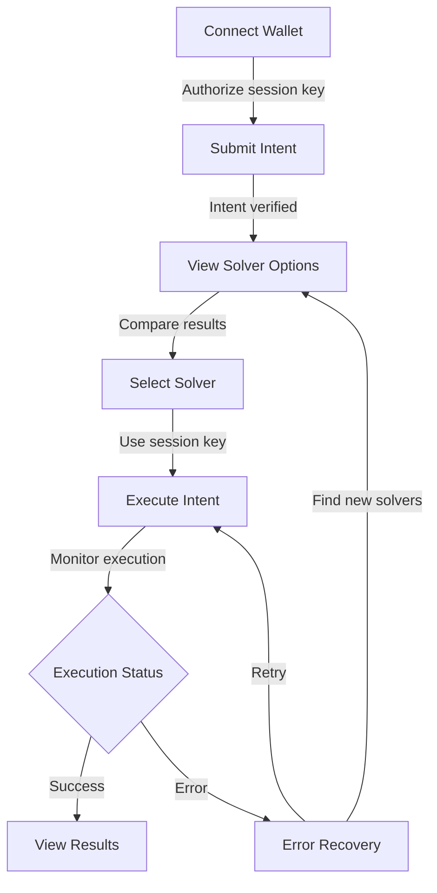

# 5.6: Executing Intents and Handling Results

**Time**: 20 minutes  
**Pre-requisite**: Solver selection from 5.5, understanding of Smart Contracts from Module 3

## The Final Step: Fulfilling User Intents

We've built our frontend components for connecting wallets, submitting intents, and selecting solvers. Now it's time to implement the final piece: executing intents through the selected solver to complete the transaction lifecycle.

> 💡 **Web2 Parallel**: This is like finalizing a purchase after selecting a product and shipping method on an e-commerce site. It's the moment when the user's intent (buying a product) is finally fulfilled.

## Enhancing Our Intent Service

First, let's add execution-related methods to our IntentService:

```javascript
// src/services/IntentService.js
// Add these methods to the existing IntentService class

// Execute an intent through a specific solver
async executeIntent(intentId, solverAccountId) {
  if (!this.sessionAccount) {
    throw new Error('Session account not initialized');
  }

  try {
    // Call the solver's solve_intent method
    const result = await this.sessionAccount.functionCall({
      contractId: solverAccountId,
      methodName: 'solve_intent',
      args: { intent_id: intentId },
      gas: '50000000000000', // 50 TGas (solvers might need more gas)
      attachedDeposit: '0' // No deposit required for session key
    });

    return {
      success: true,
      transactionHash: result.transaction.hash,
      result
    };
  } catch (error) {
    console.error('Failed to execute intent:', error);
    return {
      success: false,
      error: error.message
    };
  }
}

// Get the current status of an intent
async getIntentStatus(intentId) {
  try {
    const account = this.sessionAccount;

    // Call view method on verifier contract
    const status = await account.viewFunction({
      contractId: this.verifierContractId,
      methodName: 'get_intent_status',
      args: { intent_id: intentId }
    });

    return { success: true, status };
  } catch (error) {
    console.error('Failed to get intent status:', error);
    return { success: false, error: error.message };
  }
}

// Get execution results from a solver
async getExecutionResults(intentId, solverAccountId) {
  try {
    const account = this.sessionAccount;

    // Call view method on solver contract
    const results = await account.viewFunction({
      contractId: solverAccountId,
      methodName: 'get_execution_results',
      args: { intent_id: intentId }
    });

    return { success: true, results };
  } catch (error) {
    console.error('Failed to get execution results:', error);
    return { success: false, error: error.message };
  }
}
```

## Updating the Intent Context

Now let's add execution methods to our IntentContext:

```jsx
// src/context/IntentContext.js
// Add these to the existing IntentContext

export function IntentProvider({ children }) {
  // Existing state...
  const [executionStatus, setExecutionStatus] = useState({});
  const [executionResults, setExecutionResults] = useState({});
  const [executionError, setExecutionError] = useState({});

  // Execute an intent with a selected solver
  const executeIntent = async (intentId) => {
    if (!intentService) {
      setError("Intent service not initialized");
      return { success: false, error: "Intent service not initialized" };
    }

    // Get the selected solver for this intent
    const solverAccountId = selectedSolver[intentId];
    if (!solverAccountId) {
      setExecutionError((prev) => ({
        ...prev,
        [intentId]: "No solver selected for this intent",
      }));
      return {
        success: false,
        error: "No solver selected for this intent",
      };
    }

    try {
      setLoading(true);
      setError(null);

      // Update status to executing
      setExecutionStatus((prev) => ({
        ...prev,
        [intentId]: "executing",
      }));

      // Execute the intent
      const result = await intentService.executeIntent(
        intentId,
        solverAccountId
      );

      if (result.success) {
        // Update status and store transaction hash
        setExecutionStatus((prev) => ({
          ...prev,
          [intentId]: "completed",
        }));

        // Update active intents
        setActiveIntents((prevIntents) =>
          prevIntents.map((intent) =>
            intent.id === intentId
              ? {
                  ...intent,
                  status: "completed",
                  executionHash: result.transactionHash,
                }
              : intent
          )
        );

        // Get execution results
        setTimeout(async () => {
          const resultsResponse = await intentService.getExecutionResults(
            intentId,
            solverAccountId
          );
          if (resultsResponse.success) {
            setExecutionResults((prev) => ({
              ...prev,
              [intentId]: resultsResponse.results,
            }));
          }
        }, 2000); // Give the blockchain a moment to process

        return result;
      } else {
        setExecutionStatus((prev) => ({
          ...prev,
          [intentId]: "failed",
        }));

        setExecutionError((prev) => ({
          ...prev,
          [intentId]: result.error,
        }));

        // Update active intents
        setActiveIntents((prevIntents) =>
          prevIntents.map((intent) =>
            intent.id === intentId ? { ...intent, status: "failed" } : intent
          )
        );

        return result;
      }
    } catch (err) {
      const errorMessage = err.message || "Error executing intent";

      setExecutionStatus((prev) => ({
        ...prev,
        [intentId]: "failed",
      }));

      setExecutionError((prev) => ({
        ...prev,
        [intentId]: errorMessage,
      }));

      return { success: false, error: errorMessage };
    } finally {
      setLoading(false);
    }
  };

  // Get the current execution status
  const getExecutionStatus = (intentId) => {
    return executionStatus[intentId] || "pending";
  };

  // Get any execution error
  const getExecutionError = (intentId) => {
    return executionError[intentId] || null;
  };

  // Get execution results
  const getExecutionResults = (intentId) => {
    return executionResults[intentId] || null;
  };

  // Retry a failed execution
  const retryExecution = async (intentId) => {
    // Clear previous error
    setExecutionError((prev) => ({
      ...prev,
      [intentId]: null,
    }));

    // Reset status
    setExecutionStatus((prev) => ({
      ...prev,
      [intentId]: "pending",
    }));

    // Try again
    return executeIntent(intentId);
  };

  // Add these to the context value
  const value = {
    // Existing values...
    executeIntent,
    getExecutionStatus,
    getExecutionError,
    getExecutionResults,
    retryExecution,
  };

  // Return the provider
  return (
    <IntentContext.Provider value={value}>{children}</IntentContext.Provider>
  );
}
```

## Creating the Execute Intent Component

Now, let's create a component to execute intents and display the results:

```jsx
// src/components/ExecutionManager/ExecuteIntent.jsx
import React, { useState, useEffect } from "react";
import { useIntent } from "../../context/IntentContext";
import { utils } from "near-api-js";

function ExecuteIntent({ intentId }) {
  const {
    executeIntent,
    getExecutionStatus,
    getExecutionError,
    getExecutionResults,
    retryExecution,
    getSelectedSolver,
    getSolversForIntent,
  } = useIntent();

  const [executing, setExecuting] = useState(false);

  // Get current status and selected solver
  const executionStatus = getExecutionStatus(intentId);
  const executionError = getExecutionError(intentId);
  const executionResults = getExecutionResults(intentId);
  const selectedSolverId = getSelectedSolver(intentId);
  const solvers = getSolversForIntent(intentId);

  // Get solver details
  const selectedSolver = solvers.find((s) => s.accountId === selectedSolverId);

  // Check if we can execute (requires a selected solver)
  const canExecute =
    selectedSolverId &&
    executionStatus !== "executing" &&
    executionStatus !== "completed";

  // Execute the intent
  const handleExecute = async () => {
    if (!canExecute) return;

    setExecuting(true);
    try {
      await executeIntent(intentId);
    } finally {
      setExecuting(false);
    }
  };

  // Retry a failed execution
  const handleRetry = async () => {
    setExecuting(true);
    try {
      await retryExecution(intentId);
    } finally {
      setExecuting(false);
    }
  };

  // Format the token amount for display
  const formatAmount = (yoctoAmount, token) => {
    if (!yoctoAmount) return "Unknown amount";
    return `${utils.format.formatNearAmount(yoctoAmount, 4)} ${token}`;
  };

  return (
    <div className="execute-intent">
      <h3>Execute Intent</h3>

      {!selectedSolverId ? (
        <div className="no-solver-selected">
          <p>Please select a solver above to execute this intent.</p>
        </div>
      ) : (
        <>
          <div className="selected-solver">
            <p>
              <strong>Selected Solver:</strong>{" "}
              {selectedSolver?.details?.name || selectedSolverId}
            </p>
            {selectedSolver?.quote && (
              <p>
                <strong>Expected Output:</strong>{" "}
                {formatAmount(
                  selectedSolver.quote.output_amount,
                  selectedSolver.quote.output_token
                )}
              </p>
            )}
          </div>

          <div className="execution-status">
            <p>
              <strong>Status:</strong>
              <span className={`status ${executionStatus}`}>
                {executionStatus.charAt(0).toUpperCase() +
                  executionStatus.slice(1)}
              </span>
            </p>
          </div>

          {executionError && (
            <div className="execution-error">
              <p>
                <strong>Error:</strong> {executionError}
              </p>
              <button
                onClick={handleRetry}
                disabled={executing}
                className="retry-button"
              >
                {executing ? "Retrying..." : "Retry Execution"}
              </button>
            </div>
          )}

          {executionResults && (
            <div className="execution-results">
              <h4>Execution Results</h4>
              {executionResults.output_amount && (
                <p>
                  <strong>Received:</strong>{" "}
                  {formatAmount(
                    executionResults.output_amount,
                    executionResults.output_token
                  )}
                </p>
              )}
              {executionResults.transaction_hash && (
                <p>
                  <strong>Transaction:</strong>
                  <a
                    href={`https://explorer.testnet.near.org/transactions/${executionResults.transaction_hash}`}
                    target="_blank"
                    rel="noopener noreferrer"
                    className="explorer-link"
                  >
                    View in Explorer
                  </a>
                </p>
              )}
            </div>
          )}

          {canExecute && (
            <button
              onClick={handleExecute}
              disabled={executing || !canExecute}
              className="execute-button"
            >
              {executing ? "Executing..." : "Execute Intent"}
            </button>
          )}
        </>
      )}
    </div>
  );
}

export default ExecuteIntent;
```

## Creating the Execution Status Component

Let's also create a component to track execution status:

```jsx
// src/components/ExecutionManager/ExecutionStatus.jsx
import React, { useEffect } from "react";
import { useIntent } from "../../context/IntentContext";

function ExecutionStatus({ intentId }) {
  const {
    getExecutionStatus,
    getIntentById,
    getSolversForIntent,
    getSelectedSolver,
  } = useIntent();

  const status = getExecutionStatus(intentId);
  const intent = getIntentById(intentId);
  const selectedSolverId = getSelectedSolver(intentId);
  const solvers = getSolversForIntent(intentId);
  const selectedSolver = solvers.find((s) => s.accountId === selectedSolverId);

  // Status messages for each state
  const statusMessages = {
    pending: "Your intent is ready to be executed.",
    executing: "Your intent is being executed by the solver...",
    completed: "Your intent was successfully executed!",
    failed: "There was an issue executing your intent.",
  };

  return (
    <div className={`execution-status-tracker ${status}`}>
      <div className="status-header">
        <h4>Intent Status</h4>
        <span className={`status-badge ${status}`}>
          {status.charAt(0).toUpperCase() + status.slice(1)}
        </span>
      </div>

      <div className="status-message">
        <p>{statusMessages[status] || "Unknown status"}</p>

        {status === "completed" && intent && (
          <p className="success-message">
            Your {intent.type} intent was successfully executed
            {selectedSolver &&
              ` by ${selectedSolver.details?.name || selectedSolverId}`}.
          </p>
        )}
      </div>

      <div className="status-timeline">
        <div
          className={`timeline-step ${
            status !== "pending" ? "completed" : "current"
          }`}
        >
          <div className="step-circle"></div>
          <div className="step-text">Created</div>
        </div>
        <div
          className={`timeline-line ${status !== "pending" ? "completed" : ""}`}
        ></div>

        <div
          className={`timeline-step ${
            status === "executing"
              ? "current"
              : status === "completed" || status === "failed"
              ? "completed"
              : ""
          }`}
        >
          <div className="step-circle"></div>
          <div className="step-text">Executing</div>
        </div>
        <div
          className={`timeline-line ${
            status === "completed" || status === "failed" ? "completed" : ""
          }`}
        ></div>

        <div
          className={`timeline-step ${
            status === "completed"
              ? "completed"
              : status === "failed"
              ? "error"
              : ""
          }`}
        >
          <div className="step-circle"></div>
          <div className="step-text">Completed</div>
        </div>
      </div>
    </div>
  );
}

export default ExecutionStatus;
```

## Updating the Intent Details Page

Now, let's update our Intent Details page to include the execution components:

```jsx
// src/pages/IntentDetails.jsx
import React, { useEffect, useState } from "react";
import { useParams, Link } from "react-router-dom";
import { useIntent } from "../context/IntentContext";
import { useWallet } from "../context/WalletContext";
import SolverList from "../components/SolverList/SolverList";
import ExecuteIntent from "../components/ExecutionManager/ExecuteIntent";
import ExecutionStatus from "../components/ExecutionManager/ExecutionStatus";

function IntentDetails() {
  // Existing code...

  return (
    <div className="intent-details-page">
      <header className="page-header">
        <Link to="/" className="back-link">
          ← Back to Dashboard
        </Link>
        <h1>Intent Details</h1>
      </header>

      <div className="intent-summary">{/* Existing code... */}</div>

      <ExecutionStatus intentId={intent.id} />

      <SolverList intentId={intent.id} />

      <ExecuteIntent intentId={intent.id} />
    </div>
  );
}

export default IntentDetails;
```

## Error Recovery and Fault Handling

Our implementation includes several error recovery mechanisms:

1. **Transaction Retries** - If an intent execution fails, users can retry
2. **Status Tracking** - Clear feedback on the current execution status
3. **Error Display** - Descriptive error messages to help users understand issues
4. **Result Verification** - Confirming that execution produced the expected results

Let's create a dedicated error recovery component:

```jsx
// src/components/ExecutionManager/ErrorRecovery.jsx
import React, { useState } from "react";
import { useIntent } from "../../context/IntentContext";

function ErrorRecovery({ intentId }) {
  const { getExecutionError, retryExecution, fetchSolversForIntent } =
    useIntent();

  const [loading, setLoading] = useState(false);
  const [showDetails, setShowDetails] = useState(false);

  const error = getExecutionError(intentId);

  if (!error) return null;

  // Diagnose error type and suggest actions
  const diagnoseError = (errorMessage) => {
    if (errorMessage.includes("exceeded the allowance")) {
      return {
        reason: "Session key out of gas allowance",
        action: "Please reconnect your wallet to create a new session key",
        canRetry: false,
      };
    }

    if (errorMessage.includes("slippage")) {
      return {
        reason: "The price moved beyond your slippage tolerance",
        action:
          "Try again or create a new intent with higher slippage tolerance",
        canRetry: true,
      };
    }

    if (
      errorMessage.includes("timeout") ||
      errorMessage.includes("timed out")
    ) {
      return {
        reason: "The execution timed out",
        action: "Try again or select a different solver",
        canRetry: true,
        suggestNewSolver: true,
      };
    }

    // Generic error
    return {
      reason: "Unknown error executing intent",
      action: "Try again or select a different solver",
      canRetry: true,
      suggestNewSolver: true,
    };
  };

  const diagnosis = diagnoseError(error);

  // Handle retry
  const handleRetry = async () => {
    setLoading(true);
    try {
      await retryExecution(intentId);
    } finally {
      setLoading(false);
    }
  };

  // Refresh solvers
  const handleRefreshSolvers = async () => {
    setLoading(true);
    try {
      await fetchSolversForIntent(intentId);
    } finally {
      setLoading(false);
    }
  };

  return (
    <div className="error-recovery">
      <h4>Error Occurred</h4>

      <div className="error-diagnosis">
        <p>
          <strong>Reason:</strong> {diagnosis.reason}
        </p>
        <p>
          <strong>Suggested Action:</strong> {diagnosis.action}
        </p>
      </div>

      <div className="error-actions">
        {diagnosis.canRetry && (
          <button
            onClick={handleRetry}
            disabled={loading}
            className="retry-action"
          >
            {loading ? "Retrying..." : "Retry Execution"}
          </button>
        )}

        {diagnosis.suggestNewSolver && (
          <button
            onClick={handleRefreshSolvers}
            disabled={loading}
            className="refresh-solvers-action"
          >
            {loading ? "Refreshing..." : "Find New Solvers"}
          </button>
        )}

        <button
          onClick={() => setShowDetails(!showDetails)}
          className="toggle-details"
        >
          {showDetails ? "Hide Error Details" : "Show Error Details"}
        </button>
      </div>

      {showDetails && (
        <div className="error-details">
          <pre>{error}</pre>
        </div>
      )}
    </div>
  );
}

export default ErrorRecovery;
```

## The Complete Intent Lifecycle

Our frontend now implements the complete intent lifecycle:

1. **Connect wallet** and authorize session key
2. **Create and submit intent** through the verifier contract
3. **Discover solvers** for the intent
4. **Compare and select** the preferred execution option
5. **Execute intent** with the selected solver
6. **Monitor status** and view results
7. **Handle errors** and recovery if needed

Let's visualize this flow:



## Security and UX Considerations

When implementing intent execution, consider these important factors:

1. **Transaction Confirmation** - Clearly show when transactions are in progress and confirmed
2. **Result Validation** - Verify that the execution results match what was promised
3. **Error Communication** - Provide clear error messages with actionable steps
4. **Session Key Management** - Handle cases where session keys expire or run out of allowance
5. **Transaction History** - Maintain a clear history of all executed intents and their outcomes

## Direct Connection to Module 3 and 4

Our execution implementation ties directly to concepts from earlier modules:

1. **From Module 3** - We're calling the same contract methods we defined in our smart contracts
2. **From Module 4** - We're using session keys to execute transactions without requiring wallet confirmation for each action

## Summary and Next Steps

Congratulations! We've now built a complete frontend for our intent-centric architecture:

1. ✅ Connected wallet with session key support
2. ✅ Created and submitted intents
3. ✅ Discovered and selected solvers
4. ✅ Executed intents through selected solvers
5. ✅ Handled success and error cases

In the next module, we'll deploy our full application to the NEAR testnet for real-world testing.

## Further Enhancements

While our implementation covers the core functionality, here are some ideas for further enhancement:

1. **Intent History** - A dedicated page for viewing all past intents and their status
2. **Notification System** - Real-time updates when intents are processed
3. **Analytics Dashboard** - Statistics on solver performance and execution prices
4. **Advanced Intent Types** - Support for more complex intent types beyond simple swaps
5. **Multi-chain Support** - Extending the UI to handle cross-chain intents

These enhancements would build on our solid foundation to create an even more powerful intent-based dApp.
