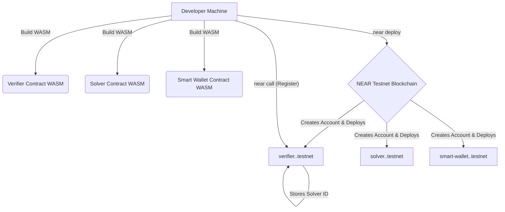

# Deploying Your Intent Architecture to NEAR Testnet

**Estimated Time:** 30 minutes  
**Prerequisites:** Completed contracts from Module 3, frontend from Module 5
**Learning Objectives:**

- Deploy smart contracts to the NEAR testnet
- Configure your frontend to use deployed contracts
- Understand the differences between local and testnet environments

## Moving from Local Development to Testnet

So far, we've been developing and testing our intent-based system locally. While local development is great for rapid iteration and testing, to share your application with others and test it in a more realistic environment, we need to deploy to the NEAR testnet.

> 💡 **Web2 Analogy**: The NEAR testnet is like a staging environment in traditional web development. It mirrors the production environment (mainnet) but uses test tokens with no real-world value, allowing you to deploy and test your application in a realistic but consequence-free environment. Just as you might deploy a Web2 app to a staging server before production to verify everything works with real APIs and infrastructure, deploying to testnet lets you verify your dApp works with actual blockchain infrastructure before risking real assets on mainnet.

## Prerequisites for Deployment

Before we begin, ensure you have:

1. Your NEAR CLI installed and configured:

   ```bash
   # If you haven't installed NEAR CLI yet
   npm install -g near-cli
   ```

2. A testnet account (if you don't have one):

   ```bash
   # Create a new testnet account
   near login
   ```

3. The compiled WASM files for your Verifier and Solver contracts.

4. Your frontend code ready for configuration.

## From Local Development to Testnet: The Staging Environment of Web3

In traditional Web2 development, you typically move from local development to a staging environment before production. In Web3, the NEAR testnet serves this exact purpose - allowing you to test your application in a live blockchain environment that mimics mainnet without using real funds.

> 💡 **Web2 Parallel**: Deploying to NEAR testnet is like deploying your application to a staging server in AWS, Azure, or GCP. It lets you validate your application in an environment that closely resembles production.

## Prerequisites

Before deploying, ensure you have:

1. **A NEAR testnet account** - Create one at [wallet.testnet.near.org](https://wallet.testnet.near.org)
2. **NEAR CLI installed** - Run `npm install -g near-cli` if you haven't already
3. **Login to your testnet account** - Run `near login` and follow the prompts
4. **Your contracts compiled** - Ensure you've built your contracts from Module 3 with `cargo build --target wasm32-unknown-unknown --release`
5. **Some testnet NEAR tokens** - These cover deployment costs (get free tokens from the [NEAR Wallet](https://wallet.testnet.near.org))

## Creating Dedicated Subaccounts

Just as you might create separate services in Web2 architecture, in Web3 it's best practice to deploy different contracts to dedicated subaccounts:

```bash
near create-account verifier.yourname.testnet --masterAccount yourname.testnet
near create-account solver.yourname.testnet --masterAccount yourname.testnet
near create-account smart-wallet.yourname.testnet --masterAccount yourname.testnet
```

Your main account (`yourname.testnet`) funds these subaccounts, covering their initial storage costs - similar to how you might allocate resources to different microservices in a Web2 architecture.

## Deploying the Core Contracts

Navigate to your project's root directory in your terminal.

```bash
# 1. Deploy Verifier Contract
# Replace <YOUR_ACCOUNT_ID> with your actual NEAR testnet account ID
near deploy --wasmFile contracts/verifier/res/verifier_contract.wasm \
  --accountId verifier.<YOUR_ACCOUNT_ID>.testnet \
  --initFunction new \
  --initArgs '{"owner_id": "<YOUR_ACCOUNT_ID>.testnet"}'

# 2. Deploy Solver Contract
near deploy --wasmFile contracts/solver/res/solver_contract.wasm \
  --accountId solver.<YOUR_ACCOUNT_ID>.testnet \
  --initFunction new \
  --initArgs '{"owner_id": "<YOUR_ACCOUNT_ID>.testnet", "verifier_contract_id": "verifier.<YOUR_ACCOUNT_ID>.testnet"}'

# 3. Register Solver with Verifier
near call verifier.<YOUR_ACCOUNT_ID>.testnet add_trusted_solver \
  '{"solver_id": "solver.<YOUR_ACCOUNT_ID>.testnet"}' \
  --accountId <YOUR_ACCOUNT_ID>.testnet
```

## Deploying the Smart Wallet Contract

```bash
# 3. Deploy the Smart Wallet Contract (Illustrative)
# Replace <YOUR_ACCOUNT_ID> with your actual NEAR testnet account ID

# IMPORTANT CLARIFICATION:
# Module 4 focused on CLIENT-SIDE wallet abstractions (managing keys/sessions in JS).
# This step shows deploying an ON-CHAIN smart contract wallet (smart_wallet.wasm).
# This is a more advanced concept where the user's account *is* a smart contract.
# This workshop DOES NOT provide the source code for or build this specific `smart_wallet.wasm`.
# This deployment is shown for completeness IF your architecture uses an on-chain wallet contract.
# If you are only using the client-side abstractions from Module 4, you can SKIP this step.
# If you intend to use an on-chain wallet, you would need to build or obtain this WASM separately.

near deploy --wasmFile path/to/smart_wallet.wasm \
  --accountId smart-wallet.<YOUR_ACCOUNT_ID>.testnet \
  --initFunction new \
  --initArgs '{"owner_id": "<YOUR_ACCOUNT_ID>.testnet"}'
```

## Verifying Successful Deployment

After deployment, verify your contracts are properly deployed and initialized:

```bash
# Check the Verifier contract
near view verifier.yourname.testnet get_owner_id '{}'

# Check the Solver contract
near view solver.yourname.testnet get_owner_id '{}'

# Check the Smart Wallet contract
near view smart-wallet.yourname.testnet get_owner_id '{}'
```

You should see your account ID returned by each command. You can also check the [NEAR Explorer](https://explorer.testnet.near.org) by searching for your contract accounts to see deployment transactions and contract activity.

## Common Deployment Issues and Solutions

| Issue                                 | Possible Cause                                   | Solution                                                              |
| ------------------------------------- | ------------------------------------------------ | --------------------------------------------------------------------- |
| `Account has insufficient funds`      | Not enough NEAR in your account                  | Get more testnet tokens from the faucet                               |
| `Cannot find file`                    | Incorrect path to WASM file                      | Verify you're in the project root and the build was successful        |
| `Cannot serialize arguments`          | Malformed JSON in `initArgs`                     | Check JSON syntax and ensure parameters match contract's `new` method |
| `Method new doesn't exist`            | Contract wasn't compiled with the correct method | Check your contract code and rebuild                                  |
| `The contract is already initialized` | Trying to initialize twice                       | Skip initialization or deploy to a new account                        |

## Updating Your Frontend Configuration

Now that your contracts are on testnet, update your frontend configuration from Module 5 to point to these deployed contracts:

```javascript
// Example update (use environment variables ideally)
export const nearConfig = {
  // ... other config
  contractVerifierId: "verifier.<YOUR_ACCOUNT_ID>.testnet",
  contractSolverId: "solver.<YOUR_ACCOUNT_ID>.testnet",
  // Add this line ONLY if you deployed and are using the on-chain smart wallet contract
  // contractSmartWalletId: "smart-wallet.<YOUR_ACCOUNT_ID>.testnet",
};
```

## Next Steps

After deploying your contracts, you'll need to:

1. Test your frontend with these testnet contracts
2. Debug any cross-contract interactions using NEAR CLI and logging
3. Monitor your contracts' performance and state through transactions

In the next section, we'll explore how to use NEAR CLI to interact with your deployed contracts for efficient testing and debugging.

## Testing the verify_intent Function

```bash
# Example: Test the verify_intent function on the deployed Verifier
# Replace <YOUR_ACCOUNT_ID> and alice.<YOUR_ACCOUNT_ID>.testnet with appropriate accounts

# Create intent_args.json file with intent data:
# {
#   "intent": {
#     "intent_id": "deploy-test-001",
#     "user_account": "alice.<YOUR_ACCOUNT_ID>.testnet",
#     "input_token": "usdc.testnet",
#     "input_amount": "1000000",
#     "output_token": "wrap.testnet",
#     "min_output_amount": "950000000000000000000000",
#     "max_slippage": 0.01,
#     "deadline": null,
#     "verifier_id": "verifier.<YOUR_ACCOUNT_ID>.testnet"
#   }
# }

near call verifier.<YOUR_ACCOUNT_ID>.testnet verify_intent \
  --argsFile intent_args.json \
  --accountId alice.<YOUR_ACCOUNT_ID>.testnet
```



Figure 1: Testnet Deployment Flow Overview.

## Preparing Account Structure

```bash
# ... existing code ...
```
