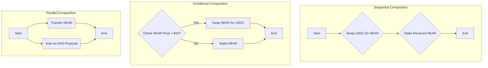

# Extending Your Intent Architecture with Composability

**Estimated Time:** 25 minutes  
**Prerequisites:** Completed testnet deployment from Module 6
**Learning Objectives:**

- Understand how composability enhances intent-based architecture
- Identify different composition patterns for complex operations
- Recognize how to extend your contracts to support composed intents
- Apply composability concepts to real-world blockchain use cases

## Bridging from Basic to Advanced Intent Architecture

In the previous modules, we've built and deployed a functional intent architecture with a Verifier contract, Solver contract, and a frontend that allows users to submit and execute simple, single-action intents. Now, let's explore how we can extend this architecture to support more sophisticated use cases.

> 💡 **Extension Note**: The concepts in this section go beyond the basic implementation we've built in the workshop. They represent advanced patterns that would require extending our current contracts with additional functionality.

## Understanding Composability in Intent Architecture

Composability allows us to combine multiple intents into more complex operations while maintaining the declarative nature that makes intents powerful. Think of it as creating "super intents" that orchestrate multiple actions as a single unit.

> 💡 **Web2 Parallel**: If you're familiar with Web2 technologies, composable intents are analogous to workflow orchestration tools like Apache Airflow, AWS Step Functions, or the Saga pattern in microservices. They allow you to define complex sequences of operations with dependencies, conditions, and error handling.

## How Composability Extends Our Workshop Implementation

To support composable intents, we would need to enhance our Verifier and Solver contracts:

```
Basic Intent Architecture (Workshop Implementation)  |  Composable Intent Architecture (Extension)
-----------------------------------------------------|-----------------------------------------------
- Single-action intents (swap, transfer)             | - Multi-action intents via composition
- Simple Verifier validates one intent at a time     | - Enhanced Verifier validates nested structures
- Solver executes a single action                    | - Composition Solver orchestrates multiple steps
- No state sharing between intents                   | - Output from one step used as input to another
```

## Benefits of Composable Intents

Extending our basic implementation to support composability provides several advantages:

- **Simplified complex workflows** - Users can request multi-step operations with a single intent
- **Optimized execution** - Solvers can find more efficient paths across composed operations
- **Reduced transaction costs** - Batching operations reduces overall gas costs
- **Enhanced user experience** - Complex operations appear as simple, atomic actions to users

## Common Composition Patterns

Let's explore how we could enhance our intent structure to support different composition patterns:

### Sequential Composition

Execute multiple intents in order, where the output of one becomes the input for the next:

```javascript
{
  "id": "seq-intent-123",
  "user_account": "alice.near",
  "action": "compose",
  "compose_type": "sequential",
  "steps": [
    {
      "action": "swap",
      "input_token": "USDC",
      "input_amount": "1000000000",
      "output_token": "NEAR",
      "min_output_amount": null,
      "max_slippage": 0.5
    },
    {
      "action": "stake",
      "input_token": "NEAR",
      "input_amount": "$PREVIOUS_OUTPUT", // Special reference to previous result
      "validator": "validator.poolv1.near"
    }
  ],
  "deadline": 1692381924
}
```

**Implementation Note**: To support this in our workshop architecture, we would need to:

1. Modify our Verifier contract to recognize and validate the `"compose"` action and nested structure
2. Implement a specialized Composition Solver that can execute steps sequentially
3. Add state management to track and inject outputs as inputs for subsequent steps

### Parallel Composition

Execute multiple independent intents concurrently:

```javascript
{
  "id": "parallel-intent-456",
  "user_account": "alice.near",
  "action": "compose",
  "compose_type": "parallel",
  "steps": [
    {
      "action": "transfer",
      "input_token": "NEAR",
      "input_amount": "1000000000",
      "recipient": "bob.near"
    },
    {
      "action": "transfer",
      "input_token": "USDC",
      "input_amount": "10000000",
      "recipient": "charlie.near"
    }
  ],
  "deadline": 1692381924
}
```

**Implementation Note**: In a blockchain context, "parallel" typically means the operations would be batched together rather than executed simultaneously. Our implementation would need to:

1. Group the operations efficiently
2. Handle partial success/failure scenarios
3. Provide clear reporting on which steps completed successfully

### Conditional Composition

Execute different intents based on runtime conditions:

```javascript
{
  "id": "conditional-intent-789",
  "user_account": "alice.near",
  "action": "compose",
  "compose_type": "conditional",
  "condition": {
    "type": "price_check",
    "token": "NEAR",
    "reference": "USD",
    "operator": "greater_than",
    "value": "5.00"
  },
  "if_true": {
    "action": "swap",
    "input_token": "NEAR",
    "input_amount": "10000000000",
    "output_token": "USDC",
    "min_output_amount": null,
    "max_slippage": 0.5
  },
  "if_false": {
    "action": "stake",
    "input_token": "NEAR",
    "input_amount": "10000000000",
    "validator": "validator.poolv1.near"
  },
  "deadline": 1692381924
}
```

**Implementation Note**: Conditional execution requires:

1. Secure access to reliable data sources (oracles) for conditions like price checks
2. Deterministic evaluation of conditions
3. Specialized Solvers that can evaluate conditions and choose the appropriate execution path

## Extending Our Verifier Contract for Composability

To support composability in our workshop implementation, we would need to extend our Verifier contract with additional functions:

```rust
// Enhanced Verifier contract with composability support
impl IntentVerifier {
    // Existing verify_intent function from workshop...

    // New function to validate composed intents
    pub fn verify_composed_intent(&mut self, intent: Intent) -> bool {
        if intent.action != "compose" {
            return self.verify_intent(intent); // Fall back to simple verification
        }

        // Validate the compose structure based on compose_type
        match intent.compose_type.as_str() {
            "sequential" => self.verify_sequential_intent(&intent),
            "parallel" => self.verify_parallel_intent(&intent),
            "conditional" => self.verify_conditional_intent(&intent),
            _ => false
        }
    }

    // Helper functions for each composition type
    fn verify_sequential_intent(&self, intent: &Intent) -> bool {
        // Verify each step in the sequence
        for step in &intent.steps {
            // Convert step to Intent and verify
            let step_intent = Intent {
                id: format!("{}-step-{}", intent.id, /* step index */),
                user_account: intent.user_account.clone(),
                action: step.action.clone(),
                // Map remaining fields...
                ..Default::default()
            };

            if !self.verify_intent(step_intent) {
                return false; // If any step is invalid, the whole intent is invalid
            }
        }

        true
    }

    // Similar functions for other composition types...
}
```

## Creating a Composition Solver

A specialized Composition Solver would be responsible for executing the composed intents:

```rust
impl CompositionSolver {
    pub fn solve_sequential_intent(&mut self, intent: Intent) -> Promise {
        // Initialize state to track between steps
        let mut state = HashMap::new();

        // Get the first step
        let first_step = &intent.steps[0];

        // Convert to regular intent
        let first_intent = self.step_to_intent(first_step, &intent, &state);

        // Execute first step and chain the rest
        let promise = self.execute_step(first_intent);

        // Chain remaining steps with callbacks to pass state
        // This is a simplified example - actual implementation would use promise chains
        for step in intent.steps.iter().skip(1) {
            promise = promise.then(
                Self::ext(env::current_account_id())
                    .with_static_gas(Gas(30 * TGAS))
                    .execute_next_step(step, intent.id.clone())
            );
        }

        promise
    }

    // Helper to handle special references like $PREVIOUS_OUTPUT
    fn resolve_dynamic_values(&self, value: String, state: &HashMap<String, String>) -> String {
        if value == "$PREVIOUS_OUTPUT" {
            return state.get("last_output").cloned().unwrap_or_default();
        }

        // Handle other special references and variable substitutions

        value
    }
}
```

## Challenges in Implementing Composable Intents

Extending our architecture to support composability introduces several challenges:

1. **State Management** - Tracking and passing state between steps securely
2. **Atomicity** - Handling partial failures in multi-step operations
3. **Gas Limitations** - Managing complex operations within gas constraints
4. **Oracle Integration** - Secure access to external data for conditional execution

## Real-World Example: DeFi Portfolio Rebalancing

Here's how a complex portfolio rebalancing operation could be expressed as a composed intent:

```javascript
{
  "id": "rebalance-intent-101112",
  "user_account": "alice.near",
  "action": "compose",
  "compose_type": "sequential",
  "steps": [
    {
      "action": "query_portfolio",
      "output_variable": "current_allocation" // Store result in a named variable
    },
    {
      "action": "compose",
      "compose_type": "conditional",
      "condition": {
        "type": "portfolio_balance_check",
        "current": "$current_allocation",
        "target": {
          "NEAR": 0.4,
          "USDC": 0.3,
          "ETH": 0.3
        },
        "threshold": 0.05 // 5% deviation tolerance
      },
      "if_true": {
        "action": "no_op" // Do nothing if already balanced
      },
      "if_false": {
        "action": "rebalance",
        "current": "$current_allocation",
        "target": {
          "NEAR": 0.4,
          "USDC": 0.3,
          "ETH": 0.3
        }
      }
    }
  ],
  "deadline": 1692381924
}
```

## User Interface Considerations for Composable Intents

When designing UIs for composable intents:

- **Progressive disclosure** - Start simple, reveal complexity gradually
- **Preview outcomes** - Show users what will happen at each step
- **Status tracking** - Provide clear indication of progress through multi-step processes
- **Error handling** - Explain failures and offer recovery options for partial failures

## From Workshop to Advanced Implementation

While our workshop implementation doesn't include composability, you can start extending it by:

1. Adding support for a simple sequential composition with two steps
2. Extending your Verifier contract to validate the new structure
3. Creating a basic Composition Solver that can execute two steps in sequence
4. Enhancing your frontend to display and submit composed intents

## Next Steps

In the [next section (7.2: Advanced Use Cases)](mdc:./02-advanced-use-cases.md), we'll explore specific scenarios that leverage this composability, showing how intent-centric architecture can enable sophisticated DeFi operations, DAO governance, and more.

> 💡 **Implementation Note**: The examples in this section are intended to illustrate concepts rather than provide production-ready code. Implementing a full composability system would require careful design and thorough testing, especially around error handling and state management.

## Combining Intents: Building Complex Workflows

The real power of intents emerges when you combine them. This is **composability** – using simple building blocks (individual intents) to create complex, multi-step workflows.

> 💡 **Web2 Parallel**: Think of Unix pipes (`command1 | command2`) or visual programming tools like Zapier or IFTTT, where you chain simple actions together to automate complex tasks. Intent composability brings this power to blockchain interactions.

### 1. Sequential Composition: A then B

Execute intents one after another, potentially using the output of one as the input for the next.

**Example Intent**: "First, swap 100 USDC for NEAR. Then, stake the received NEAR with validator `<VALIDATOR_ID>.poolv1.near`."

```json
{
  "id": "comp-intent-seq-001",
  "user_account": "<USER_ACCOUNT_ID>.testnet",
  "action": "sequence",
  "steps": [
    {
      "id": "step_swap",
      "action": "swap",
      "input_token": "usdc.testnet",
      "input_amount": "100000000", // 100 USDC (6 decimals)
      "output_token": "wrap.testnet",
      "max_slippage": 0.01,
      "save_output_as": "SWAP_OUTPUT_AMOUNT" // Name for the output variable
    },
    {
      "id": "step_stake",
      "action": "stake",
      "input_token": "wrap.testnet",
      // Reference the output of the previous step
      // Assumes a special resolver understands this placeholder.
      "input_amount": "$SWAP_OUTPUT_AMOUNT",
      "validator_id": "<VALIDATOR_ID>.poolv1.near"
    }
  ],
  "constraints": {
    "atomicExecution": true, // Ensure either both succeed or both fail
    "deadline": "1735689600000000000" // Nanosecond timestamp
  }
}
```

**Extension Notes (Sequential Composition):**

- **Feasibility**: Requires Contract Modifications (Verifier/Solver) & potentially Off-Chain Services.
- **Mechanism**: A dedicated "Composition Solver" or enhanced Verifier/Solver contract is needed.
- **Output Handling (`$SWAP_OUTPUT_AMOUNT`)**: This requires a mechanism for the composition solver to:
  1.  Execute `step_swap`.
  2.  Capture its specific output amount (e.g., from execution logs or callbacks).
  3.  Temporarily store this value (e.g., in contract state or passed in subsequent calls).
  4.  Substitute this value into the `input_amount` for `step_stake` before execution.
- **Atomicity**: Ensuring `atomicExecution` is crucial and non-trivial, especially if steps involve external calls. It often requires careful state management and rollback logic within the composition solver.
- **Placeholders**: `<USER_ACCOUNT_ID>.testnet` and `<VALIDATOR_ID>.poolv1.near` are illustrative; replace with actual account IDs.

### 2. Conditional Composition: If X then A else B

Execute different intents based on on-chain conditions or oracle data.

**Example Intent**: "If the price of NEAR > $10 USD, swap 50 NEAR for USDC. Otherwise, stake 50 NEAR."

```json
{
  "id": "comp-intent-cond-001",
  "user_account": "<USER_ACCOUNT_ID>.testnet",
  "action": "conditional",
  "condition": {
    "source": "oracle", // Assumes a trusted price oracle contract
    "oracle_contract": "priceoracle.near", // Placeholder for oracle contract
    "feed": "NEAR_USD",
    "operator": ">=",
    "value": "10000000" // Price target (e.g., $10.00 with 6 decimals)
  },
  "true_branch": {
    // Intent to execute if condition is true
    "action": "swap",
    "input_token": "wrap.testnet",
    "input_amount": "50000000000000000000000000", // 50 NEAR
    "output_token": "usdc.testnet",
    "min_output_amount": "495000000" // e.g., Min 495 USDC (6 decimals)
  },
  "false_branch": {
    // Intent to execute if condition is false
    "action": "stake",
    "input_token": "wrap.testnet",
    "input_amount": "50000000000000000000000000", // 50 NEAR
    "validator_id": "<VALIDATOR_ID>.poolv1.near"
  }
}
```

**Extension Notes (Conditional Composition):**

- **Feasibility**: Requires Contract Modifications (Verifier/Solver) & External Dependencies (Oracle).
- **Mechanism**: Needs a Verifier/Solver capable of querying the specified `oracle_contract` (or other on-chain state) and executing the appropriate branch (`true_branch` or `false_branch`).
- **Oracle Trust**: Relies heavily on the security and reliability of the chosen oracle.
- **Placeholders**: `<USER_ACCOUNT_ID>.testnet`, `priceoracle.near`, `<VALIDATOR_ID>.poolv1.near` are illustrative.

### 3. Parallel Composition: A and B Simultaneously

Execute multiple intents concurrently, often used for batching unrelated actions.

**Example Intent**: "Simultaneously: 1) Transfer 10 NEAR to `<FRIEND_ACCOUNT_ID>.testnet`, and 2) Vote YES on DAO proposal #42."

```json
{
  "id": "comp-intent-para-001",
  "user_account": "<USER_ACCOUNT_ID>.testnet",
  "action": "parallel",
  "intents": [
    {
      // Sub-intent 1: Transfer
      "action": "transfer",
      "input_token": "NEAR",
      "input_amount": "10000000000000000000000000", // 10 NEAR
      "recipient": "<FRIEND_ACCOUNT_ID>.testnet" // Placeholder
    },
    {
      // Sub-intent 2: DAO Vote
      "action": "dao_vote",
      "dao_contract": "<DAO_NAME>.sputnik-dao.near", // Placeholder
      "proposal_id": 42,
      "vote": "YES"
    }
  ]
}
```

**Extension Notes (Parallel Composition):**

- **Feasibility**: Requires Contract Modifications (Verifier/Solver).
- **Mechanism**: A specialized Solver or enhanced Verifier batches the actions from the sub-intents into a single transaction submitted to the NEAR blockchain. NEAR supports batching actions within one transaction.
- **Atomicity**: Execution is typically atomic because NEAR processes batched actions within a single transaction receipt. If one action fails, others in the batch might still succeed unless the contract logic explicitly implements rollbacks.
- **Placeholders**: `<USER_ACCOUNT_ID>.testnet`, `<FRIEND_ACCOUNT_ID>.testnet`, `<DAO_NAME>.sputnik-dao.near` are illustrative.

### Visualizing Composable Workflows

Mermaid diagrams help visualize these complex flows:



Figure 1: Visualizing Different Intent Composition Patterns.

### Building a Composition Solver (Conceptual Rust)

Implementing a solver capable of handling these compositions requires careful design:

```rust
// Conceptual Rust - simplified for illustration
// Assumes necessary imports and supporting structs (Intent, ExecutionResult, etc.)

#[near_bindgen]
impl CompositionSolver {
    // ... (state, initialization)

    pub fn execute_composed_intent(&mut self, composed_intent: ComposedIntent) -> Promise {
        env::log_str(&format!("Executing composed intent: {}", composed_intent.id));

        match composed_intent.action_type {
            ActionType::Sequence => self.execute_sequence(composed_intent.steps, composed_intent.constraints),
            ActionType::Conditional => self.execute_conditional(composed_intent.condition, composed_intent.true_branch, composed_intent.false_branch),
            ActionType::Parallel => self.execute_parallel(composed_intent.intents),
        }
    }

    fn execute_sequence(&mut self, steps: Vec<IntentStep>, constraints: Constraints) -> Promise {
        // Implementation needs to:
        // 1. Execute steps sequentially using promises and callbacks.
        // 2. Store intermediate results (e.g., using a map with intent_id + step_id as key).
        // 3. Resolve dynamic values like "$PREVIOUS_OUTPUT" before executing the next step.
        // 4. Handle atomicity constraints - potentially requiring complex rollback logic if a step fails.
        env::log_str("Executing sequential intent...");
        // ... complex promise chaining and state management ...
        // Placeholder: return promise indicating completion/failure
        Promise::new(env::current_account_id()) // Example placeholder promise
    }

    fn execute_conditional(&mut self, condition: Condition, true_branch: Intent, false_branch: Option<Intent>) -> Promise {
        // Implementation needs to:
        // 1. Evaluate the condition (e.g., call an oracle contract).
        // 2. Based on the result, execute either the true_branch or false_branch intent.
        // 3. Use promises/callbacks to handle the asynchronous condition check and subsequent execution.
        env::log_str("Executing conditional intent...");
        // ... call oracle, then execute appropriate branch via promise ...
        Promise::new(env::current_account_id())
    }

    fn execute_parallel(&mut self, intents: Vec<Intent>) -> Promise {
        // Implementation needs to:
        // 1. Construct a single transaction containing actions for ALL sub-intents.
        //    NEAR allows batching actions within a single transaction.
        // 2. Submit this batched transaction.
        // 3. Handle the combined result (potentially multiple receipts).
        env::log_str("Executing parallel intent...");
        // ... construct batched actions and submit transaction ...
        Promise::new(env::current_account_id())
    }

    // Helper to resolve dynamic values like "$SWAP_OUTPUT_AMOUNT"
    // Needs access to stored intermediate results from previous steps.
    fn resolve_dynamic_values(&self, intent_step: &mut IntentStep, results_store: &IntermediateResults) {
        // Conceptual: find placeholder, lookup in results_store, replace value.
        // E.g., if intent_step.input_amount == "$SWAP_OUTPUT_AMOUNT", replace it.
    }

    // Callback to handle results of individual steps or the final outcome
    #[private]
    pub fn on_step_complete(&mut self, /* ... args ... */) {
        // ... process results, potentially trigger next step, handle errors ...
    }
}

// Note: This is highly simplified. Real implementation requires robust error handling,
// gas management, state management for intermediate results, and potentially complex callback logic.
```

**Extension Notes (Composition Solver):**

- **Feasibility**: Requires Significant Contract Modifications & potentially Off-Chain Services.
- **Complexity**: Building a robust composition solver is a complex task involving intricate state management, promise handling, and potentially off-chain coordination for resolving dynamic values or managing atomicity across complex steps.
- **Gas Costs**: Composed intents, especially sequential ones with multiple cross-contract calls, can consume significant gas. Careful optimization is required.
